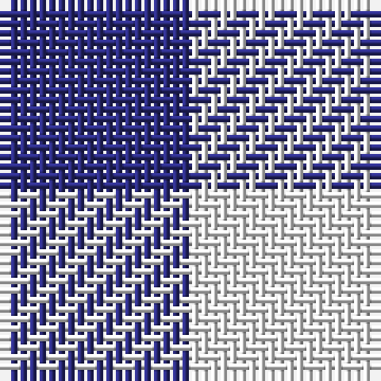

**Bands:** [BW](/stripes/bw/) · **Stripes:** [DB W](/stripes/stripes2/) DB W

This was sourced from register-of-tartans.  It is a [2 band tartan](/bands/bands2/).

Original link https://www.tartanregister.gov.uk/tartanDetails.aspx?ref=3786

## Attestations

This cloth appears in 2 source records; the oldest owns this page.

- 01/01/1932 — Sillitoe (register-of-tartans, [record](https://www.tartanregister.gov.uk/tartanDetails.aspx?ref=3786))
- 1932 — Sillitoe (Corporate) (tartans-authority, [record](http://www.tartansauthority.com/tartan-ferret/display/6430/))

## Register references

External register numbers recorded for this tartan.

- Scottish Register of Tartans: [3786](https://www.tartanregister.gov.uk/tartanDetails.aspx?ref=3786)
- Scottish Tartans Authority (ITI): 6430

## Thread count
DB/20 W/20

## Palette
Each colour and its ΔE from the base-6 reference it is a variant of.

| Colour | Shade | Base | ΔE (OKLab) |
|---|---|---|---|
| DB | <code style="background-color:#2C2C80;">#2C2C80</code> `#2C2C80` | B <code style="background-color:#2A418A;">#2A418A</code> | 0.06 |
| K | <code style="background-color:#101010;">#101010</code> `#101010` | K <code style="background-color:#000000;">#000000</code> | 0.17 |
| W | <code style="background-color:#F8F8F8;">#F8F8F8</code> `#F8F8F8` | W <code style="background-color:#F7F7F7;">#F7F7F7</code> | 0.00 |

# Sample pattern

## Nearest tartans

The nearest existing variants by ΔTartan distance.

1. [Shepherd Check (Universal)](/setts/s2/k1w1~x6/) — ΔT 1.78
1. [Falkirk Tartan](/setts/s2/k1w1~x24/) — ΔT 2.22
1. [Shepherd](/setts/s2/k1w1~x15/) — ΔT 2.31
1. [Shepherd Check](/setts/s2/k1w1~x28/) — ΔT 2.31
1. [Shepherd or Falkirk](/setts/s4/k1w1~x6/) — ΔT 2.38
1. [Shepherd Brown & White (Fashion?)](/setts/s2/dy1lb1~x6/) — ΔT 2.54
1. [Glen Moriston Estate Check](/setts/s3/dt1lb1w1~x8/) — ΔT 2.60
1. [Wilson's, No 116](/setts/s2/g1p1~x16/) — ΔT 2.62
1. [Hogg](/setts/s4/k1w1do1~x8/) — ΔT 2.77
1. [Wilson's No.172](/setts/s2/k9t8~x2/) — ΔT 2.83

## Neighbour map

Every grey dot is one of 14299 variants placed by the first two principal components of the ΔTartan feature space (44% of its variance). Red is this tartan; blue dots are its nearest — click one to open its page.

<svg viewBox="0 0 640 380" role="img" style="max-width:100%;height:auto;border:1px solid #e0e0e0;border-radius:4px;display:block" xmlns="http://www.w3.org/2000/svg"><image href="/nn/cloud.v1.png" width="640" height="380"/><a href="/setts/s2/k1w1~x6/"><circle cx="110.8" cy="366.0" r="4" fill="#3465a4"><title>Shepherd Check (Universal)</title></circle></a><a href="/setts/s2/k1w1~x24/"><circle cx="113.8" cy="366.0" r="4" fill="#3465a4"><title>Falkirk Tartan</title></circle></a><a href="/setts/s2/k1w1~x15/"><circle cx="109.6" cy="366.0" r="4" fill="#3465a4"><title>Shepherd</title></circle></a><a href="/setts/s2/k1w1~x28/"><circle cx="109.6" cy="366.0" r="4" fill="#3465a4"><title>Shepherd Check</title></circle></a><a href="/setts/s4/k1w1~x6/"><circle cx="95.8" cy="366.0" r="4" fill="#3465a4"><title>Shepherd or Falkirk</title></circle></a><a href="/setts/s2/dy1lb1~x6/"><circle cx="146.1" cy="366.0" r="4" fill="#3465a4"><title>Shepherd Brown &amp; White (Fashion?)</title></circle></a><a href="/setts/s3/dt1lb1w1~x8/"><circle cx="14.0" cy="366.0" r="4" fill="#3465a4"><title>Glen Moriston Estate Check</title></circle></a><a href="/setts/s2/g1p1~x16/"><circle cx="160.7" cy="366.0" r="4" fill="#3465a4"><title>Wilson's, No 116</title></circle></a><a href="/setts/s4/k1w1do1~x8/"><circle cx="35.5" cy="366.0" r="4" fill="#3465a4"><title>Hogg</title></circle></a><a href="/setts/s2/k9t8~x2/"><circle cx="172.0" cy="366.0" r="4" fill="#3465a4"><title>Wilson's No.172</title></circle></a><circle cx="109.5" cy="366.0" r="5" fill="#c00000"/></svg>

ID: /setts/s2/db1w1~x20/
