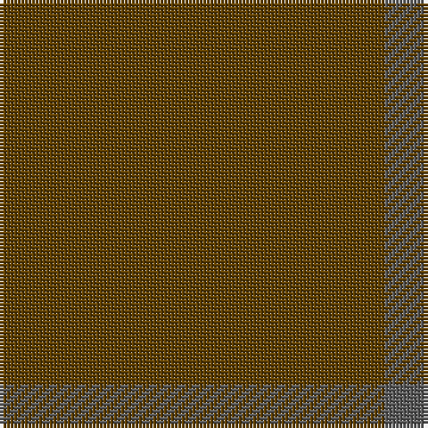

**Bands:** [GB](/stripes/gb/) · **Stripes:** [DY N](/stripes/stripes2/) DY N

This was sourced from tartans-authority.  It is a [2 band tartan](/bands/bands2/).

Original link http://www.tartansauthority.com/tartan-ferret/display/11116/

## Thread count
T/108 N/12

## Palette
Each colour and its ΔE from the base-6 reference it is a variant of.

| Colour | Shade | Base | ΔE (OKLab) |
|---|---|---|---|
| N | <code style="background-color:#5C5C5C;">#5C5C5C</code> `#5C5C5C` | B <code style="background-color:#2A418A;">#2A418A</code> | 0.15 |
| T | <code style="background-color:#604000;">#604000</code> `#604000` | G <code style="background-color:#006100;">#006100</code> | 0.14 |

# Sample pattern

## Nearest tartans

The nearest existing variants by ΔTartan distance.

1. [Hallstatt (Artefact)](/setts/s3/dy16y3dy2~x10/) — ΔT 1.50
1. [Outlander #4](/setts/s3/do27n3do17~x4/) — ΔT 2.03
1. [Ben Dubh (The Black Mount)](/setts/s6/dt4k2dt16k2dt16k1~x4/) — ΔT 3.24
1. [Dunbar, John Telfer (Personal)](/setts/s7/do5k2do28k10do26k4do4~x2/) — ΔT 3.79
1. [Young in Australia (Name)](/setts/s4/lo81g6lo8g8~x2/) — ΔT 4.12
1. [Hebridean Cairn Fashion Tartan Tartan Number: 6822. Earliest known date: 2005 For a new House of Edgar Collection in wedding gray. See products available Copyright © Blair Urquhart, Comrie, 2015](/setts/s8/n2y3n3y3n10y2n18y1~x4/) — ΔT 4.30
1. [Staines](/setts/s2/db12k1~x10/) — ΔT 4.73
1. [Masai Shuka 09 (Artefact)](/setts/s8/o60lo15o4lo2o2lo2o2lo2~x2/) — ΔT 4.84
1. [Loch Garth](/setts/s4/o12o6o2ly1~x4/) — ΔT 4.90
1. [Hebridean Cairn (Fashion)](/setts/s8/n2o3n3o3n10o2n18o1~x4/) — ΔT 5.08

## Neighbour map

Every grey dot is one of 14299 variants placed by the first two principal components of the ΔTartan feature space (44% of its variance). Red is this tartan; blue dots are its nearest — click one to open its page.

<svg viewBox="0 0 640 380" role="img" style="max-width:100%;height:auto;border:1px solid #e0e0e0;border-radius:4px;display:block" xmlns="http://www.w3.org/2000/svg"><image href="/nn/cloud.v1.png" width="640" height="380"/><a href="/setts/s3/dy16y3dy2~x10/"><circle cx="626.0" cy="366.0" r="4" fill="#3465a4"><title>Hallstatt (Artefact)</title></circle></a><a href="/setts/s3/do27n3do17~x4/"><circle cx="626.0" cy="366.0" r="4" fill="#3465a4"><title>Outlander #4</title></circle></a><a href="/setts/s6/dt4k2dt16k2dt16k1~x4/"><circle cx="626.0" cy="366.0" r="4" fill="#3465a4"><title>Ben Dubh (The Black Mount)</title></circle></a><a href="/setts/s7/do5k2do28k10do26k4do4~x2/"><circle cx="626.0" cy="356.2" r="4" fill="#3465a4"><title>Dunbar, John Telfer (Personal)</title></circle></a><a href="/setts/s4/lo81g6lo8g8~x2/"><circle cx="626.0" cy="314.0" r="4" fill="#3465a4"><title>Young in Australia (Name)</title></circle></a><a href="/setts/s8/n2y3n3y3n10y2n18y1~x4/"><circle cx="626.0" cy="322.6" r="4" fill="#3465a4"><title>Hebridean Cairn Fashion Tartan Tartan Number: 6822. Earliest known date: 2005 For a new House of Edgar Collection in wedding gray. See products available Copyright © Blair Urquhart, Comrie, 2015</title></circle></a><a href="/setts/s2/db12k1~x10/"><circle cx="626.0" cy="366.0" r="4" fill="#3465a4"><title>Staines</title></circle></a><a href="/setts/s8/o60lo15o4lo2o2lo2o2lo2~x2/"><circle cx="626.0" cy="271.0" r="4" fill="#3465a4"><title>Masai Shuka 09 (Artefact)</title></circle></a><a href="/setts/s4/o12o6o2ly1~x4/"><circle cx="619.8" cy="354.9" r="4" fill="#3465a4"><title>Loch Garth</title></circle></a><a href="/setts/s8/n2o3n3o3n10o2n18o1~x4/"><circle cx="626.0" cy="297.9" r="4" fill="#3465a4"><title>Hebridean Cairn (Fashion)</title></circle></a><circle cx="626.0" cy="366.0" r="5" fill="#c00000"/></svg>

ID: /setts/s2/dy9n1~x12/
