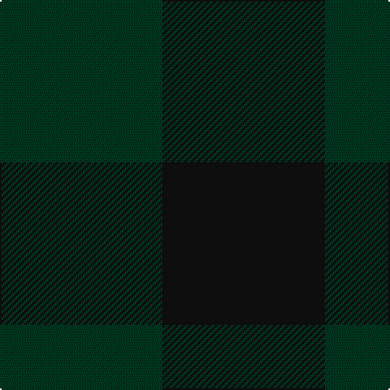

In pattern [GK](/patterns/gk/).

This was sourced from register-of-tartans.  It is a [2 stripes tartan](/stripes/stripes2/).

Original link https://www.tartanregister.gov.uk/tartanDetails.aspx?ref=3537

## Thread count
DG/100 K/100

## Palette
Each colour and its ΔE from the base-6 reference it is a variant of.

| Colour | Shade | Base | ΔE (OKLab) |
|---|---|---|---|
| DG | <code style="background-color:#003820;">#003820</code> `#003820` | G <code style="background-color:#006400;">#006400</code> | 0.16 |
| K | <code style="background-color:#101010;">#101010</code> `#101010` | K <code style="background-color:#000000;">#000000</code> | 0.17 |

# Sample pattern

## Nearest tartans

The nearest existing variants by ΔTartan distance.

1. [Hafren (Personal)](/setts/s2/b130g130-b4c6878-g006818/) — ΔT 2.26
1. [Wilson's No.219](/setts/s2/g14ga12-g003820-ga5c6428/) — ΔT 2.85
1. [Buffalo Plaid](/setts/s2/b100k100-b1c0070-k101010/) — ΔT 2.95
1. [MacKillen Hunting](/setts/s2/g168k168-g006428-k001e00/) — ΔT 4.20
1. [Robin Hood (Fashion)](/setts/s2/g100k100-g285800-k101010/) — ΔT 4.58
1. [Glenlyon](/setts/s3/b16g14k16-b2c4084-g005020-k101010/) — ΔT 4.62
1. [Wilson's, No 210](/setts/s2/g14b12-b5480b0-g008000/) — ΔT 4.75
1. [Bruce Special 1985 XXX](/setts/s2/b2ba2-b1474b4-ba5c8ca8/) — ΔT 4.84
1. [Rob Roy, Blue & Red (Fashion)](/setts/s2/b100r100-b202060-r880000/) — ΔT 4.88
1. [Cairnbulg & Inverllocjy Fisher Plaid](/setts/s2/b14r14-b202060-r880000/) — ΔT 4.88

## Neighbour map

Every grey dot is one of 15726 variants placed by the first two principal components of the ΔTartan feature space (44% of its variance). Red is this tartan; blue dots are its nearest — click one to open its page.

<svg viewBox="0 0 640 380" role="img" style="max-width:100%;height:auto;border:1px solid #e0e0e0;border-radius:4px;display:block" xmlns="http://www.w3.org/2000/svg"><image href="/nn/cloud.v1.png" width="640" height="380"/><a href="/setts/s2/b130g130-b4c6878-g006818/"><circle cx="310.8" cy="366.0" r="4" fill="#3465a4"><title>Hafren (Personal)</title></circle></a><a href="/setts/s2/g14ga12-g003820-ga5c6428/"><circle cx="314.2" cy="366.0" r="4" fill="#3465a4"><title>Wilson's No.219</title></circle></a><a href="/setts/s2/b100k100-b1c0070-k101010/"><circle cx="292.6" cy="366.0" r="4" fill="#3465a4"><title>Buffalo Plaid</title></circle></a><a href="/setts/s2/g168k168-g006428-k001e00/"><circle cx="228.7" cy="366.0" r="4" fill="#3465a4"><title>MacKillen Hunting</title></circle></a><a href="/setts/s2/g100k100-g285800-k101010/"><circle cx="218.5" cy="366.0" r="4" fill="#3465a4"><title>Robin Hood (Fashion)</title></circle></a><a href="/setts/s3/b16g14k16-b2c4084-g005020-k101010/"><circle cx="111.7" cy="366.0" r="4" fill="#3465a4"><title>Glenlyon</title></circle></a><a href="/setts/s2/g14b12-b5480b0-g008000/"><circle cx="262.9" cy="366.0" r="4" fill="#3465a4"><title>Wilson's, No 210</title></circle></a><a href="/setts/s2/b2ba2-b1474b4-ba5c8ca8/"><circle cx="399.8" cy="366.0" r="4" fill="#3465a4"><title>Bruce Special 1985 XXX</title></circle></a><a href="/setts/s2/b100r100-b202060-r880000/"><circle cx="243.0" cy="366.0" r="4" fill="#3465a4"><title>Rob Roy, Blue &amp; Red (Fashion)</title></circle></a><a href="/setts/s2/b14r14-b202060-r880000/"><circle cx="243.0" cy="366.0" r="4" fill="#3465a4"><title>Cairnbulg &amp; Inverllocjy Fisher Plaid</title></circle></a><circle cx="340.5" cy="366.0" r="5" fill="#c00000"/></svg>

ID: /setts/s2/g100k100-g003820-k101010/
