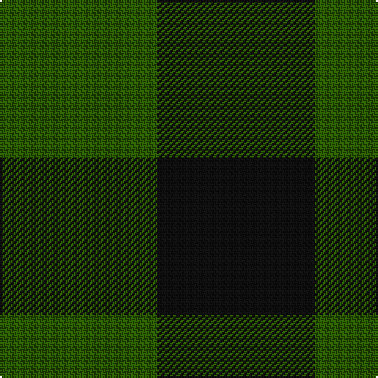

In pattern [GK](/patterns/gk/).

This was sourced from tartans-authority.  It is a [2 stripes tartan](/stripes/stripes2/).

Original link http://www.tartansauthority.com/tartan-ferret/display/785/

## Thread count
G/100 K/100

## Palette
Each colour and its ΔE from the base-6 reference it is a variant of.

| Colour | Shade | Base | ΔE (OKLab) |
|---|---|---|---|
| G | <code style="background-color:#285800;">#285800</code> `#285800` | G <code style="background-color:#006400;">#006400</code> | 0.04 |
| K | <code style="background-color:#101010;">#101010</code> `#101010` | K <code style="background-color:#000000;">#000000</code> | 0.17 |

# Sample pattern

ID: /setts/s2/g100k100-g285800-k101010/
