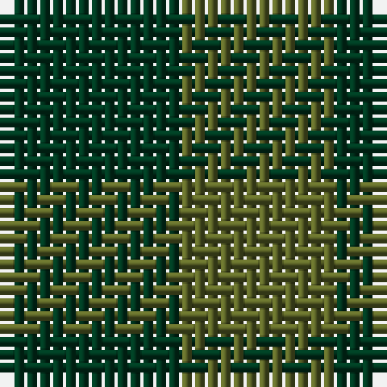

In pattern [GG](/patterns/gg/).

This was sourced from register-of-tartans.  It is a [2 stripes tartan](/stripes/stripes2/).

Original link https://www.tartanregister.gov.uk/tartanDetails.aspx?ref=4747

## Thread count
DG/14 G/12

## Palette
Each colour and its ΔE from the base-6 reference it is a variant of.

| Colour | Shade | Base | ΔE (OKLab) |
|---|---|---|---|
| DG | <code style="background-color:#003820;">#003820</code> `#003820` | G <code style="background-color:#006400;">#006400</code> | 0.16 |
| G | <code style="background-color:#5C6428;">#5C6428</code> `#5C6428` | G <code style="background-color:#006400;">#006400</code> | 0.09 |

# Sample pattern

ID: /setts/s2/g14ga12-g003820-ga5c6428/
