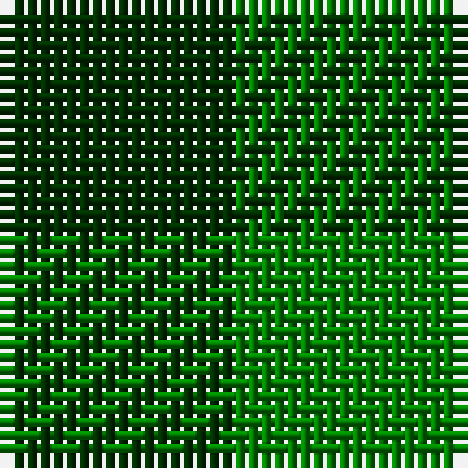

In pattern [GG](/patterns/gg/).

This was sourced from weddslist.  It is a [2 stripes tartan](/stripes/stripes2/).

Original link http://www.weddslist.com/cgi-bin/tartans/pg.pl?source=sts

## Thread count
DG/18 G/18

## Palette
Each colour and its ΔE from the base-6 reference it is a variant of.

| Colour | Shade | Base | ΔE (OKLab) |
|---|---|---|---|
| DG | <code style="background-color:#003000;">#003000</code> `#003000` | G <code style="background-color:#006400;">#006400</code> | 0.18 |
| G | <code style="background-color:#008000;">#008000</code> `#008000` | G <code style="background-color:#006400;">#006400</code> | 0.09 |

# Sample pattern

ID: /setts/s2/g18ga18-g003000-ga008000/
