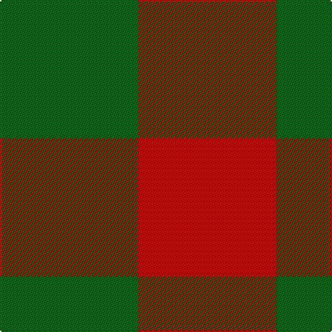

In pattern [GR](/patterns/gr/).

This was sourced from tartans-authority.  It is a [2 stripes tartan](/stripes/stripes2/).

Original link http://www.tartansauthority.com/tartan-ferret/display/963/

## Thread count
G/100 R/100

## Palette
Each colour and its ΔE from the base-6 reference it is a variant of.

| Colour | Shade | Base | ΔE (OKLab) |
|---|---|---|---|
| G | <code style="background-color:#006818;">#006818</code> `#006818` | G <code style="background-color:#006100;">#006100</code> | 0.02 |
| R | <code style="background-color:#C80000;">#C80000</code> `#C80000` | R <code style="background-color:#CC0000;">#CC0000</code> | 0.01 |

# Sample pattern

## Nearest tartans

The nearest existing variants by ΔTartan distance.

1. [Moncreiffe](/setts/s2/g1r1x50~g006818-rc80000/) — ΔT 0.00
1. [Moncreiffe (MacLachlan) Clan Tartan Tartan Number: 963. Earliest known date: 1819 Sir Iain Moncreiffe of that Ilk, acquired the MacLachlan old sett for the clan when he became Chief in 1957. Micheil MacDonald writes in his book, 'The Clans of Scotland', "As a result of a long association with Clan Murray, the Moncreiffes traditionally wore the Atholl tartan. But Sir Iain... arranged that Madam MacLachlan of MacLachlan assign to him a 'primitive' pattern of red and green squares which, though no longer favoured by Clan MacLachlan, Sir Iain felt was appropriate to the long history of the Moncreiffes 'before tartan became fashionable in its present form'. See products available Copyright © Blair Urquhart, Comrie, 2015](/setts/s2/r14g13x2~g006818-rc80000/) — ΔT 0.46
1. [Wilson's No.099](/setts/s2/g14r13x2~g285800-rc80000/) — ΔT 0.59
1. [Glenlyon (District)](/setts/s2/g1r1x80~g005020-rdc0000/) — ΔT 0.73
1. [Moncreiffe](/setts/s2/g1r1x2~g11450d-raa0000/) — ΔT 1.06
1. [Rob Roy, Black & Tan (Fashion)](/setts/s2/g1k1x100~g8c7038-k101010/) — ΔT 1.92
1. [Shepherd Brown & White (Fashion?)](/setts/s2/g1w1x6~g604000-wc0c0c0/) — ΔT 2.00
1. [Wilson's No.116 (light)](/setts/s2/g9b8x2~b440044-g5c6428/) — ΔT 2.10
1. [Wilson's, No 116](/setts/s2/b1g1x16~b800080-g008000/) — ΔT 2.13
1. [Moncreiffe D](/setts/s3/r1g1r1x2~g11450d-raa0000/) — ΔT 2.21

## Neighbour map

Every grey dot is one of 15726 variants placed by the first two principal components of the ΔTartan feature space (44% of its variance). Red is this tartan; blue dots are its nearest — click one to open its page.

<svg viewBox="0 0 640 380" role="img" style="max-width:100%;height:auto;border:1px solid #e0e0e0;border-radius:4px;display:block" xmlns="http://www.w3.org/2000/svg"><image href="/nn/cloud.v1.png" width="640" height="380"/><a href="/setts/s2/g1r1x50~g006818-rc80000/"><circle cx="192.2" cy="366.0" r="4" fill="#3465a4"><title>Moncreiffe</title></circle></a><a href="/setts/s2/r14g13x2~g006818-rc80000/"><circle cx="211.8" cy="366.0" r="4" fill="#3465a4"><title>Moncreiffe (MacLachlan) Clan Tartan Tartan Number: 963. Earliest known date: 1819 Sir Iain Moncreiffe of that Ilk, acquired the MacLachlan old sett for the clan when he became Chief in 1957. Micheil MacDonald writes in his book, 'The Clans of Scotland', &quot;As a result of a long association with Clan Murray, the Moncreiffes traditionally wore the Atholl tartan. But Sir Iain... arranged that Madam MacLachlan of MacLachlan assign to him a 'primitive' pattern of red and green squares which, though no longer favoured by Clan MacLachlan, Sir Iain felt was appropriate to the long history of the Moncreiffes 'before tartan became fashionable in its present form'. See products available Copyright © Blair Urquhart, Comrie, 2015</title></circle></a><a href="/setts/s2/g14r13x2~g285800-rc80000/"><circle cx="220.9" cy="366.0" r="4" fill="#3465a4"><title>Wilson's No.099</title></circle></a><a href="/setts/s2/g1r1x80~g005020-rdc0000/"><circle cx="179.8" cy="366.0" r="4" fill="#3465a4"><title>Glenlyon (District)</title></circle></a><a href="/setts/s2/g1r1x2~g11450d-raa0000/"><circle cx="216.3" cy="366.0" r="4" fill="#3465a4"><title>Moncreiffe</title></circle></a><a href="/setts/s2/g1k1x100~g8c7038-k101010/"><circle cx="160.0" cy="366.0" r="4" fill="#3465a4"><title>Rob Roy, Black &amp; Tan (Fashion)</title></circle></a><a href="/setts/s2/g1w1x6~g604000-wc0c0c0/"><circle cx="145.3" cy="366.0" r="4" fill="#3465a4"><title>Shepherd Brown &amp; White (Fashion?)</title></circle></a><a href="/setts/s2/g9b8x2~b440044-g5c6428/"><circle cx="233.3" cy="366.0" r="4" fill="#3465a4"><title>Wilson's No.116 (light)</title></circle></a><a href="/setts/s2/b1g1x16~b800080-g008000/"><circle cx="159.4" cy="366.0" r="4" fill="#3465a4"><title>Wilson's, No 116</title></circle></a><a href="/setts/s3/r1g1r1x2~g11450d-raa0000/"><circle cx="294.7" cy="366.0" r="4" fill="#3465a4"><title>Moncreiffe D</title></circle></a><circle cx="192.2" cy="366.0" r="5" fill="#c00000"/></svg>

ID: /setts/s2/g1r1x100~g006818-rc80000/
