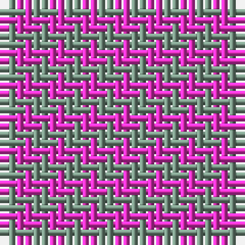

In pattern [GR](/patterns/gr/).

This was sourced from tartans-authority.  It is a [2 stripes tartan](/stripes/stripes2/).

Original link http://www.tartansauthority.com/tartan-ferret/display/2180/

## Thread count
LG/2 LR/2

## Palette
Each colour and its ΔE from the base-6 reference it is a variant of.

| Colour | Shade | Base | ΔE (OKLab) |
|---|---|---|---|
| LG | <code style="background-color:#789484;">#789484</code> `#789484` | G <code style="background-color:#006400;">#006400</code> | 0.23 |
| LR | <code style="background-color:#EC34C4;">#EC34C4</code> `#EC34C4` | R <code style="background-color:#C80000;">#C80000</code> | 0.24 |

# Sample pattern

ID: /setts/s2/g2r2-g789484-rec34c4/
