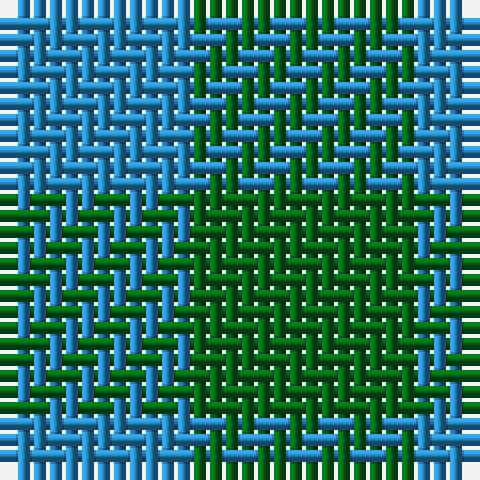

In pattern [BG](/stripes/bg/).

This was sourced from register-of-tartans.  It is a [2 stripe tartan](/stripes/stripes2/).

Original link https://www.tartanregister.gov.uk/tartanDetails.aspx?ref=4741

## Also known as

This cloth is also recorded under:

- Wilson's, No 210

## Attestations

This cloth appears in 2 source records; the oldest owns this page.

- 01/01/1819 — Wilson's No.210 (register-of-tartans, [record](https://www.tartanregister.gov.uk/tartanDetails.aspx?ref=4741))
- undated — Wilson's, No 210 (weddslist, [record](http://www.weddslist.com/cgi-bin/tartans/pg.pl?source=sts))

## Register references

External register numbers recorded for this tartan.

- Scottish Register of Tartans: [4741](https://www.tartanregister.gov.uk/tartanDetails.aspx?ref=4741)
- Scottish Tartans Authority (ITI): 118
- Scottish Tartans World Register: 118

## Thread count
G/14 B/12

## Palette
Each colour and the base-6 reference it is a variant of.

| Colour | Shade | Base |
|---|---|---|
| B | <code style="background-color:#2888C4;">#2888C4</code> `oklch(60.1% 0.125 241.5)` <small>#2888C4</small> | B <code style="background-color:#2A418A;">#2A418A</code> |
| DG | <code style="background-color:#003820;">#003820</code> `oklch(30.0% 0.070 158.3)` <small>#003820</small> | G <code style="background-color:#006100;">#006100</code> |
| G | <code style="background-color:#006818;">#006818</code> `oklch(45.0% 0.142 145.0)` <small>#006818</small> | G <code style="background-color:#006100;">#006100</code> |

# Sample pattern

## Nearest tartans

The nearest existing variants by ΔTartan distance.

1. [MacKillen Hunting](/setts/s2/k1g1~x168/) — ΔT 2.29
1. [Wilson's, No 219](/setts/s2/dg1g1~x18/) — ΔT 2.36
1. [Robin Hood Fancy Tartan Tartan Number: 785. Earliest known date: 1819 In 1815, members of the Highland Society of London resolved to request of each of the Highland chiefs, a sample of their clan tartan. The swatches were to be signed and sealed in the chief's own hand. This sett is one of those delivered to the Society between 1815 and 1822. See products available Copyright © Blair Urquhart, Comrie, 2015](/setts/s2/g9k8~x2/) — ΔT 2.43
1. [Wilson's No.219](/setts/s2/dg7y6~x2/) — ΔT 2.65
1. [St. Combs Fisher Plaid](/setts/s2/db1b1~x14/) — ΔT 2.96
1. [Wilson's No.116 (light)](/setts/s2/y9dp8~x2/) — ΔT 3.02
1. [Wilson's, No 116](/setts/s2/g1p1~x16/) — ΔT 3.28
1. [Wilson's No.052](/setts/s3/g7k4t4~x2/) — ΔT 3.34
1. [Wilson's No.045](/setts/s4/g2k1g2t1~x8/) — ΔT 3.34
1. [Glenlyon](/setts/s3/k8dg7db8~x2/) — ΔT 3.37

## Neighbour map

Every grey dot is one of 14299 variants placed by the first two principal components of the ΔTartan feature space (44% of its variance). Red is this tartan; blue dots are its nearest — click one to open its page.

<svg viewBox="0 0 640 380" role="img" style="max-width:100%;height:auto;border:1px solid #e0e0e0;border-radius:4px;display:block" xmlns="http://www.w3.org/2000/svg"><image href="/nn/cloud.v1.png" width="640" height="380"/><a href="/setts/s2/k1g1~x168/"><circle cx="224.1" cy="366.0" r="4" fill="#3465a4"><title>MacKillen Hunting</title></circle></a><a href="/setts/s2/dg1g1~x18/"><circle cx="201.9" cy="366.0" r="4" fill="#3465a4"><title>Wilson's, No 219</title></circle></a><a href="/setts/s2/g9k8~x2/"><circle cx="215.5" cy="366.0" r="4" fill="#3465a4"><title>Robin Hood Fancy Tartan Tartan Number: 785. Earliest known date: 1819 In 1815, members of the Highland Society of London resolved to request of each of the Highland chiefs, a sample of their clan tartan. The swatches were to be signed and sealed in the chief's own hand. This sett is one of those delivered to the Society between 1815 and 1822. See products available Copyright © Blair Urquhart, Comrie, 2015</title></circle></a><a href="/setts/s2/dg7y6~x2/"><circle cx="309.7" cy="366.0" r="4" fill="#3465a4"><title>Wilson's No.219</title></circle></a><a href="/setts/s2/db1b1~x14/"><circle cx="210.9" cy="366.0" r="4" fill="#3465a4"><title>St. Combs Fisher Plaid</title></circle></a><a href="/setts/s2/y9dp8~x2/"><circle cx="234.1" cy="366.0" r="4" fill="#3465a4"><title>Wilson's No.116 (light)</title></circle></a><a href="/setts/s2/g1p1~x16/"><circle cx="160.7" cy="366.0" r="4" fill="#3465a4"><title>Wilson's, No 116</title></circle></a><a href="/setts/s3/g7k4t4~x2/"><circle cx="153.6" cy="366.0" r="4" fill="#3465a4"><title>Wilson's No.052</title></circle></a><a href="/setts/s4/g2k1g2t1~x8/"><circle cx="301.7" cy="366.0" r="4" fill="#3465a4"><title>Wilson's No.045</title></circle></a><a href="/setts/s3/k8dg7db8~x2/"><circle cx="110.2" cy="366.0" r="4" fill="#3465a4"><title>Glenlyon</title></circle></a><circle cx="245.9" cy="366.0" r="5" fill="#c00000"/></svg>

ID: /setts/s2/g7t6~x2/
