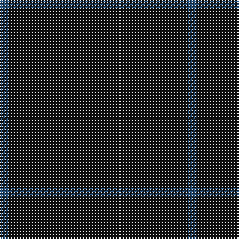

In pattern [BK](/patterns/bk/).

This was sourced from tartans-authority.  It is a [2 stripes tartan](/stripes/stripes2/).

Original link http://www.tartansauthority.com/tartan-ferret/display/6680/

## Thread count
B/6 K/120

## Palette
Each colour and its ΔE from the base-6 reference it is a variant of.

| Colour | Shade | Base | ΔE (OKLab) |
|---|---|---|---|
| B | <code style="background-color:#244C74;">#244C74</code> `#244C74` | B <code style="background-color:#2C4084;">#2C4084</code> | 0.05 |
| K | <code style="background-color:#101010;">#101010</code> `#101010` | K <code style="background-color:#000000;">#000000</code> | 0.17 |

# Sample pattern

ID: /setts/s2/k120b6-b244c74-k101010/
