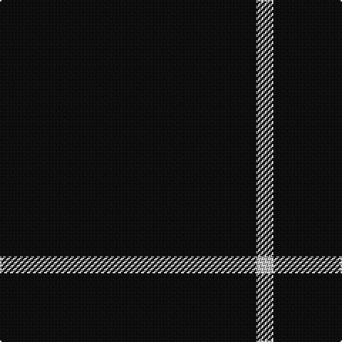

In pattern [KW](/stripes/kw/).

This was sourced from tartans-authority.  It is a [2 stripe tartan](/stripes/stripes2/).

Original link http://www.tartansauthority.com/tartan-ferret/display/3245/

## Attestations

This cloth appears in 2 source records; the oldest owns this page.

- 1996 — Joy's Fancy, Allen (Personal) (tartans-authority, [record](http://www.tartansauthority.com/tartan-ferret/display/3245/))
- undated — Joy's Fancy, Allen (Personal) (register-of-tartans, [record](https://www.tartanregister.gov.uk/tartanDetails.aspx?ref=5271))

## Register references

External register numbers recorded for this tartan.

- Scottish Register of Tartans: [5271](https://www.tartanregister.gov.uk/tartanDetails.aspx?ref=5271)
- Scottish Tartans Authority (ITI): 3245

## Thread count
K/180 N/12

## Palette
Each colour and the base-6 reference it is a variant of.

| Colour | Shade | Base |
|---|---|---|
| K | <code style="background-color:#101010;">#101010</code> `oklch(17.3% 0.000 89.9)` <small>#101010</small> | K <code style="background-color:#000000;">#000000</code> |
| N | <code style="background-color:#C0C0C0;">#C0C0C0</code> `oklch(80.8% 0.000 89.9)` <small>#C0C0C0</small> | W <code style="background-color:#F7F7F7;">#F7F7F7</code> |

# Sample pattern

## Nearest tartans

The nearest existing variants by ΔTartan distance.

1. [Wallington (Corporate?)](/setts/s4/k60t3k9g7/) — ΔT 2.26
1. [Fily (Verneuil L'tang) (Personal)](/setts/s3/k20w2t1~x6/) — ΔT 2.33
1. [Staines (2013)](/setts/s3/db1k12db1~x10/) — ΔT 2.33
1. [Dunnotar (School)](/setts/s4/k72w3k11db9/) — ΔT 2.40
1. [Pasteur Fancy Tartan Tartan Number: 7094. Earliest known date: 1836 The pattern is taken from a shawl or cloak which appears in a portrait of Louie Pasteur's mother. The portrait was drawn in pastels when Pasteur was just 13 years old. The information came Marie-Claude Fortier researching the life of Pasteur. See products available Copyright © Blair Urquhart, Comrie, 2015](/setts/s4/do10ly1do30y3~x4/) — ΔT 2.58
1. [Fily (Verneuil L'tang) (Personal)](/setts/s3/k20w2lt1~x6/) — ΔT 2.63
1. [Loevenstein Castle 2 (Artefact)](/setts/s4/k20db1k4db3~x4/) — ΔT 2.84
1. [Red Watch](/setts/s3/k10r3k1~x4/) — ΔT 2.94
1. [Gem](/setts/s4/db140r11db14ly11/) — ΔT 3.03
1. [Chafyn House (School)](/setts/s7/k72r3k11t9k11r3k37/) — ΔT 3.04

## Neighbour map

Every grey dot is one of 14299 variants placed by the first two principal components of the ΔTartan feature space (44% of its variance). Red is this tartan; blue dots are its nearest — click one to open its page.

<svg viewBox="0 0 640 380" role="img" style="max-width:100%;height:auto;border:1px solid #e0e0e0;border-radius:4px;display:block" xmlns="http://www.w3.org/2000/svg"><image href="/nn/cloud.v1.png" width="640" height="380"/><a href="/setts/s4/k60t3k9g7/"><circle cx="626.0" cy="231.3" r="4" fill="#3465a4"><title>Wallington (Corporate?)</title></circle></a><a href="/setts/s3/k20w2t1~x6/"><circle cx="601.0" cy="226.8" r="4" fill="#3465a4"><title>Fily (Verneuil L'tang) (Personal)</title></circle></a><a href="/setts/s3/db1k12db1~x10/"><circle cx="626.0" cy="299.7" r="4" fill="#3465a4"><title>Staines (2013)</title></circle></a><a href="/setts/s4/k72w3k11db9/"><circle cx="626.0" cy="233.0" r="4" fill="#3465a4"><title>Dunnotar (School)</title></circle></a><a href="/setts/s4/do10ly1do30y3~x4/"><circle cx="626.0" cy="231.9" r="4" fill="#3465a4"><title>Pasteur Fancy Tartan Tartan Number: 7094. Earliest known date: 1836 The pattern is taken from a shawl or cloak which appears in a portrait of Louie Pasteur's mother. The portrait was drawn in pastels when Pasteur was just 13 years old. The information came Marie-Claude Fortier researching the life of Pasteur. See products available Copyright © Blair Urquhart, Comrie, 2015</title></circle></a><a href="/setts/s3/k20w2lt1~x6/"><circle cx="588.0" cy="220.6" r="4" fill="#3465a4"><title>Fily (Verneuil L'tang) (Personal)</title></circle></a><a href="/setts/s4/k20db1k4db3~x4/"><circle cx="626.0" cy="278.9" r="4" fill="#3465a4"><title>Loevenstein Castle 2 (Artefact)</title></circle></a><a href="/setts/s3/k10r3k1~x4/"><circle cx="550.6" cy="307.7" r="4" fill="#3465a4"><title>Red Watch</title></circle></a><a href="/setts/s4/db140r11db14ly11/"><circle cx="616.0" cy="230.9" r="4" fill="#3465a4"><title>Gem</title></circle></a><a href="/setts/s7/k72r3k11t9k11r3k37/"><circle cx="626.0" cy="213.8" r="4" fill="#3465a4"><title>Chafyn House (School)</title></circle></a><circle cx="626.0" cy="308.8" r="5" fill="#c00000"/></svg>

ID: /setts/s2/k15lb1~x12/
