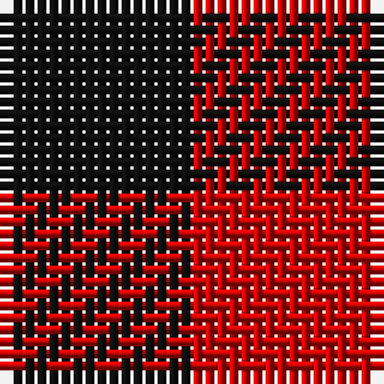

In pattern [KR](/patterns/kr/).

This was sourced from house-of-tartan.  It is a [2 stripes tartan](/stripes/stripes2/).

Original link http://www.house-of-tartan.scotland.net/house/TartanViewjs.asp?colr=Def&tnam=1504

## Thread count
K/16 R/16

## Palette
Each colour and its ΔE from the base-6 reference it is a variant of.

| Colour | Shade | Base | ΔE (OKLab) |
|---|---|---|---|
| K | <code style="background-color:#101010;">#101010</code> `#101010` | K <code style="background-color:#000000;">#000000</code> | 0.17 |
| R | <code style="background-color:#C80000;">#C80000</code> `#C80000` | R <code style="background-color:#C80000;">#C80000</code> | 0.00 |

# Sample pattern

ID: /setts/s2/k16r16-k101010-rc80000/
