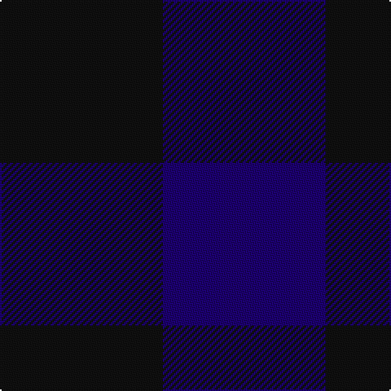

In pattern [BK](/stripes/bk/).

This was sourced from register-of-tartans.  It is a [2 stripe tartan](/stripes/stripes2/).

Original link https://www.tartanregister.gov.uk/tartanDetails.aspx?ref=5286

## Register references

External register numbers recorded for this tartan.

- Scottish Register of Tartans: [5286](https://www.tartanregister.gov.uk/tartanDetails.aspx?ref=5286)
- Scottish Tartans Authority (ITI): 3762

## Thread count
K/100 DB/100

## Palette
Each colour and the base-6 reference it is a variant of.

| Colour | Shade | Base |
|---|---|---|
| DB | <code style="background-color:#1C0070;">#1C0070</code> `oklch(26.3% 0.162 277.1)` <small>#1C0070</small> | B <code style="background-color:#2A418A;">#2A418A</code> |
| K | <code style="background-color:#101010;">#101010</code> `oklch(17.3% 0.000 89.9)` <small>#101010</small> | K <code style="background-color:#000000;">#000000</code> |

# Sample pattern

## Nearest tartans

The nearest existing variants by ΔTartan distance.

1. [Robin Hood/Wilson no.224/Rob Roy Hunting](/setts/s2/k1dg1~x100/) — ΔT 2.99
1. [St. Combs Fisher Plaid](/setts/s2/db1b1~x14/) — ΔT 3.09
1. [Rob Roy, Blue & Red (Fashion)](/setts/s2/db1r1~x100/) — ΔT 3.13
1. [Cairnbulg & Inverllocjy Fisher Plaid](/setts/s2/db1r1~x14/) — ΔT 3.13
1. [Wilson's No.219](/setts/s2/dg7y6~x2/) — ΔT 3.43
1. [Glenlyon](/setts/s3/k8dg7db8~x2/) — ΔT 3.46
1. [Hafren (Personal)](/setts/s2/n1g1~x130/) — ΔT 3.82
1. [Wilson's No.116 (light)](/setts/s2/y9dp8~x2/) — ΔT 3.93
1. [MacKillen Hunting](/setts/s2/k1g1~x168/) — ΔT 4.00
1. [Tartan Army](/setts/s2/db2k1~x4/) — ΔT 4.08

## Neighbour map

Every grey dot is one of 14299 variants placed by the first two principal components of the ΔTartan feature space (44% of its variance). Red is this tartan; blue dots are its nearest — click one to open its page.

<svg viewBox="0 0 640 380" role="img" style="max-width:100%;height:auto;border:1px solid #e0e0e0;border-radius:4px;display:block" xmlns="http://www.w3.org/2000/svg"><image href="/nn/cloud.v1.png" width="640" height="380"/><a href="/setts/s2/k1dg1~x100/"><circle cx="336.4" cy="366.0" r="4" fill="#3465a4"><title>Robin Hood/Wilson no.224/Rob Roy Hunting</title></circle></a><a href="/setts/s2/db1b1~x14/"><circle cx="210.9" cy="366.0" r="4" fill="#3465a4"><title>St. Combs Fisher Plaid</title></circle></a><a href="/setts/s2/db1r1~x100/"><circle cx="236.5" cy="366.0" r="4" fill="#3465a4"><title>Rob Roy, Blue &amp; Red (Fashion)</title></circle></a><a href="/setts/s2/db1r1~x14/"><circle cx="236.5" cy="366.0" r="4" fill="#3465a4"><title>Cairnbulg &amp; Inverllocjy Fisher Plaid</title></circle></a><a href="/setts/s2/dg7y6~x2/"><circle cx="309.7" cy="366.0" r="4" fill="#3465a4"><title>Wilson's No.219</title></circle></a><a href="/setts/s3/k8dg7db8~x2/"><circle cx="110.2" cy="366.0" r="4" fill="#3465a4"><title>Glenlyon</title></circle></a><a href="/setts/s2/n1g1~x130/"><circle cx="306.4" cy="366.0" r="4" fill="#3465a4"><title>Hafren (Personal)</title></circle></a><a href="/setts/s2/y9dp8~x2/"><circle cx="234.1" cy="366.0" r="4" fill="#3465a4"><title>Wilson's No.116 (light)</title></circle></a><a href="/setts/s2/k1g1~x168/"><circle cx="224.1" cy="366.0" r="4" fill="#3465a4"><title>MacKillen Hunting</title></circle></a><a href="/setts/s2/db2k1~x4/"><circle cx="397.2" cy="366.0" r="4" fill="#3465a4"><title>Tartan Army</title></circle></a><circle cx="288.8" cy="366.0" r="5" fill="#c00000"/></svg>

ID: /setts/s2/k1db1~x100/
