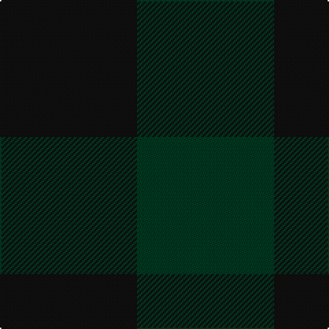

In pattern [GK](/stripes/gk/).

This was sourced from register-of-tartans.  It is a [2 stripe tartan](/stripes/stripes2/).

Original link https://www.tartanregister.gov.uk/tartanDetails.aspx?ref=3537

## Also known as

This cloth is also recorded under:

- Robin Hood/Wilson no.224/Rob Roy Hunting

## Attestations

This cloth appears in 2 source records; the oldest owns this page.

- 01/01/1819 — Robin Hood/Wilson no.224/Rob Roy Hunting (register-of-tartans, [record](https://www.tartanregister.gov.uk/tartanDetails.aspx?ref=3537))
- 1819 — Robin Hood (Fashion) (tartans-authority, [record](http://www.tartansauthority.com/tartan-ferret/display/785/))

## Register references

External register numbers recorded for this tartan.

- Scottish Register of Tartans: [3537](https://www.tartanregister.gov.uk/tartanDetails.aspx?ref=3537)
- Scottish Tartans Authority (ITI): 785
- Scottish Tartans World Register: 785

## Thread count
K/100 DG/100

## Palette
Each colour and the base-6 reference it is a variant of.

| Colour | Shade | Base |
|---|---|---|
| DG | <code style="background-color:#003820;">#003820</code> `oklch(30.0% 0.070 158.3)` <small>#003820</small> | G <code style="background-color:#006100;">#006100</code> |
| K | <code style="background-color:#101010;">#101010</code> `oklch(17.3% 0.000 89.9)` <small>#101010</small> | K <code style="background-color:#000000;">#000000</code> |

# Sample pattern

## Nearest tartans

The nearest existing variants by ΔTartan distance, with this tartan at the top so the swatches line up against it.

ΔTartan

Tartan

Sett

—

<a href="/ttd/edit/#slug=k1dg1~x100">Robin Hood/Wilson no.224/Rob Roy Hunting</a> <a class="nn-out" href="/setts/s2/k1dg1~x100/" title="open its dictionary page">↗</a>

2.28

<a href="/ttd/edit/#slug=n1g1~x130">Hafren (Personal)</a> <a class="nn-out" href="/setts/s2/n1g1~x130/" title="open its dictionary page">↗</a>

2.90

<a href="/ttd/edit/#slug=dg7y6~x2">Wilson's No.219</a> <a class="nn-out" href="/setts/s2/dg7y6~x2/" title="open its dictionary page">↗</a>

2.99

<a href="/ttd/edit/#slug=k1db1~x100">Buffalo Plaid</a> <a class="nn-out" href="/setts/s2/k1db1~x100/" title="open its dictionary page">↗</a>

4.31

<a href="/ttd/edit/#slug=k1g1~x168">MacKillen Hunting</a> <a class="nn-out" href="/setts/s2/k1g1~x168/" title="open its dictionary page">↗</a>

4.70

<a href="/ttd/edit/#slug=k8dg7db8~x2">Glenlyon</a> <a class="nn-out" href="/setts/s3/k8dg7db8~x2/" title="open its dictionary page">↗</a>

4.92

<a href="/ttd/edit/#slug=t1b1~x2">Bruce Special 1985 XXX</a> <a class="nn-out" href="/setts/s2/t1b1~x2/" title="open its dictionary page">↗</a>

4.99

<a href="/ttd/edit/#slug=db1r1~x100">Rob Roy, Blue &amp; Red (Fashion)</a> <a class="nn-out" href="/setts/s2/db1r1~x100/" title="open its dictionary page">↗</a>

4.99

<a href="/ttd/edit/#slug=db1r1~x14">Cairnbulg &amp; Inverllocjy Fisher Plaid</a> <a class="nn-out" href="/setts/s2/db1r1~x14/" title="open its dictionary page">↗</a>

## Neighbour map

Every grey dot is one of 14299 variants placed by the first two principal components of the ΔTartan feature space (44% of its variance). Red is this tartan; blue dots are its nearest — click one to open its page.

<svg viewBox="0 0 640 380" role="img" style="max-width:100%;height:auto;border:1px solid #e0e0e0;border-radius:4px;display:block" xmlns="http://www.w3.org/2000/svg"><image href="/nn/cloud.v1.png" width="640" height="380"/><a href="/setts/s2/n1g1~x130/"><circle cx="306.4" cy="366.0" r="4" fill="#3465a4"><title>Hafren (Personal)</title></circle></a><a href="/setts/s2/dg7y6~x2/"><circle cx="309.7" cy="366.0" r="4" fill="#3465a4"><title>Wilson's No.219</title></circle></a><a href="/setts/s2/k1db1~x100/"><circle cx="288.8" cy="366.0" r="4" fill="#3465a4"><title>Buffalo Plaid</title></circle></a><a href="/setts/s2/k1g1~x168/"><circle cx="224.1" cy="366.0" r="4" fill="#3465a4"><title>MacKillen Hunting</title></circle></a><a href="/setts/s3/k8dg7db8~x2/"><circle cx="110.2" cy="366.0" r="4" fill="#3465a4"><title>Glenlyon</title></circle></a><a href="/setts/s2/t1b1~x2/"><circle cx="396.6" cy="366.0" r="4" fill="#3465a4"><title>Bruce Special 1985 XXX</title></circle></a><a href="/setts/s2/db1r1~x100/"><circle cx="236.5" cy="366.0" r="4" fill="#3465a4"><title>Rob Roy, Blue &amp; Red (Fashion)</title></circle></a><a href="/setts/s2/db1r1~x14/"><circle cx="236.5" cy="366.0" r="4" fill="#3465a4"><title>Cairnbulg &amp; Inverllocjy Fisher Plaid</title></circle></a><circle cx="336.4" cy="366.0" r="5" fill="#c00000"/></svg>

ID: /setts/s2/k1dg1~x100/
