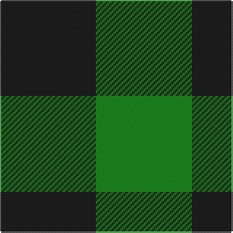

In pattern [GK](/stripes/gk/).

This was sourced from weddslist.  It is a [2 stripe tartan](/stripes/stripes2/).

Original link http://www.weddslist.com/cgi-bin/tartans/pg.pl?source=sts

## Thread count
K/66 G/66

## Palette
Each colour and the base-6 reference it is a variant of.

| Colour | Shade | Base |
|---|---|---|
| G | <code style="background-color:#008000;">#008000</code> `oklch(52.0% 0.177 142.5)` <small>#008000</small> | G <code style="background-color:#006100;">#006100</code> |
| K | <code style="background-color:#000000;">#000000</code> `oklch(0.0% 0.000 0.0)` <small>#000000</small> | K <code style="background-color:#000000;">#000000</code> |

# Sample pattern

## Nearest tartans

The nearest existing variants by ΔTartan distance.

1. [Rob Roy, Black & Tan (Fashion)](/setts/s2/k1y1~x100/) — ΔT 2.12
1. [Shepherd](/setts/s2/k1lr1/) — ΔT 2.15
1. [Robin Hood Fancy Tartan Tartan Number: 785. Earliest known date: 1819 In 1815, members of the Highland Society of London resolved to request of each of the Highland chiefs, a sample of their clan tartan. The swatches were to be signed and sealed in the chief's own hand. This sett is one of those delivered to the Society between 1815 and 1822. See products available Copyright © Blair Urquhart, Comrie, 2015](/setts/s2/g9k8~x2/) — ΔT 2.23
1. [Justus Check (Personal)](/setts/s2/k1ly1~x40/) — ΔT 2.54
1. [Justus Check (Personal)](/setts/s2/k1ly1~x50/) — ΔT 2.54
1. [Shepherd](/setts/s2/k1w1~x15/) — ΔT 2.58
1. [Shepherd Check](/setts/s2/k1w1~x28/) — ΔT 2.58
1. [Wilson's No.172](/setts/s2/k9t8~x2/) — ΔT 2.71
1. [Glen Lyon](/setts/s3/k8g7db8~x2/) — ΔT 2.78
1. [Wilson's, No 116](/setts/s2/g1p1~x16/) — ΔT 2.94

## Neighbour map

Every grey dot is one of 14299 variants placed by the first two principal components of the ΔTartan feature space (44% of its variance). Red is this tartan; blue dots are its nearest — click one to open its page.

<svg viewBox="0 0 640 380" role="img" style="max-width:100%;height:auto;border:1px solid #e0e0e0;border-radius:4px;display:block" xmlns="http://www.w3.org/2000/svg"><image href="/nn/cloud.v1.png" width="640" height="380"/><a href="/setts/s2/k1y1~x100/"><circle cx="161.5" cy="366.0" r="4" fill="#3465a4"><title>Rob Roy, Black &amp; Tan (Fashion)</title></circle></a><a href="/setts/s2/k1lr1/"><circle cx="118.0" cy="366.0" r="4" fill="#3465a4"><title>Shepherd</title></circle></a><a href="/setts/s2/g9k8~x2/"><circle cx="215.5" cy="366.0" r="4" fill="#3465a4"><title>Robin Hood Fancy Tartan Tartan Number: 785. Earliest known date: 1819 In 1815, members of the Highland Society of London resolved to request of each of the Highland chiefs, a sample of their clan tartan. The swatches were to be signed and sealed in the chief's own hand. This sett is one of those delivered to the Society between 1815 and 1822. See products available Copyright © Blair Urquhart, Comrie, 2015</title></circle></a><a href="/setts/s2/k1ly1~x40/"><circle cx="117.6" cy="366.0" r="4" fill="#3465a4"><title>Justus Check (Personal)</title></circle></a><a href="/setts/s2/k1ly1~x50/"><circle cx="117.6" cy="366.0" r="4" fill="#3465a4"><title>Justus Check (Personal)</title></circle></a><a href="/setts/s2/k1w1~x15/"><circle cx="109.6" cy="366.0" r="4" fill="#3465a4"><title>Shepherd</title></circle></a><a href="/setts/s2/k1w1~x28/"><circle cx="109.6" cy="366.0" r="4" fill="#3465a4"><title>Shepherd Check</title></circle></a><a href="/setts/s2/k9t8~x2/"><circle cx="172.0" cy="366.0" r="4" fill="#3465a4"><title>Wilson's No.172</title></circle></a><a href="/setts/s3/k8g7db8~x2/"><circle cx="23.0" cy="366.0" r="4" fill="#3465a4"><title>Glen Lyon</title></circle></a><a href="/setts/s2/g1p1~x16/"><circle cx="160.7" cy="366.0" r="4" fill="#3465a4"><title>Wilson's, No 116</title></circle></a><circle cx="128.2" cy="366.0" r="5" fill="#c00000"/></svg>

ID: /setts/s2/k1g1~x66/
