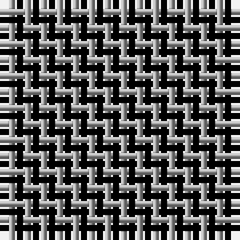

In pattern [KY](/stripes/ky/).

This was sourced from weddslist.  It is a [2 stripe tartan](/stripes/stripes2/).

Original link http://www.weddslist.com/cgi-bin/tartans/pg.pl?source=tinsel

## Attestations

This cloth appears in 2 source records; the oldest owns this page.

- undated — Shepherd (weddslist, [record](http://www.weddslist.com/cgi-bin/tartans/pg.pl?source=tinsel))
- undated — Shepherd (weddslist, [record](http://www.weddslist.com/cgi-bin/tartans/pg.pl?source=x))

## Register references

External register numbers recorded for this tartan.

- Scottish Register of Tartans: [1166](https://www.tartanregister.gov.uk/tartanDetails.aspx?ref=1166)
- Scottish Register of Tartans: [1510](https://www.tartanregister.gov.uk/tartanDetails.aspx?ref=1510)
- Scottish Register of Tartans: [1758](https://www.tartanregister.gov.uk/tartanDetails.aspx?ref=1758)
- Scottish Register of Tartans: [2307](https://www.tartanregister.gov.uk/tartanDetails.aspx?ref=2307)
- Scottish Register of Tartans: [2349](https://www.tartanregister.gov.uk/tartanDetails.aspx?ref=2349)
- Scottish Register of Tartans: [2540](https://www.tartanregister.gov.uk/tartanDetails.aspx?ref=2540)
- Scottish Register of Tartans: [2582](https://www.tartanregister.gov.uk/tartanDetails.aspx?ref=2582)
- Scottish Register of Tartans: [2585](https://www.tartanregister.gov.uk/tartanDetails.aspx?ref=2585)
- Scottish Register of Tartans: [2625](https://www.tartanregister.gov.uk/tartanDetails.aspx?ref=2625)
- Scottish Register of Tartans: [2730](https://www.tartanregister.gov.uk/tartanDetails.aspx?ref=2730)
- Scottish Register of Tartans: [2862](https://www.tartanregister.gov.uk/tartanDetails.aspx?ref=2862)
- Scottish Register of Tartans: [3072](https://www.tartanregister.gov.uk/tartanDetails.aspx?ref=3072)
- Scottish Register of Tartans: [3555](https://www.tartanregister.gov.uk/tartanDetails.aspx?ref=3555)
- Scottish Register of Tartans: [4925](https://www.tartanregister.gov.uk/tartanDetails.aspx?ref=4925)
- Scottish Register of Tartans: [696](https://www.tartanregister.gov.uk/tartanDetails.aspx?ref=696)
- Scottish Register of Tartans: [697](https://www.tartanregister.gov.uk/tartanDetails.aspx?ref=697)
- Scottish Register of Tartans: [982](https://www.tartanregister.gov.uk/tartanDetails.aspx?ref=982)
- Scottish Tartans Authority (ITI): 1277
- Scottish Tartans Authority (ITI): 1429
- Scottish Tartans Authority (ITI): 218
- Scottish Tartans Authority (ITI): 977
- Scottish Tartans World Register: 1042
- Scottish Tartans World Register: 127
- Scottish Tartans World Register: 1277
- Scottish Tartans World Register: 1399
- Scottish Tartans World Register: 1429
- Scottish Tartans World Register: 1593
- Scottish Tartans World Register: 218
- Scottish Tartans World Register: 2218
- Scottish Tartans World Register: 3061
- Scottish Tartans World Register: 441
- Scottish Tartans World Register: 737
- Scottish Tartans World Register: 858
- Scottish Tartans World Register: 864
- Scottish Tartans World Register: 873
- Scottish Tartans World Register: 897
- Scottish Tartans World Register: 977
- Scottish Tartans World Register: 978

## Thread count
K/1 N/1

## Palette
Each colour and its ΔE from the base-6 reference it is a variant of.

| Colour | Shade | Base | ΔE (OKLab) |
|---|---|---|---|
| K | <code style="background-color:#000000;">#000000</code> `#000000` | K <code style="background-color:#000000;">#000000</code> | 0.00 |
| N | <code style="background-color:#AAAAAA;">#AAAAAA</code> `#AAAAAA` | Y <code style="background-color:#F2BF00;">#F2BF00</code> | 0.19 |

# Sample pattern

## Nearest tartans

The nearest existing variants by ΔTartan distance.

1. [Shepherd](/setts/s2/k1w1~x15/) — ΔT 0.73
1. [Shepherd Check](/setts/s2/k1w1~x28/) — ΔT 0.73
1. [Shepherd Check (Universal)](/setts/s2/k1w1~x6/) — ΔT 1.44
1. [Falkirk Tartan](/setts/s2/k1w1~x24/) — ΔT 1.66
1. [Rob Roy, Black & Tan (Fashion)](/setts/s2/k1y1~x100/) — ΔT 1.68
1. [Northumberland](/setts/s3/k1w1k1~x10/) — ΔT 1.73
1. [Wilson's No.172](/setts/s2/k9t8~x2/) — ΔT 1.77
1. [Wilson's, No 116](/setts/s2/g1p1~x16/) — ΔT 1.82
1. [Justus Check (Personal)](/setts/s2/k1ly1~x40/) — ΔT 2.04
1. [Justus Check (Personal)](/setts/s2/k1ly1~x50/) — ΔT 2.04

## Neighbour map

Every grey dot is one of 14299 variants placed by the first two principal components of the ΔTartan feature space (44% of its variance). Red is this tartan; blue dots are its nearest — click one to open its page.

<svg viewBox="0 0 640 380" role="img" style="max-width:100%;height:auto;border:1px solid #e0e0e0;border-radius:4px;display:block" xmlns="http://www.w3.org/2000/svg"><image href="/nn/cloud.v1.png" width="640" height="380"/><a href="/setts/s2/k1w1~x15/"><circle cx="109.6" cy="366.0" r="4" fill="#3465a4"><title>Shepherd</title></circle></a><a href="/setts/s2/k1w1~x28/"><circle cx="109.6" cy="366.0" r="4" fill="#3465a4"><title>Shepherd Check</title></circle></a><a href="/setts/s2/k1w1~x6/"><circle cx="110.8" cy="366.0" r="4" fill="#3465a4"><title>Shepherd Check (Universal)</title></circle></a><a href="/setts/s2/k1w1~x24/"><circle cx="113.8" cy="366.0" r="4" fill="#3465a4"><title>Falkirk Tartan</title></circle></a><a href="/setts/s2/k1y1~x100/"><circle cx="161.5" cy="366.0" r="4" fill="#3465a4"><title>Rob Roy, Black &amp; Tan (Fashion)</title></circle></a><a href="/setts/s3/k1w1k1~x10/"><circle cx="179.6" cy="366.0" r="4" fill="#3465a4"><title>Northumberland</title></circle></a><a href="/setts/s2/k9t8~x2/"><circle cx="172.0" cy="366.0" r="4" fill="#3465a4"><title>Wilson's No.172</title></circle></a><a href="/setts/s2/g1p1~x16/"><circle cx="160.7" cy="366.0" r="4" fill="#3465a4"><title>Wilson's, No 116</title></circle></a><a href="/setts/s2/k1ly1~x40/"><circle cx="117.6" cy="366.0" r="4" fill="#3465a4"><title>Justus Check (Personal)</title></circle></a><a href="/setts/s2/k1ly1~x50/"><circle cx="117.6" cy="366.0" r="4" fill="#3465a4"><title>Justus Check (Personal)</title></circle></a><circle cx="118.0" cy="366.0" r="5" fill="#c00000"/></svg>

ID: /setts/s2/k1lr1/
