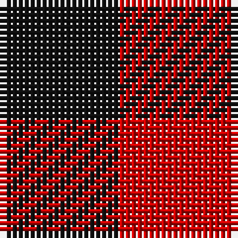

In pattern [KR](/stripes/kr/).

This was sourced from tartans-authority.  It is a [2 stripe tartan](/stripes/stripes2/).

Original link http://www.tartansauthority.com/tartan-ferret/display/7190/

## Also known as

This cloth is also recorded under:

- MacGregor
- Masai Shuka 03
- Rob Roy
- Rob Roy Macgregor

## Thread count
K/20 R/20

## Palette
Each colour and the base-6 reference it is a variant of.

| Colour | Shade | Base |
|---|---|---|
| K | <code style="background-color:#101010;">#101010</code> `oklch(17.3% 0.000 89.9)` <small>#101010</small> | K <code style="background-color:#000000;">#000000</code> |
| R | <code style="background-color:#C80000;">#C80000</code> `oklch(52.3% 0.215 29.2)` <small>#C80000</small> | R <code style="background-color:#CC0000;">#CC0000</code> |

# Sample pattern

## Nearest tartans

The nearest existing variants by ΔTartan distance.

1. [Rob Roy Macgregor](/setts/s2/k1r1~x172/) — ΔT 0.00
1. [MacGregor - 1816 (Red & Black)](/setts/s2/k1r1~x100/) — ΔT 0.00
1. [Rob Roy Clan Tartan Tartan Number: 1504. Earliest known date: 1815 - 16 A specimen of the Rob Roy sett exists in the collection of the Highland Society of London, bearing the Seal of Arms of Sir John MacGregor Murray of MacGregor, Baronet, and signed John M. Murray. The specimens were collected during the period 1815-16. See products available Copyright © Blair Urquhart, Comrie, 2015](/setts/s2/k1r1~x16/) — ΔT 0.00
1. [Rob Roy](/setts/s2/k1r1~x66/) — ΔT 1.16
1. [Rob Roy](/setts/s2/k1r1~x4/) — ΔT 1.16
1. [Rob Roy](/setts/s2/k1r1~x8/) — ΔT 1.19
1. [Glenlyon (District)](/setts/s2/dg1r1~x80/) — ΔT 1.59
1. [Masai Shuka 02 (Artefact)](/setts/s2/db1r1~x20/) — ΔT 1.76
1. [Rob Roy, Black & Tan (Fashion)](/setts/s2/k1y1~x100/) — ΔT 1.95
1. [Moncreiffe (MacLachlan) Clan Tartan Tartan Number: 963. Earliest known date: 1819 Sir Iain Moncreiffe of that Ilk, acquired the MacLachlan old sett for the clan when he became Chief in 1957. Micheil MacDonald writes in his book, 'The Clans of Scotland', "As a result of a long association with Clan Murray, the Moncreiffes traditionally wore the Atholl tartan. But Sir Iain... arranged that Madam MacLachlan of MacLachlan assign to him a 'primitive' pattern of red and green squares which, though no longer favoured by Clan MacLachlan, Sir Iain felt was appropriate to the long history of the Moncreiffes 'before tartan became fashionable in its present form'. See products available Copyright © Blair Urquhart, Comrie, 2015](/setts/s2/r14g13~x2/) — ΔT 2.23

## Neighbour map

Every grey dot is one of 14299 variants placed by the first two principal components of the ΔTartan feature space (44% of its variance). Red is this tartan; blue dots are its nearest — click one to open its page.

<svg viewBox="0 0 640 380" role="img" style="max-width:100%;height:auto;border:1px solid #e0e0e0;border-radius:4px;display:block" xmlns="http://www.w3.org/2000/svg"><image href="/nn/cloud.v1.png" width="640" height="380"/><a href="/setts/s2/k1r1~x172/"><circle cx="170.7" cy="366.0" r="4" fill="#3465a4"><title>Rob Roy Macgregor</title></circle></a><a href="/setts/s2/k1r1~x100/"><circle cx="170.7" cy="366.0" r="4" fill="#3465a4"><title>MacGregor - 1816 (Red &amp; Black)</title></circle></a><a href="/setts/s2/k1r1~x16/"><circle cx="170.7" cy="366.0" r="4" fill="#3465a4"><title>Rob Roy Clan Tartan Tartan Number: 1504. Earliest known date: 1815 - 16 A specimen of the Rob Roy sett exists in the collection of the Highland Society of London, bearing the Seal of Arms of Sir John MacGregor Murray of MacGregor, Baronet, and signed John M. Murray. The specimens were collected during the period 1815-16. See products available Copyright © Blair Urquhart, Comrie, 2015</title></circle></a><a href="/setts/s2/k1r1~x66/"><circle cx="150.2" cy="366.0" r="4" fill="#3465a4"><title>Rob Roy</title></circle></a><a href="/setts/s2/k1r1~x4/"><circle cx="148.4" cy="366.0" r="4" fill="#3465a4"><title>Rob Roy</title></circle></a><a href="/setts/s2/k1r1~x8/"><circle cx="156.3" cy="366.0" r="4" fill="#3465a4"><title>Rob Roy</title></circle></a><a href="/setts/s2/dg1r1~x80/"><circle cx="179.6" cy="366.0" r="4" fill="#3465a4"><title>Glenlyon (District)</title></circle></a><a href="/setts/s2/db1r1~x20/"><circle cx="187.4" cy="366.0" r="4" fill="#3465a4"><title>Masai Shuka 02 (Artefact)</title></circle></a><a href="/setts/s2/k1y1~x100/"><circle cx="161.5" cy="366.0" r="4" fill="#3465a4"><title>Rob Roy, Black &amp; Tan (Fashion)</title></circle></a><a href="/setts/s2/r14g13~x2/"><circle cx="211.4" cy="366.0" r="4" fill="#3465a4"><title>Moncreiffe (MacLachlan) Clan Tartan Tartan Number: 963. Earliest known date: 1819 Sir Iain Moncreiffe of that Ilk, acquired the MacLachlan old sett for the clan when he became Chief in 1957. Micheil MacDonald writes in his book, 'The Clans of Scotland', &quot;As a result of a long association with Clan Murray, the Moncreiffes traditionally wore the Atholl tartan. But Sir Iain... arranged that Madam MacLachlan of MacLachlan assign to him a 'primitive' pattern of red and green squares which, though no longer favoured by Clan MacLachlan, Sir Iain felt was appropriate to the long history of the Moncreiffes 'before tartan became fashionable in its present form'. See products available Copyright © Blair Urquhart, Comrie, 2015</title></circle></a><circle cx="170.7" cy="366.0" r="5" fill="#c00000"/></svg>

ID: /setts/s2/k1r1~x20/
