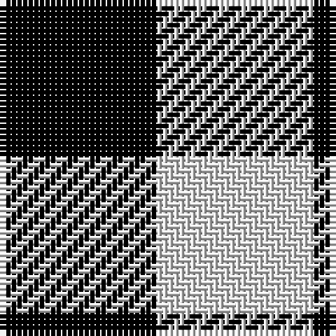

In pattern [KW](/stripes/kw/).

This was sourced from weddslist.  It is a [2 stripe tartan](/stripes/stripes2/).

Original link http://www.weddslist.com/cgi-bin/tartans/pg.pl?source=sts

## Also known as

This cloth is also recorded under:

- Northumberland
- Shepherd Check
- Shepherd Historic

## Thread count
K/28 LN/28

## Palette
Each colour and the base-6 reference it is a variant of.

| Colour | Shade | Base |
|---|---|---|
| K | <code style="background-color:#000000;">#000000</code> `oklch(0.0% 0.000 0.0)` <small>#000000</small> | K <code style="background-color:#000000;">#000000</code> |
| LN | <code style="background-color:#E0E0E0;">#E0E0E0</code> `oklch(90.7% 0.000 89.9)` <small>#E0E0E0</small> | W <code style="background-color:#F7F7F7;">#F7F7F7</code> |

# Sample pattern

## Nearest tartans

The nearest existing variants by ΔTartan distance.

1. [Shepherd](/setts/s2/k1w1~x15/) — ΔT 0.00
1. [Shepherd](/setts/s2/k1lr1/) — ΔT 0.73
1. [Shepherd Check (Universal)](/setts/s2/k1w1~x6/) — ΔT 0.75
1. [Falkirk Tartan](/setts/s2/k1w1~x24/) — ΔT 1.06
1. [Northumberland](/setts/s3/k1w1k1~x10/) — ΔT 1.63
1. [Shepherd or Falkirk](/setts/s4/k1w1~x6/) — ΔT 1.68
1. [Wilson's, No 116](/setts/s2/g1p1~x16/) — ΔT 1.78
1. [Justus Check (Personal)](/setts/s2/k1ly1~x40/) — ΔT 1.79
1. [Justus Check (Personal)](/setts/s2/k1ly1~x50/) — ΔT 1.79
1. [Rob Roy, Black & Tan (Fashion)](/setts/s2/k1y1~x100/) — ΔT 1.97

## Neighbour map

Every grey dot is one of 14299 variants placed by the first two principal components of the ΔTartan feature space (44% of its variance). Red is this tartan; blue dots are its nearest — click one to open its page.

<svg viewBox="0 0 640 380" role="img" style="max-width:100%;height:auto;border:1px solid #e0e0e0;border-radius:4px;display:block" xmlns="http://www.w3.org/2000/svg"><image href="/nn/cloud.v1.png" width="640" height="380"/><a href="/setts/s2/k1w1~x15/"><circle cx="109.6" cy="366.0" r="4" fill="#3465a4"><title>Shepherd</title></circle></a><a href="/setts/s2/k1lr1/"><circle cx="118.0" cy="366.0" r="4" fill="#3465a4"><title>Shepherd</title></circle></a><a href="/setts/s2/k1w1~x6/"><circle cx="110.8" cy="366.0" r="4" fill="#3465a4"><title>Shepherd Check (Universal)</title></circle></a><a href="/setts/s2/k1w1~x24/"><circle cx="113.8" cy="366.0" r="4" fill="#3465a4"><title>Falkirk Tartan</title></circle></a><a href="/setts/s3/k1w1k1~x10/"><circle cx="179.6" cy="366.0" r="4" fill="#3465a4"><title>Northumberland</title></circle></a><a href="/setts/s4/k1w1~x6/"><circle cx="95.8" cy="366.0" r="4" fill="#3465a4"><title>Shepherd or Falkirk</title></circle></a><a href="/setts/s2/g1p1~x16/"><circle cx="160.7" cy="366.0" r="4" fill="#3465a4"><title>Wilson's, No 116</title></circle></a><a href="/setts/s2/k1ly1~x40/"><circle cx="117.6" cy="366.0" r="4" fill="#3465a4"><title>Justus Check (Personal)</title></circle></a><a href="/setts/s2/k1ly1~x50/"><circle cx="117.6" cy="366.0" r="4" fill="#3465a4"><title>Justus Check (Personal)</title></circle></a><a href="/setts/s2/k1y1~x100/"><circle cx="161.5" cy="366.0" r="4" fill="#3465a4"><title>Rob Roy, Black &amp; Tan (Fashion)</title></circle></a><circle cx="109.6" cy="366.0" r="5" fill="#c00000"/></svg>

ID: /setts/s2/k1w1~x28/
