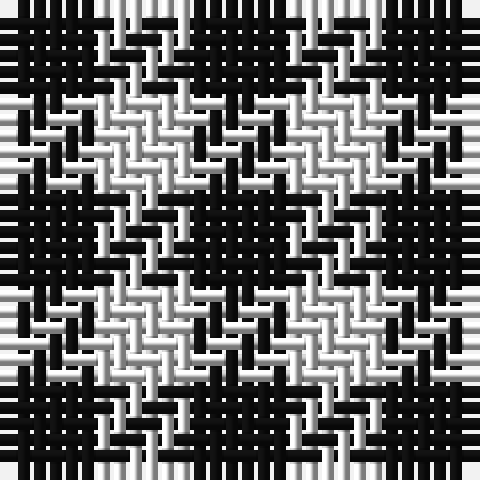

In pattern [KW](/stripes/kw/).

This was sourced from tartans-authority.  It is a [2 stripe tartan](/stripes/stripes2/).

Original link http://www.tartansauthority.com/tartan-ferret/display/1253/

## Also known as

This cloth is also recorded under:

- Northumberland
- Shepherd Check
- Shepherd Historic

## Attestations

This cloth appears in 2 source records; the oldest owns this page.

- 260 AD — Shepherd Check (Universal) (tartans-authority, [record](http://www.tartansauthority.com/tartan-ferret/display/1253/))
- 260 AD — Northumberland (District) (tartans-authority, [record](http://www.tartansauthority.com/tartan-ferret/display/6765/))

## Thread count
K/6 LN/6

## Palette
Each colour and the base-6 reference it is a variant of.

| Colour | Shade | Base |
|---|---|---|
| K | <code style="background-color:#101010;">#101010</code> `oklch(17.3% 0.000 89.9)` <small>#101010</small> | K <code style="background-color:#000000;">#000000</code> |
| LN | <code style="background-color:#E0E0E0;">#E0E0E0</code> `oklch(90.7% 0.000 89.9)` <small>#E0E0E0</small> | W <code style="background-color:#F7F7F7;">#F7F7F7</code> |

# Sample pattern

## Nearest tartans

The nearest existing variants by ΔTartan distance.

1. [Falkirk Tartan](/setts/s2/k1w1~x24/) — ΔT 0.62
1. [Shepherd](/setts/s2/k1w1~x15/) — ΔT 0.75
1. [Shepherd Check](/setts/s2/k1w1~x28/) — ΔT 0.75
1. [Shepherd or Falkirk](/setts/s4/k1w1~x6/) — ΔT 1.44
1. [Shepherd](/setts/s2/k1lr1/) — ΔT 1.44
1. [Shepherd Brown & White (Fashion?)](/setts/s2/dy1lb1~x6/) — ΔT 1.61
1. [Wilson's, No 116](/setts/s2/g1p1~x16/) — ΔT 1.70
1. [Justus Check (Personal)](/setts/s2/k1ly1~x40/) — ΔT 1.77
1. [Justus Check (Personal)](/setts/s2/k1ly1~x50/) — ΔT 1.77
1. [Sillitoe](/setts/s2/db1w1~x20/) — ΔT 1.78

## Neighbour map

Every grey dot is one of 14299 variants placed by the first two principal components of the ΔTartan feature space (44% of its variance). Red is this tartan; blue dots are its nearest — click one to open its page.

<svg viewBox="0 0 640 380" role="img" style="max-width:100%;height:auto;border:1px solid #e0e0e0;border-radius:4px;display:block" xmlns="http://www.w3.org/2000/svg"><image href="/nn/cloud.v1.png" width="640" height="380"/><a href="/setts/s2/k1w1~x24/"><circle cx="113.8" cy="366.0" r="4" fill="#3465a4"><title>Falkirk Tartan</title></circle></a><a href="/setts/s2/k1w1~x15/"><circle cx="109.6" cy="366.0" r="4" fill="#3465a4"><title>Shepherd</title></circle></a><a href="/setts/s2/k1w1~x28/"><circle cx="109.6" cy="366.0" r="4" fill="#3465a4"><title>Shepherd Check</title></circle></a><a href="/setts/s4/k1w1~x6/"><circle cx="95.8" cy="366.0" r="4" fill="#3465a4"><title>Shepherd or Falkirk</title></circle></a><a href="/setts/s2/k1lr1/"><circle cx="118.0" cy="366.0" r="4" fill="#3465a4"><title>Shepherd</title></circle></a><a href="/setts/s2/dy1lb1~x6/"><circle cx="146.1" cy="366.0" r="4" fill="#3465a4"><title>Shepherd Brown &amp; White (Fashion?)</title></circle></a><a href="/setts/s2/g1p1~x16/"><circle cx="160.7" cy="366.0" r="4" fill="#3465a4"><title>Wilson's, No 116</title></circle></a><a href="/setts/s2/k1ly1~x40/"><circle cx="117.6" cy="366.0" r="4" fill="#3465a4"><title>Justus Check (Personal)</title></circle></a><a href="/setts/s2/k1ly1~x50/"><circle cx="117.6" cy="366.0" r="4" fill="#3465a4"><title>Justus Check (Personal)</title></circle></a><a href="/setts/s2/db1w1~x20/"><circle cx="109.5" cy="366.0" r="4" fill="#3465a4"><title>Sillitoe</title></circle></a><circle cx="110.8" cy="366.0" r="5" fill="#c00000"/></svg>

ID: /setts/s2/k1w1~x6/
