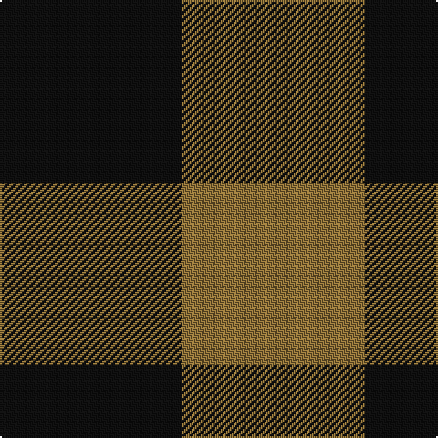

**Bands:** [KG](/stripes/kg/) · **Stripes:** [K Y](/stripes/stripes2/) K Y

This was sourced from tartans-authority.  It is a [2 band tartan](/bands/bands2/).

Original link http://www.tartansauthority.com/tartan-ferret/display/3154/

## Thread count
K/100 LT/100

## Palette
Each colour and its ΔE from the base-6 reference it is a variant of.

| Colour | Shade | Base | ΔE (OKLab) |
|---|---|---|---|
| K | <code style="background-color:#101010;">#101010</code> `#101010` | K <code style="background-color:#000000;">#000000</code> | 0.17 |
| LT | <code style="background-color:#8C7038;">#8C7038</code> `#8C7038` | G <code style="background-color:#006100;">#006100</code> | 0.18 |

# Sample pattern

## Nearest tartans

The nearest existing variants by ΔTartan distance.

1. [Wilson's, No 116](/setts/s2/g1p1~x16/) — ΔT 1.19
1. [Shepherd](/setts/s2/k1lr1/) — ΔT 1.68
1. [Glenlyon (District)](/setts/s2/dg1r1~x80/) — ΔT 1.72
1. [Wilson's No.116 (light)](/setts/s2/y9dp8~x2/) — ΔT 1.81
1. [Moncreiffe](/setts/s2/r1g1~x50/) — ΔT 1.93
1. [Moncrieffe Lachlan (Clan)](/setts/s2/r1g1~x100/) — ΔT 1.93
1. [Justus Check (Personal)](/setts/s2/k1ly1~x40/) — ΔT 1.95
1. [Justus Check (Personal)](/setts/s2/k1ly1~x50/) — ΔT 1.95
1. [Rob Roy Macgregor](/setts/s2/k1r1~x172/) — ΔT 1.95
1. [MacGregor - 1816 (Red & Black)](/setts/s2/k1r1~x100/) — ΔT 1.95

## Neighbour map

Every grey dot is one of 14299 variants placed by the first two principal components of the ΔTartan feature space (44% of its variance). Red is this tartan; blue dots are its nearest — click one to open its page.

<svg viewBox="0 0 640 380" role="img" style="max-width:100%;height:auto;border:1px solid #e0e0e0;border-radius:4px;display:block" xmlns="http://www.w3.org/2000/svg"><image href="/nn/cloud.v1.png" width="640" height="380"/><a href="/setts/s2/g1p1~x16/"><circle cx="160.7" cy="366.0" r="4" fill="#3465a4"><title>Wilson's, No 116</title></circle></a><a href="/setts/s2/k1lr1/"><circle cx="118.0" cy="366.0" r="4" fill="#3465a4"><title>Shepherd</title></circle></a><a href="/setts/s2/dg1r1~x80/"><circle cx="179.6" cy="366.0" r="4" fill="#3465a4"><title>Glenlyon (District)</title></circle></a><a href="/setts/s2/y9dp8~x2/"><circle cx="234.1" cy="366.0" r="4" fill="#3465a4"><title>Wilson's No.116 (light)</title></circle></a><a href="/setts/s2/r1g1~x50/"><circle cx="192.0" cy="366.0" r="4" fill="#3465a4"><title>Moncreiffe</title></circle></a><a href="/setts/s2/r1g1~x100/"><circle cx="192.0" cy="366.0" r="4" fill="#3465a4"><title>Moncrieffe Lachlan (Clan)</title></circle></a><a href="/setts/s2/k1ly1~x40/"><circle cx="117.6" cy="366.0" r="4" fill="#3465a4"><title>Justus Check (Personal)</title></circle></a><a href="/setts/s2/k1ly1~x50/"><circle cx="117.6" cy="366.0" r="4" fill="#3465a4"><title>Justus Check (Personal)</title></circle></a><a href="/setts/s2/k1r1~x172/"><circle cx="170.7" cy="366.0" r="4" fill="#3465a4"><title>Rob Roy Macgregor</title></circle></a><a href="/setts/s2/k1r1~x100/"><circle cx="170.7" cy="366.0" r="4" fill="#3465a4"><title>MacGregor - 1816 (Red &amp; Black)</title></circle></a><circle cx="161.5" cy="366.0" r="5" fill="#c00000"/></svg>

ID: /setts/s2/k1y1~x100/
