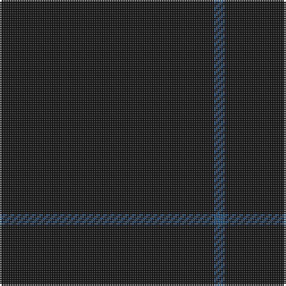

In pattern [BK](/stripes/bk/).

This was sourced from tartans-authority.  It is a [2 stripe tartan](/stripes/stripes2/).

Original link http://www.tartansauthority.com/tartan-ferret/display/6680/

## Thread count
K/120 B/6

## Palette
Each colour and the base-6 reference it is a variant of.

| Colour | Shade | Base |
|---|---|---|
| B | <code style="background-color:#244C74;">#244C74</code> `oklch(40.8% 0.081 250.5)` <small>#244C74</small> | B <code style="background-color:#2A418A;">#2A418A</code> |
| K | <code style="background-color:#101010;">#101010</code> `oklch(17.3% 0.000 89.9)` <small>#101010</small> | K <code style="background-color:#000000;">#000000</code> |

# Sample pattern

## Nearest tartans

The nearest existing variants by ΔTartan distance, with this tartan at the top so the swatches line up against it.

ΔTartan

Tartan

Sett

—

<a href="/ttd/edit/#slug=k20n1~x6">Black Shadow (Fashion)</a> <a class="nn-out" href="/setts/s2/k20n1~x6/" title="open its dictionary page">↗</a>

3.20

<a href="/ttd/edit/#slug=k80r1k60~x2">Bodog</a> <a class="nn-out" href="/setts/s3/k80r1k60~x2/" title="open its dictionary page">↗</a>

3.22

<a href="/ttd/edit/#slug=dg20r1dg4~x3">Castle Fraser Check</a> <a class="nn-out" href="/setts/s3/dg20r1dg4~x3/" title="open its dictionary page">↗</a>

3.52

<a href="/ttd/edit/#slug=k50r1dt3dp1~x4">Alich (Personal)</a> <a class="nn-out" href="/setts/s4/k50r1dt3dp1~x4/" title="open its dictionary page">↗</a>

3.64

<a href="/ttd/edit/#slug=k50r1db3dp1~x4">Alich (Personal)</a> <a class="nn-out" href="/setts/s4/k50r1db3dp1~x4/" title="open its dictionary page">↗</a>

3.69

<a href="/ttd/edit/#slug=db12k1~x10">Staines</a> <a class="nn-out" href="/setts/s2/db12k1~x10/" title="open its dictionary page">↗</a>

3.69

<a href="/ttd/edit/#slug=k4dt1k3~x10">Ben Dubh (Fashion)</a> <a class="nn-out" href="/setts/s3/k4dt1k3~x10/" title="open its dictionary page">↗</a>

3.80

<a href="/ttd/edit/#slug=dg22k3dg25k4~x2">Campbell Simpson</a> <a class="nn-out" href="/setts/s4/dg22k3dg25k4~x2/" title="open its dictionary page">↗</a>

4.01

<a href="/ttd/edit/#slug=k99r5k4r3k2y1~x2">Allt Dubh (Black Burn)</a> <a class="nn-out" href="/setts/s6/k99r5k4r3k2y1~x2/" title="open its dictionary page">↗</a>

4.12

<a href="/ttd/edit/#slug=dy10ly1dy30y3~x4">Pasteur</a> <a class="nn-out" href="/setts/s4/dy10ly1dy30y3~x4/" title="open its dictionary page">↗</a>

4.23

<a href="/ttd/edit/#slug=dg60r2dg8r1dg5k2">St. David's (District)</a> <a class="nn-out" href="/setts/s6/dg60r2dg8r1dg5k2/" title="open its dictionary page">↗</a>

## Neighbour map

Every grey dot is one of 14299 variants placed by the first two principal components of the ΔTartan feature space (44% of its variance). Red is this tartan; blue dots are its nearest — click one to open its page.

<svg viewBox="0 0 640 380" role="img" style="max-width:100%;height:auto;border:1px solid #e0e0e0;border-radius:4px;display:block" xmlns="http://www.w3.org/2000/svg"><image href="/nn/cloud.v1.png" width="640" height="380"/><a href="/setts/s3/k80r1k60~x2/"><circle cx="626.0" cy="363.4" r="4" fill="#3465a4"><title>Bodog</title></circle></a><a href="/setts/s3/dg20r1dg4~x3/"><circle cx="626.0" cy="326.5" r="4" fill="#3465a4"><title>Castle Fraser Check</title></circle></a><a href="/setts/s4/k50r1dt3dp1~x4/"><circle cx="626.0" cy="217.2" r="4" fill="#3465a4"><title>Alich (Personal)</title></circle></a><a href="/setts/s4/k50r1db3dp1~x4/"><circle cx="626.0" cy="213.5" r="4" fill="#3465a4"><title>Alich (Personal)</title></circle></a><a href="/setts/s2/db12k1~x10/"><circle cx="626.0" cy="366.0" r="4" fill="#3465a4"><title>Staines</title></circle></a><a href="/setts/s3/k4dt1k3~x10/"><circle cx="626.0" cy="366.0" r="4" fill="#3465a4"><title>Ben Dubh (Fashion)</title></circle></a><a href="/setts/s4/dg22k3dg25k4~x2/"><circle cx="626.0" cy="362.6" r="4" fill="#3465a4"><title>Campbell Simpson</title></circle></a><a href="/setts/s6/k99r5k4r3k2y1~x2/"><circle cx="626.0" cy="193.7" r="4" fill="#3465a4"><title>Allt Dubh (Black Burn)</title></circle></a><a href="/setts/s4/dy10ly1dy30y3~x4/"><circle cx="626.0" cy="239.0" r="4" fill="#3465a4"><title>Pasteur</title></circle></a><a href="/setts/s6/dg60r2dg8r1dg5k2/"><circle cx="626.0" cy="200.1" r="4" fill="#3465a4"><title>St. David's (District)</title></circle></a><circle cx="626.0" cy="366.0" r="5" fill="#c00000"/></svg>

ID: /setts/s2/k20n1~x6/
