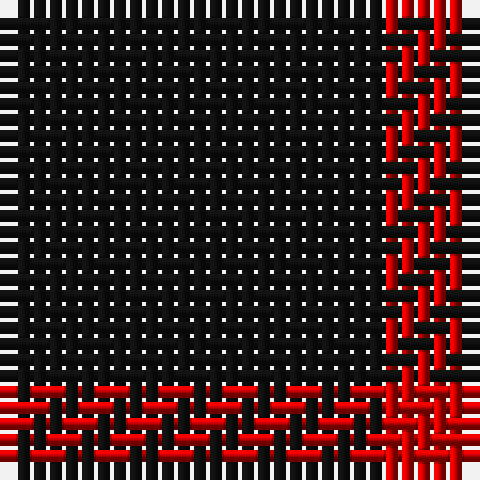

In pattern [KR](/patterns/kr/).

This was sourced from house-of-tartan.  It is a [2 stripes tartan](/stripes/stripes2/).

Original link http://www.house-of-tartan.scotland.net/house/TartanViewjs.asp?colr=Def&tnam=1189

## Thread count
K/24 R/6

## Palette
Each colour and its ΔE from the base-6 reference it is a variant of.

| Colour | Shade | Base | ΔE (OKLab) |
|---|---|---|---|
| K | <code style="background-color:#101010;">#101010</code> `#101010` | K <code style="background-color:#000000;">#000000</code> | 0.17 |
| R | <code style="background-color:#C80000;">#C80000</code> `#C80000` | R <code style="background-color:#C80000;">#C80000</code> | 0.00 |

# Sample pattern

## Nearest tartans

The nearest existing variants by ΔTartan distance.

1. [St Kilda](/setts/s2/k144r36-k101010-rc80000/) — ΔT 0.00
1. [St Kilda](/setts/s2/k24r6-k000000-rc00000/) — ΔT 1.58
1. [Red Watch](/setts/s3/k40r12k4-k000000-r780028/) — ΔT 2.33
1. [Justus #2 (Personal)](/setts/s4/k100y20k20y20-k101010-yd09800/) — ΔT 2.48
1. [Batson (Personal)](/setts/s3/k138r28y10-k101010-rc80000-ye8c000/) — ΔT 2.73
1. [Leonard Hunting (Name)](/setts/s4/k120b20k40b36-b6c006c-k101010/) — ΔT 2.78
1. [Romsdal Tresfjord](/setts/s5/k4r8k14r2k4-k101010-r880000/) — ΔT 2.90
1. [Wcwm 9275-1333-2](/setts/s4/k40r6k40r40-k101010-r880000/) — ΔT 2.92
1. [Unidentified Kirtle](/setts/s5/k55r18k4r18k38-k101010-rdc0000/) — ΔT 2.93
1. [Justus](/setts/s4/k60y12k12y12-k000000-yf0c000/) — ΔT 2.97

## Neighbour map

Every grey dot is one of 15726 variants placed by the first two principal components of the ΔTartan feature space (44% of its variance). Red is this tartan; blue dots are its nearest — click one to open its page.

<svg viewBox="0 0 640 380" role="img" style="max-width:100%;height:auto;border:1px solid #e0e0e0;border-radius:4px;display:block" xmlns="http://www.w3.org/2000/svg"><image href="/nn/cloud.v1.png" width="640" height="380"/><a href="/setts/s2/k144r36-k101010-rc80000/"><circle cx="510.4" cy="365.8" r="4" fill="#3465a4"><title>St Kilda</title></circle></a><a href="/setts/s2/k24r6-k000000-rc00000/"><circle cx="486.0" cy="362.4" r="4" fill="#3465a4"><title>St Kilda</title></circle></a><a href="/setts/s3/k40r12k4-k000000-r780028/"><circle cx="552.3" cy="305.7" r="4" fill="#3465a4"><title>Red Watch</title></circle></a><a href="/setts/s4/k100y20k20y20-k101010-yd09800/"><circle cx="445.7" cy="285.6" r="4" fill="#3465a4"><title>Justus #2 (Personal)</title></circle></a><a href="/setts/s3/k138r28y10-k101010-rc80000-ye8c000/"><circle cx="516.0" cy="245.8" r="4" fill="#3465a4"><title>Batson (Personal)</title></circle></a><a href="/setts/s4/k120b20k40b36-b6c006c-k101010/"><circle cx="532.3" cy="334.3" r="4" fill="#3465a4"><title>Leonard Hunting (Name)</title></circle></a><a href="/setts/s5/k4r8k14r2k4-k101010-r880000/"><circle cx="482.7" cy="314.4" r="4" fill="#3465a4"><title>Romsdal Tresfjord</title></circle></a><a href="/setts/s4/k40r6k40r40-k101010-r880000/"><circle cx="430.4" cy="344.2" r="4" fill="#3465a4"><title>Wcwm 9275-1333-2</title></circle></a><a href="/setts/s5/k55r18k4r18k38-k101010-rdc0000/"><circle cx="471.8" cy="260.9" r="4" fill="#3465a4"><title>Unidentified Kirtle</title></circle></a><a href="/setts/s4/k60y12k12y12-k000000-yf0c000/"><circle cx="428.2" cy="284.1" r="4" fill="#3465a4"><title>Justus</title></circle></a><circle cx="510.4" cy="365.8" r="5" fill="#c00000"/></svg>

ID: /setts/s2/k24r6-k101010-rc80000/
