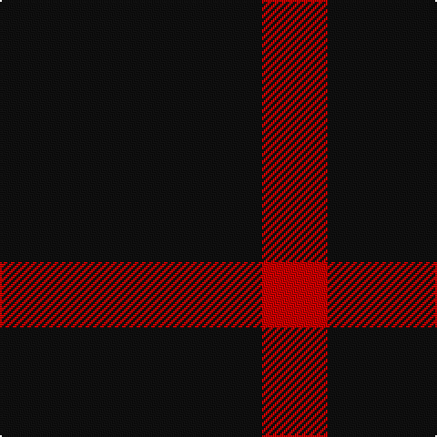

**Bands:** [KR](/stripes/kr/) · **Stripes:** [K R](/stripes/stripes2/) K R

This was sourced from register-of-tartans.  It is a [2 band tartan](/bands/bands2/).

Original link https://www.tartanregister.gov.uk/tartanDetails.aspx?ref=3896

## Attestations

This cloth appears in 2 source records; the oldest owns this page.

- 01/01/1900 — St Kilda (register-of-tartans, [record](https://www.tartanregister.gov.uk/tartanDetails.aspx?ref=3896))
- pre 2002 — St. Kilda (District) (tartans-authority, [record](http://www.tartansauthority.com/tartan-ferret/display/1189/))

## Register references

External register numbers recorded for this tartan.

- Scottish Register of Tartans: [3896](https://www.tartanregister.gov.uk/tartanDetails.aspx?ref=3896)
- Scottish Tartans Authority (ITI): 1189
- Scottish Tartans World Register: 1189

## Variants

Other setts woven to the same stripe pattern.

- [MacGregor - 1816 (Red & Black)](/setts/s2/k1r1~x100/)
- [Masai Shuka 03 (Artefact)](/setts/s2/k1r1~x20/)
- [Rob Roy](/setts/s2/k1r1~x4/)
- [Rob Roy](/setts/s2/k1r1~x66/)
- [Rob Roy](/setts/s2/k1r1~x8/)
- [Rob Roy Clan Tartan Tartan Number: 1504. Earliest known date: 1815 - 16 A specimen of the Rob Roy sett exists in the collection of the Highland Society of London, bearing the Seal of Arms of Sir John MacGregor Murray of MacGregor, Baronet, and signed John M. Murray. The specimens were collected during the period 1815-16. See products available Copyright © Blair Urquhart, Comrie, 2015](/setts/s2/k1r1~x16/)
- [Rob Roy Macgregor](/setts/s2/k1r1~x172/)
- [St Kilda](/setts/s2/k4r1~x6/)
- [Wilson's No.234](/setts/s2/r8k3~x2/)

## Thread count
K/144 R/36

## Palette
Each colour and its ΔE from the base-6 reference it is a variant of.

| Colour | Shade | Base | ΔE (OKLab) |
|---|---|---|---|
| K | <code style="background-color:#101010;">#101010</code> `#101010` | K <code style="background-color:#000000;">#000000</code> | 0.17 |
| R | <code style="background-color:#C80000;">#C80000</code> `#C80000` | R <code style="background-color:#CC0000;">#CC0000</code> | 0.01 |

# Sample pattern

## Nearest tartans

The nearest existing variants by ΔTartan distance.

1. [St Kilda](/setts/s2/k4r1~x6/) — ΔT 1.59
1. [Red Watch](/setts/s3/k10r3k1~x4/) — ΔT 2.33
1. [Justus #2 (Personal)](/setts/s4/k5lo1k1lo1~x20/) — ΔT 2.49
1. [Batson (Personal)](/setts/s3/k69r14ly5~x2/) — ΔT 2.74
1. [Leonard Hunting (Name)](/setts/s4/k30dp5k10dp9~x4/) — ΔT 2.81
1. [Romsdal Tresfjord](/setts/s5/k2r4k7r1k2~x2/) — ΔT 2.91
1. [Unidentified Kirtle](/setts/s5/k55r18k4r18k38/) — ΔT 2.93
1. [Wcwm 9275-1333-2](/setts/s4/k20r3k20r20~x2/) — ΔT 2.94
1. [Buie](/setts/s3/m18k3m2~x4/) — ΔT 2.98
1. [Justus](/setts/s4/k5ly1k1ly1~x12/) — ΔT 2.98

## Neighbour map

Every grey dot is one of 14313 variants placed by the first two principal components of the ΔTartan feature space (44% of its variance). Red is this tartan; blue dots are its nearest — click one to open its page.

<svg viewBox="0 0 640 380" role="img" style="max-width:100%;height:auto;border:1px solid #e0e0e0;border-radius:4px;display:block" xmlns="http://www.w3.org/2000/svg"><image href="/nn/cloud.v1.png" width="640" height="380"/><a href="/setts/s2/k4r1~x6/"><circle cx="481.8" cy="361.5" r="4" fill="#3465a4"><title>St Kilda</title></circle></a><a href="/setts/s3/k10r3k1~x4/"><circle cx="550.4" cy="308.2" r="4" fill="#3465a4"><title>Red Watch</title></circle></a><a href="/setts/s4/k5lo1k1lo1~x20/"><circle cx="443.5" cy="284.1" r="4" fill="#3465a4"><title>Justus #2 (Personal)</title></circle></a><a href="/setts/s3/k69r14ly5~x2/"><circle cx="514.5" cy="245.5" r="4" fill="#3465a4"><title>Batson (Personal)</title></circle></a><a href="/setts/s4/k30dp5k10dp9~x4/"><circle cx="530.7" cy="340.1" r="4" fill="#3465a4"><title>Leonard Hunting (Name)</title></circle></a><a href="/setts/s5/k2r4k7r1k2~x2/"><circle cx="481.0" cy="318.9" r="4" fill="#3465a4"><title>Romsdal Tresfjord</title></circle></a><a href="/setts/s5/k55r18k4r18k38/"><circle cx="469.7" cy="260.3" r="4" fill="#3465a4"><title>Unidentified Kirtle</title></circle></a><a href="/setts/s4/k20r3k20r20~x2/"><circle cx="427.8" cy="347.9" r="4" fill="#3465a4"><title>Wcwm 9275-1333-2</title></circle></a><a href="/setts/s3/m18k3m2~x4/"><circle cx="626.0" cy="281.5" r="4" fill="#3465a4"><title>Buie</title></circle></a><a href="/setts/s4/k5ly1k1ly1~x12/"><circle cx="426.4" cy="282.0" r="4" fill="#3465a4"><title>Justus</title></circle></a><circle cx="505.9" cy="366.0" r="5" fill="#c00000"/></svg>

ID: /setts/s2/k4r1~x36/
