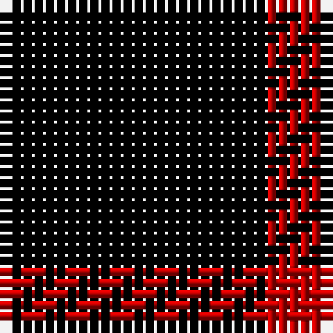

This page is one **sett** — a single exact thread-count. It belongs to the [tartan](/tartans/k4r1/)
(the same proportion at any scale), whose colour order is pattern [KR](/stripes/kr/).

Sourced from weddslist.  It is a [2 stripe tartan](/stripes/stripes2/).

Original link http://www.weddslist.com/cgi-bin/tartans/pg.pl?source=sts

## Also known as

This cloth is also recorded under:

- St. Kilda

2 attestations — the source records this cloth was collapsed from (oldest owns this page)

<ul>
<li>undated — St Kilda (weddslist, <a href="http://www.weddslist.com/cgi-bin/tartans/pg.pl?source=sts">record</a>)</li>
<li>undated — St Kilda District Tartan Tartan Number: 1189. Earliest known date: pre 2003 Reconstructed by Dr Phil Smith from a fragment in the Royal Museum of Antiquities late of Queen Street, Edinburgh. Sample in Glasgow City Museum. No other details. See products available Copyright © Blair Urquhart, Comrie, 2015 (house-of-tartan, <a href="http://www.house-of-tartan.scotland.net/house/TartanViewjs.asp?colr=Def&tnam=1189">record</a>)</li>
</ul>

## Thread count
K/24 R/6

## Palette

Palette: <strong>Ingles Buchan</strong> <small style="color:#888">(1 of 2 colours)</small>
<table><thead><tr><th>Colour</th><th>Threads</th><th>Shade</th><th>Base</th><th>OKLCh</th></tr></thead><tbody><tr><td>K/</td><td style="text-align:right;font-variant-numeric:tabular-nums">24</td><td><code style="background-color:#000000;">#000000</code> <small style="color:#888">#000000</small></td><td>K <code style="background-color:#000000;">#000000</code></td><td><small style="color:#888">oklch(0.0% 0.000 0.0)</small></td></tr><tr><td>R/</td><td style="text-align:right;font-variant-numeric:tabular-nums">6</td><td><code style="background-color:#C00000;">#C00000</code> <small style="color:#888">#C00000</small></td><td>R <code style="background-color:#CC0000;">#CC0000</code></td><td><small style="color:#888">oklch(50.7% 0.208 29.2)</small></td></tr></tbody></table>

# Sample pattern

## Nearest tartans

The nearest existing variants by ΔTartan distance, with this tartan at the top so the swatches line up against it.

ΔTartan

Tartan

Sett

—

<a href="/ttd/edit/#slug=k4r1~x6">St Kilda</a> <a class="nn-out" href="/setts/s2/k4r1~x6/" title="open its dictionary page">↗</a>

1.59

<a href="/ttd/edit/#slug=k4r1~x36">St Kilda</a> <a class="nn-out" href="/setts/s2/k4r1~x36/" title="open its dictionary page">↗</a>

2.19

<a href="/ttd/edit/#slug=k10r3k1~x4">Red Watch</a> <a class="nn-out" href="/setts/s3/k10r3k1~x4/" title="open its dictionary page">↗</a>

2.51

<a href="/setts/s4/k5ly1k1~x12/">Justus</a>

2.69

<a href="/setts/s4/k5lo1k1~x20/">Justus #2 (Personal)</a>

2.96

<a href="/ttd/edit/#slug=k69r14ly5~x2">Batson (Personal)</a> <a class="nn-out" href="/setts/s3/k69r14ly5~x2/" title="open its dictionary page">↗</a>

2.98

<a href="/ttd/edit/#slug=k2ri4k7r1k1~x2">Romsdal, Tresfjord</a> <a class="nn-out" href="/setts/s5/k2ri4k7r1k1~x2/" title="open its dictionary page">↗</a>

3.21

<a href="/ttd/edit/#slug=k55r18k4r18k38">Unidentified Kirtle</a> <a class="nn-out" href="/setts/s5/k55r18k4r18k38/" title="open its dictionary page">↗</a>

3.34

<a href="/ttd/edit/#slug=k46o7k8w20~x2">Lords, of Skye</a> <a class="nn-out" href="/setts/s4/k46o7k8w20~x2/" title="open its dictionary page">↗</a>

3.36

<a href="/ttd/edit/#slug=k8ly1k1r1k4db1~x12">Justus</a> <a class="nn-out" href="/setts/s6/k8ly1k1r1k4db1~x12/" title="open its dictionary page">↗</a>

3.38

<a href="/ttd/edit/#slug=k21lb2k5lb9k13g2~x4">New Zealand (2000)</a> <a class="nn-out" href="/setts/s6/k21lb2k5lb9k13g2~x4/" title="open its dictionary page">↗</a>

## Neighbour map

Every grey dot is one of 14359 variants placed by the first two principal components of the ΔTartan feature space (44% of its variance). Red is this tartan; blue dots are its nearest — click one to open its page.

<svg viewBox="0 0 640 380" role="img" style="max-width:100%;height:auto;border:1px solid #e0e0e0;border-radius:4px;display:block" xmlns="http://www.w3.org/2000/svg"><image href="/nn/cloud.v1.png" width="640" height="380"/><a href="/setts/s2/k4r1~x36/"><circle cx="505.2" cy="366.0" r="4" fill="#3465a4"><title>St Kilda</title></circle></a><a href="/setts/s3/k10r3k1~x4/"><circle cx="550.0" cy="309.0" r="4" fill="#3465a4"><title>Red Watch</title></circle></a><a href="/setts/s4/k5ly1k1~x12/"><circle cx="425.6" cy="282.9" r="4" fill="#3465a4"><title>Justus</title></circle></a><a href="/setts/s4/k5lo1k1~x20/"><circle cx="442.6" cy="284.9" r="4" fill="#3465a4"><title>Justus #2 (Personal)</title></circle></a><a href="/setts/s3/k69r14ly5~x2/"><circle cx="513.4" cy="246.0" r="4" fill="#3465a4"><title>Batson (Personal)</title></circle></a><a href="/setts/s5/k2ri4k7r1k1~x2/"><circle cx="386.9" cy="267.8" r="4" fill="#3465a4"><title>Romsdal, Tresfjord</title></circle></a><a href="/setts/s5/k55r18k4r18k38/"><circle cx="468.6" cy="261.0" r="4" fill="#3465a4"><title>Unidentified Kirtle</title></circle></a><a href="/setts/s4/k46o7k8w20~x2/"><circle cx="336.8" cy="257.5" r="4" fill="#3465a4"><title>Lords, of Skye</title></circle></a><a href="/setts/s6/k8ly1k1r1k4db1~x12/"><circle cx="471.7" cy="226.3" r="4" fill="#3465a4"><title>Justus</title></circle></a><a href="/setts/s6/k21lb2k5lb9k13g2~x4/"><circle cx="415.2" cy="235.1" r="4" fill="#3465a4"><title>New Zealand (2000)</title></circle></a><circle cx="481.4" cy="362.7" r="5" fill="#c00000"/></svg>

ID: /setts/s2/k4r1~x6/
