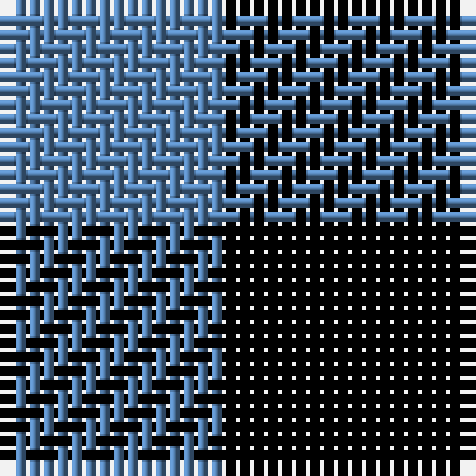

In pattern [BK](/patterns/bk/).

This was sourced from weddslist.  It is a [2 stripes tartan](/stripes/stripes2/).

Original link http://www.weddslist.com/cgi-bin/tartans/pg.pl?source=sts

## Thread count
B/16 K/18

## Palette
Each colour and its ΔE from the base-6 reference it is a variant of.

| Colour | Shade | Base | ΔE (OKLab) |
|---|---|---|---|
| B | <code style="background-color:#5480B0;">#5480B0</code> `#5480B0` | B <code style="background-color:#2A418A;">#2A418A</code> | 0.19 |
| K | <code style="background-color:#000000;">#000000</code> `#000000` | K <code style="background-color:#000000;">#000000</code> | 0.00 |

# Sample pattern

## Nearest tartans

The nearest existing variants by ΔTartan distance.

1. [Wilson's No.172](/setts/s2/k9b8~b2888c4-k101010~x2/) — ΔT 1.17
1. [Shepherd](/setts/s2/k1y1~k000000-yaaaaaa/) — ΔT 1.39
1. [Shepherd](/setts/s2/k1w1~k000000-we0e0e0~x15/) — ΔT 1.92
1. [Shepherd Check](/setts/s2/k1w1~k000000-we0e0e0~x28/) — ΔT 1.92
1. [Rob Roy, Black & Tan (Fashion)](/setts/s2/g1k1~g8c7038-k101010~x100/) — ΔT 2.29
1. [Northumberland](/setts/s3/k1w1k1~k101010-wf8f8f8~x10/) — ΔT 2.31
1. [Robin Hood / Rob Roy hunting](/setts/s2/g1k1~g008000-k000000~x66/) — ΔT 2.40
1. [Wilson's, No 116](/setts/s2/b1g1~b800080-g008000~x16/) — ΔT 2.41
1. [Shepherd Check (Universal)](/setts/s2/k1w1~k101010-we0e0e0~x6/) — ΔT 2.50
1. [Shepherd Historic Tartan Tartan Number: 1253. Earliest known date: 250 A.D. The Falkirk Tartan. An ornamental twill weave check of natural light and dark wool was discovered at Falkirk in the neck of a jar containing Roman coins. The find is thought to have been buried about 260 A.D. The black and white check is woven today as the Shepherd tartan. See products available Copyright © Blair Urquhart, Comrie, 2015](/setts/s2/k1w1~k101010-we0e0e0~x15/) — ΔT 2.50

## Neighbour map

Every grey dot is one of 15726 variants placed by the first two principal components of the ΔTartan feature space (44% of its variance). Red is this tartan; blue dots are its nearest — click one to open its page.

<svg viewBox="0 0 640 380" role="img" style="max-width:100%;height:auto;border:1px solid #e0e0e0;border-radius:4px;display:block" xmlns="http://www.w3.org/2000/svg"><image href="/nn/cloud.v1.png" width="640" height="380"/><a href="/setts/s2/k9b8~b2888c4-k101010~x2/"><circle cx="169.0" cy="366.0" r="4" fill="#3465a4"><title>Wilson's No.172</title></circle></a><a href="/setts/s2/k1y1~k000000-yaaaaaa/"><circle cx="115.6" cy="366.0" r="4" fill="#3465a4"><title>Shepherd</title></circle></a><a href="/setts/s2/k1w1~k000000-we0e0e0~x15/"><circle cx="107.4" cy="366.0" r="4" fill="#3465a4"><title>Shepherd</title></circle></a><a href="/setts/s2/k1w1~k000000-we0e0e0~x28/"><circle cx="107.4" cy="366.0" r="4" fill="#3465a4"><title>Shepherd Check</title></circle></a><a href="/setts/s2/g1k1~g8c7038-k101010~x100/"><circle cx="160.0" cy="366.0" r="4" fill="#3465a4"><title>Rob Roy, Black &amp; Tan (Fashion)</title></circle></a><a href="/setts/s3/k1w1k1~k101010-wf8f8f8~x10/"><circle cx="177.9" cy="366.0" r="4" fill="#3465a4"><title>Northumberland</title></circle></a><a href="/setts/s2/g1k1~g008000-k000000~x66/"><circle cx="125.1" cy="366.0" r="4" fill="#3465a4"><title>Robin Hood / Rob Roy hunting</title></circle></a><a href="/setts/s2/b1g1~b800080-g008000~x16/"><circle cx="159.4" cy="366.0" r="4" fill="#3465a4"><title>Wilson's, No 116</title></circle></a><a href="/setts/s2/k1w1~k101010-we0e0e0~x6/"><circle cx="108.8" cy="366.0" r="4" fill="#3465a4"><title>Shepherd Check (Universal)</title></circle></a><a href="/setts/s2/k1w1~k101010-we0e0e0~x15/"><circle cx="108.8" cy="366.0" r="4" fill="#3465a4"><title>Shepherd Historic Tartan Tartan Number: 1253. Earliest known date: 250 A.D. The Falkirk Tartan. An ornamental twill weave check of natural light and dark wool was discovered at Falkirk in the neck of a jar containing Roman coins. The find is thought to have been buried about 260 A.D. The black and white check is woven today as the Shepherd tartan. See products available Copyright © Blair Urquhart, Comrie, 2015</title></circle></a><circle cx="154.6" cy="366.0" r="5" fill="#c00000"/></svg>

ID: /setts/s2/k9b8~b5480b0-k000000~x2/
