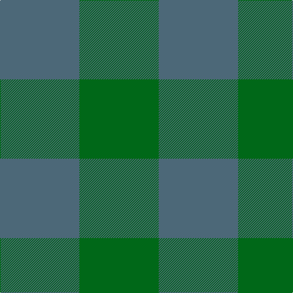

In pattern [BG](/stripes/bg/).

This was sourced from register-of-tartans.  It is a [2 stripe tartan](/stripes/stripes2/).

Original link https://www.tartanregister.gov.uk/tartanDetails.aspx?ref=1567

## Attestations

This cloth appears in 2 source records; the oldest owns this page.

- 01/01/1986 — Hafren (Personal) (register-of-tartans, [record](https://www.tartanregister.gov.uk/tartanDetails.aspx?ref=1567))
- 1986-1993 — Hafren (Personal) (tartans-authority, [record](http://www.tartansauthority.com/tartan-ferret/display/7073/))

## Register references

External register numbers recorded for this tartan.

- Scottish Register of Tartans: [1567](https://www.tartanregister.gov.uk/tartanDetails.aspx?ref=1567)
- Scottish Tartans Authority (ITI): 7073

## Thread count
N/130 G/130

## Palette
Each colour and its ΔE from the base-6 reference it is a variant of.

| Colour | Shade | Base | ΔE (OKLab) |
|---|---|---|---|
| G | <code style="background-color:#006818;">#006818</code> `#006818` | G <code style="background-color:#006100;">#006100</code> | 0.02 |
| N | <code style="background-color:#4C6878;">#4C6878</code> `#4C6878` | B <code style="background-color:#2A418A;">#2A418A</code> | 0.14 |

# Sample pattern

## Nearest tartans

The nearest existing variants by ΔTartan distance.

1. [Wilson's No.219](/setts/s2/dg7y6~x2/) — ΔT 2.17
1. [Robin Hood/Wilson no.224/Rob Roy Hunting](/setts/s2/k1dg1~x100/) — ΔT 2.28
1. [MacKillen Hunting](/setts/s2/k1g1~x168/) — ΔT 3.72
1. [Buffalo Plaid](/setts/s2/k1db1~x100/) — ΔT 3.82
1. [Wilson's No.210](/setts/s2/g7t6~x2/) — ΔT 3.83
1. [Wilson's, No 219](/setts/s2/dg1g1~x18/) — ΔT 4.31
1. [Glenlyon](/setts/s3/k8dg7db8~x2/) — ΔT 4.52
1. [Green Alaskan](/setts/s4/dg41y26y19n19~x2/) — ΔT 4.64
1. [Bruce Special 1985 XXX](/setts/s2/t1b1~x2/) — ΔT 4.72
1. [St. Combs Fisher Plaid](/setts/s2/db1b1~x14/) — ΔT 4.95

## Neighbour map

Every grey dot is one of 14299 variants placed by the first two principal components of the ΔTartan feature space (44% of its variance). Red is this tartan; blue dots are its nearest — click one to open its page.

<svg viewBox="0 0 640 380" role="img" style="max-width:100%;height:auto;border:1px solid #e0e0e0;border-radius:4px;display:block" xmlns="http://www.w3.org/2000/svg"><image href="/nn/cloud.v1.png" width="640" height="380"/><a href="/setts/s2/dg7y6~x2/"><circle cx="309.7" cy="366.0" r="4" fill="#3465a4"><title>Wilson's No.219</title></circle></a><a href="/setts/s2/k1dg1~x100/"><circle cx="336.4" cy="366.0" r="4" fill="#3465a4"><title>Robin Hood/Wilson no.224/Rob Roy Hunting</title></circle></a><a href="/setts/s2/k1g1~x168/"><circle cx="224.1" cy="366.0" r="4" fill="#3465a4"><title>MacKillen Hunting</title></circle></a><a href="/setts/s2/k1db1~x100/"><circle cx="288.8" cy="366.0" r="4" fill="#3465a4"><title>Buffalo Plaid</title></circle></a><a href="/setts/s2/g7t6~x2/"><circle cx="245.9" cy="366.0" r="4" fill="#3465a4"><title>Wilson's No.210</title></circle></a><a href="/setts/s2/dg1g1~x18/"><circle cx="201.9" cy="366.0" r="4" fill="#3465a4"><title>Wilson's, No 219</title></circle></a><a href="/setts/s3/k8dg7db8~x2/"><circle cx="110.2" cy="366.0" r="4" fill="#3465a4"><title>Glenlyon</title></circle></a><a href="/setts/s4/dg41y26y19n19~x2/"><circle cx="210.4" cy="366.0" r="4" fill="#3465a4"><title>Green Alaskan</title></circle></a><a href="/setts/s2/t1b1~x2/"><circle cx="396.6" cy="366.0" r="4" fill="#3465a4"><title>Bruce Special 1985 XXX</title></circle></a><a href="/setts/s2/db1b1~x14/"><circle cx="210.9" cy="366.0" r="4" fill="#3465a4"><title>St. Combs Fisher Plaid</title></circle></a><circle cx="306.4" cy="366.0" r="5" fill="#c00000"/></svg>

ID: /setts/s2/n1g1~x130/
