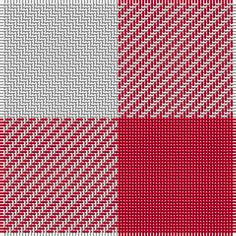

This page is one **sett** — a single exact thread-count. It belongs to the [tartan](/tartans/r1ln1/)
(the same proportion at any scale), whose colour order is pattern [RW](/stripes/rw/).

Sourced from register-of-tartans.  It is a [2 stripe tartan](/stripes/stripes2/).

Original link https://www.tartanregister.gov.uk/tartanDetails.aspx?ref=2654

## Also known as

This cloth is also recorded under:

- McMedic
- Spare
- Spare #2

3 attestations — the source records this cloth was collapsed from (oldest owns this page)

<ul>
<li>01/01/1997 — MacMedic (register-of-tartans, <a href="https://www.tartanregister.gov.uk/tartanDetails.aspx?ref=2654">record</a>)</li>
<li>pe 1998 — McMedic (Fashion) (tartans-authority, <a href="http://www.tartansauthority.com/tartan-ferret/display/2684/">record</a>)</li>
<li>undated — MacMedic (weddslist, <a href="http://www.weddslist.com/cgi-bin/tartans/pg.pl?source=sts">record</a>)</li>
</ul>

## Register references

External register numbers recorded for this tartan.

- Scottish Register of Tartans: [2654](https://www.tartanregister.gov.uk/tartanDetails.aspx?ref=2654)
- Scottish Tartans World Register: 2684

## Thread count
R/40 LN/40

## Palette
Each colour and the base-6 reference it is a variant of.

| Colour | Shade | Base |
|---|---|---|
| LN | <code style="background-color:#E0E0E0;">#E0E0E0</code> `oklch(90.7% 0.000 89.9)` <small>#E0E0E0</small> | W <code style="background-color:#F7F7F7;">#F7F7F7</code> |
| R | <code style="background-color:#C80028;">#C80028</code> `oklch(52.5% 0.212 23.0)` <small>#C80028</small> | R <code style="background-color:#CC0000;">#CC0000</code> |

# Sample pattern

## Nearest tartans

The nearest existing variants by ΔTartan distance, with this tartan at the top so the swatches line up against it.

ΔTartan

Tartan

Sett

—

<a href="/ttd/edit/#slug=r1w1~x40">MacMedic</a> <a class="nn-out" href="/setts/s2/r1w1~x40/" title="open its dictionary page">↗</a>

0.39

<a href="/ttd/edit/#slug=r1w1~x5">Spare</a> <a class="nn-out" href="/setts/s2/r1w1~x5/" title="open its dictionary page">↗</a>

2.14

<a href="/ttd/edit/#slug=dy1lb1~x6">Shepherd Brown &amp; White (Fashion?)</a> <a class="nn-out" href="/setts/s2/dy1lb1~x6/" title="open its dictionary page">↗</a>

2.43

<a href="/ttd/edit/#slug=y1m1~x2">Une Energie Nouvelle (Corporate) XXX</a> <a class="nn-out" href="/setts/s2/y1m1~x2/" title="open its dictionary page">↗</a>

2.56

<a href="/setts/s4/dy1lb1~x6/">Shepherd (Brown &amp; White)</a>

2.57

<a href="/ttd/edit/#slug=dg1r1~x80">Glenlyon (District)</a> <a class="nn-out" href="/setts/s2/dg1r1~x80/" title="open its dictionary page">↗</a>

2.67

<a href="/ttd/edit/#slug=k1w1~x24">Falkirk Tartan</a> <a class="nn-out" href="/setts/s2/k1w1~x24/" title="open its dictionary page">↗</a>

2.77

<a href="/ttd/edit/#slug=r1db1ly1~x40">Mothers Pride</a> <a class="nn-out" href="/setts/s3/r1db1ly1~x40/" title="open its dictionary page">↗</a>

2.81

<a href="/ttd/edit/#slug=db1r1~x20">Masai Shuka 02 (Artefact)</a> <a class="nn-out" href="/setts/s2/db1r1~x20/" title="open its dictionary page">↗</a>

2.89

<a href="/ttd/edit/#slug=db1w1r1~x22">Aquascutum</a> <a class="nn-out" href="/setts/s3/db1w1r1~x22/" title="open its dictionary page">↗</a>

2.91

<a href="/ttd/edit/#slug=r14g13~x2">Moncreiffe (MacLachlan) Clan Tartan Tartan Number: 963. Earliest known date: 1819 Sir Iain Moncreiffe of that Ilk, acquired the MacLachlan old sett for the clan when he became Chief in 1957. Micheil MacDonald writes in his book, 'The Clans of Scotland', &quot;As a result of a long association with Clan Murray, the Moncreiffes traditionally wore the Atholl tartan. But Sir Iain... arranged that Madam MacLachlan of MacLachlan assign to him a 'primitive' pattern of red and green squares which, though no longer favoured by Clan MacLachlan, Sir Iain felt was appropriate to the long history of the Moncreiffes 'before tartan became fashionable in its present form'. See products available Copyright © Blair Urquhart, Comrie, 2015</a> <a class="nn-out" href="/setts/s2/r14g13~x2/" title="open its dictionary page">↗</a>

## Neighbour map

Every grey dot is one of 14299 variants placed by the first two principal components of the ΔTartan feature space (44% of its variance). Red is this tartan; blue dots are its nearest — click one to open its page.

<svg viewBox="0 0 640 380" role="img" style="max-width:100%;height:auto;border:1px solid #e0e0e0;border-radius:4px;display:block" xmlns="http://www.w3.org/2000/svg"><image href="/nn/cloud.v1.png" width="640" height="380"/><a href="/setts/s2/r1w1~x5/"><circle cx="153.9" cy="366.0" r="4" fill="#3465a4"><title>Spare</title></circle></a><a href="/setts/s2/dy1lb1~x6/"><circle cx="146.1" cy="366.0" r="4" fill="#3465a4"><title>Shepherd Brown &amp; White (Fashion?)</title></circle></a><a href="/setts/s2/y1m1~x2/"><circle cx="198.8" cy="366.0" r="4" fill="#3465a4"><title>Une Energie Nouvelle (Corporate) XXX</title></circle></a><a href="/setts/s4/dy1lb1~x6/"><circle cx="132.0" cy="366.0" r="4" fill="#3465a4"><title>Shepherd (Brown &amp; White)</title></circle></a><a href="/setts/s2/dg1r1~x80/"><circle cx="179.6" cy="366.0" r="4" fill="#3465a4"><title>Glenlyon (District)</title></circle></a><a href="/setts/s2/k1w1~x24/"><circle cx="113.8" cy="366.0" r="4" fill="#3465a4"><title>Falkirk Tartan</title></circle></a><a href="/setts/s3/r1db1ly1~x40/"><circle cx="14.0" cy="366.0" r="4" fill="#3465a4"><title>Mothers Pride</title></circle></a><a href="/setts/s2/db1r1~x20/"><circle cx="187.4" cy="366.0" r="4" fill="#3465a4"><title>Masai Shuka 02 (Artefact)</title></circle></a><a href="/setts/s3/db1w1r1~x22/"><circle cx="14.0" cy="366.0" r="4" fill="#3465a4"><title>Aquascutum</title></circle></a><a href="/setts/s2/r14g13~x2/"><circle cx="211.4" cy="366.0" r="4" fill="#3465a4"><title>Moncreiffe (MacLachlan) Clan Tartan Tartan Number: 963. Earliest known date: 1819 Sir Iain Moncreiffe of that Ilk, acquired the MacLachlan old sett for the clan when he became Chief in 1957. Micheil MacDonald writes in his book, 'The Clans of Scotland', &quot;As a result of a long association with Clan Murray, the Moncreiffes traditionally wore the Atholl tartan. But Sir Iain... arranged that Madam MacLachlan of MacLachlan assign to him a 'primitive' pattern of red and green squares which, though no longer favoured by Clan MacLachlan, Sir Iain felt was appropriate to the long history of the Moncreiffes 'before tartan became fashionable in its present form'. See products available Copyright © Blair Urquhart, Comrie, 2015</title></circle></a><circle cx="148.9" cy="366.0" r="5" fill="#c00000"/></svg>

ID: /setts/s2/r1w1~x40/
