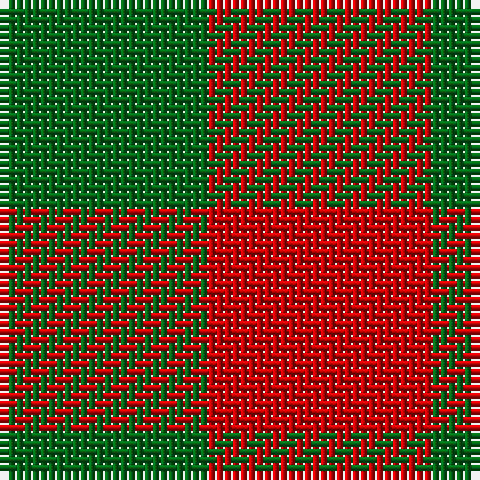

In pattern [GR](/patterns/gr/).

This was sourced from house-of-tartan.  It is a [2 stripes tartan](/stripes/stripes2/).

Original link http://www.house-of-tartan.scotland.net/house/TartanViewjs.asp?colr=Def&tnam=963

## Thread count
G/26 R/28

## Palette
Each colour and its ΔE from the base-6 reference it is a variant of.

| Colour | Shade | Base | ΔE (OKLab) |
|---|---|---|---|
| G | <code style="background-color:#006818;">#006818</code> `#006818` | G <code style="background-color:#006400;">#006400</code> | 0.02 |
| R | <code style="background-color:#C80000;">#C80000</code> `#C80000` | R <code style="background-color:#C80000;">#C80000</code> | 0.00 |

# Sample pattern

ID: /setts/s2/r28g26-g006818-rc80000/
