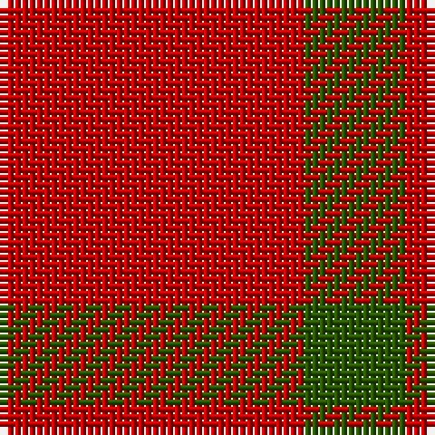

**Bands:** [RG](/stripes/rg/) · **Stripes:** [R DG](/stripes/stripes2/) R DG

This was sourced from register-of-tartans.  It is a [2 band tartan](/bands/bands2/).

Original link https://www.tartanregister.gov.uk/tartanDetails.aspx?ref=4691

## Also known as

This cloth is also recorded under:

- Wilson's, No 134

## Register references

External register numbers recorded for this tartan.

- Scottish Register of Tartans: [4691](https://www.tartanregister.gov.uk/tartanDetails.aspx?ref=4691)
- Scottish Tartans Authority (ITI): 964
- Scottish Tartans World Register: 964

## Variants

Other setts woven to the same stripe pattern.

- [Glenlyon (District)](/setts/s2/dg1r1~x80/)
- [Moncreiffe](/setts/s2/dg1r1/)
- [Wilson's No.099](/setts/s2/dg14r13~x2/)

## Thread count
R/42 G/14

## Palette
Each colour and its ΔE from the base-6 reference it is a variant of.

| Colour | Shade | Base | ΔE (OKLab) |
|---|---|---|---|
| DG | <code style="background-color:#003820;">#003820</code> `#003820` | G <code style="background-color:#006100;">#006100</code> | 0.15 |
| G | <code style="background-color:#285800;">#285800</code> `#285800` | G <code style="background-color:#006100;">#006100</code> | 0.03 |
| R | <code style="background-color:#C80000;">#C80000</code> `#C80000` | R <code style="background-color:#CC0000;">#CC0000</code> | 0.01 |
| Ra | <code style="background-color:#C80000;">#C80000</code> `#C80000` | R <code style="background-color:#CC0000;">#CC0000</code> | 0.01 |

# Sample pattern

## Nearest tartans

The nearest existing variants by ΔTartan distance.

1. [Wilson's, No 134](/setts/s2/r3g1~x14/) — ΔT 0.59
1. [Wilson's No.138](/setts/s2/r3t1~x14/) — ΔT 0.89
1. [Wilson's No.234](/setts/s2/r8k3~x2/) — ΔT 1.87
1. [Ikelman #4 (Personal)](/setts/s5/r11k4r4lo4r11~x4/) — ΔT 2.34
1. [Wilson's, No 188](/setts/s3/r4g2t1~x4/) — ΔT 3.12
1. [Roddy "Rowdy" Piper (Personal)](/setts/s2/r9lr1~x20/) — ΔT 3.21
1. [Masai Shuka 20 (Artefact)](/setts/s3/r30k10ly3~x4/) — ΔT 3.31
1. [International Karate Fed. (Corporat)](/setts/s3/r8w1k1~x20/) — ΔT 3.34
1. [Virgin One (Corporate)](/setts/s4/lo7w6lo11r2~x2/) — ΔT 3.47
1. [MacDonald of Sleat - 1810 (Clan)](/setts/s4/r36dg2r5dg16~x2/) — ΔT 3.52

## Neighbour map

Every grey dot is one of 14299 variants placed by the first two principal components of the ΔTartan feature space (44% of its variance). Red is this tartan; blue dots are its nearest — click one to open its page.

<svg viewBox="0 0 640 380" role="img" style="max-width:100%;height:auto;border:1px solid #e0e0e0;border-radius:4px;display:block" xmlns="http://www.w3.org/2000/svg"><image href="/nn/cloud.v1.png" width="640" height="380"/><a href="/setts/s2/r3g1~x14/"><circle cx="470.5" cy="366.0" r="4" fill="#3465a4"><title>Wilson's, No 134</title></circle></a><a href="/setts/s2/r3t1~x14/"><circle cx="487.2" cy="366.0" r="4" fill="#3465a4"><title>Wilson's No.138</title></circle></a><a href="/setts/s2/r8k3~x2/"><circle cx="417.7" cy="363.6" r="4" fill="#3465a4"><title>Wilson's No.234</title></circle></a><a href="/setts/s5/r11k4r4lo4r11~x4/"><circle cx="429.7" cy="321.4" r="4" fill="#3465a4"><title>Ikelman #4 (Personal)</title></circle></a><a href="/setts/s3/r4g2t1~x4/"><circle cx="308.6" cy="316.3" r="4" fill="#3465a4"><title>Wilson's, No 188</title></circle></a><a href="/setts/s2/r9lr1~x20/"><circle cx="626.0" cy="313.9" r="4" fill="#3465a4"><title>Roddy &quot;Rowdy&quot; Piper (Personal)</title></circle></a><a href="/setts/s3/r30k10ly3~x4/"><circle cx="434.4" cy="240.2" r="4" fill="#3465a4"><title>Masai Shuka 20 (Artefact)</title></circle></a><a href="/setts/s3/r8w1k1~x20/"><circle cx="523.4" cy="246.0" r="4" fill="#3465a4"><title>International Karate Fed. (Corporat)</title></circle></a><a href="/setts/s4/lo7w6lo11r2~x2/"><circle cx="400.6" cy="305.1" r="4" fill="#3465a4"><title>Virgin One (Corporate)</title></circle></a><a href="/setts/s4/r36dg2r5dg16~x2/"><circle cx="531.7" cy="241.3" r="4" fill="#3465a4"><title>MacDonald of Sleat - 1810 (Clan)</title></circle></a><circle cx="485.7" cy="366.0" r="5" fill="#c00000"/></svg>

ID: /setts/s2/r3dg1~x14/
