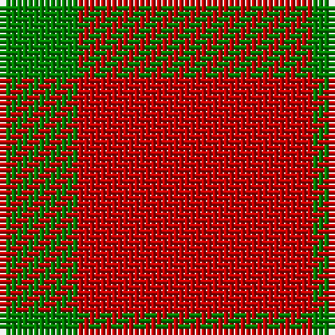

This page is one **sett** — a single exact thread-count. It belongs to the [tartan](/tartans/r3g1/)
(the same proportion at any scale), whose colour order is pattern [GR](/stripes/gr/).

Sourced from weddslist.  It is a [2 stripe tartan](/stripes/stripes2/).

Original link http://www.weddslist.com/cgi-bin/tartans/pg.pl?source=sts

## Also known as

This cloth is also recorded under:

- Wilson's, No 134

## Thread count
R/42 G/14

## Palette

Palette: <strong>custom</strong>
<table><thead><tr><th>Colour</th><th>Threads</th><th>Shade</th><th>Base</th><th>OKLCh</th></tr></thead><tbody><tr><td>R/</td><td style="text-align:right;font-variant-numeric:tabular-nums">42</td><td><code style="background-color:#C00000;">#C00000</code> <small style="color:#888">#C00000</small></td><td>R <code style="background-color:#CC0000;">#CC0000</code></td><td><small style="color:#888">oklch(50.7% 0.208 29.2)</small></td></tr><tr><td>G/</td><td style="text-align:right;font-variant-numeric:tabular-nums">14</td><td><code style="background-color:#008000;">#008000</code> <small style="color:#888">#008000</small></td><td>G <code style="background-color:#006100;">#006100</code></td><td><small style="color:#888">oklch(52.0% 0.177 142.5)</small></td></tr></tbody></table>

# Sample pattern

## Nearest tartans

The nearest existing variants by ΔTartan distance, with this tartan at the top so the swatches line up against it.

ΔTartan

Tartan

Sett

—

<a href="/ttd/edit/#slug=r3g1~x14">Wilson's, No 134</a> <a class="nn-out" href="/setts/s2/r3g1~x14/" title="open its dictionary page">↗</a>

0.59

<a href="/ttd/edit/#slug=r3dg1~x14">Wilson's No.134</a> <a class="nn-out" href="/setts/s2/r3dg1~x14/" title="open its dictionary page">↗</a>

1.19

<a href="/ttd/edit/#slug=r3t1~x14">Wilson's No.138</a> <a class="nn-out" href="/setts/s2/r3t1~x14/" title="open its dictionary page">↗</a>

1.72

<a href="/ttd/edit/#slug=r8k3~x2">Wilson's No.234</a> <a class="nn-out" href="/setts/s2/r8k3~x2/" title="open its dictionary page">↗</a>

2.32

<a href="/ttd/edit/#slug=r11k4r4lo4r11~x4">Ikelman #4 (Personal)</a> <a class="nn-out" href="/setts/s5/r11k4r4lo4r11~x4/" title="open its dictionary page">↗</a>

2.90

<a href="/ttd/edit/#slug=r4g2t1~x4">Wilson's, No 188</a> <a class="nn-out" href="/setts/s3/r4g2t1~x4/" title="open its dictionary page">↗</a>

3.16

<a href="/ttd/edit/#slug=r30k10ly3~x4">Masai Shuka 20 (Artefact)</a> <a class="nn-out" href="/setts/s3/r30k10ly3~x4/" title="open its dictionary page">↗</a>

3.20

<a href="/ttd/edit/#slug=r8w1k1~x20">International Karate Fed. (Corporat)</a> <a class="nn-out" href="/setts/s3/r8w1k1~x20/" title="open its dictionary page">↗</a>

3.22

<a href="/ttd/edit/#slug=lo7w6lo11r2~x2">Virgin One (Corporate)</a> <a class="nn-out" href="/setts/s4/lo7w6lo11r2~x2/" title="open its dictionary page">↗</a>

3.31

<a href="/ttd/edit/#slug=r9lr1~x20">Roddy &quot;Rowdy&quot; Piper (Personal)</a> <a class="nn-out" href="/setts/s2/r9lr1~x20/" title="open its dictionary page">↗</a>

3.36

<a href="/setts/s4/r17dg9r2~x2/">MacGregor of Glenstrae #2</a>

## Neighbour map

Every grey dot is one of 14299 variants placed by the first two principal components of the ΔTartan feature space (44% of its variance). Red is this tartan; blue dots are its nearest — click one to open its page.

<svg viewBox="0 0 640 380" role="img" style="max-width:100%;height:auto;border:1px solid #e0e0e0;border-radius:4px;display:block" xmlns="http://www.w3.org/2000/svg"><image href="/nn/cloud.v1.png" width="640" height="380"/><a href="/setts/s2/r3dg1~x14/"><circle cx="485.7" cy="366.0" r="4" fill="#3465a4"><title>Wilson's No.134</title></circle></a><a href="/setts/s2/r3t1~x14/"><circle cx="487.2" cy="366.0" r="4" fill="#3465a4"><title>Wilson's No.138</title></circle></a><a href="/setts/s2/r8k3~x2/"><circle cx="417.7" cy="363.6" r="4" fill="#3465a4"><title>Wilson's No.234</title></circle></a><a href="/setts/s5/r11k4r4lo4r11~x4/"><circle cx="429.7" cy="321.4" r="4" fill="#3465a4"><title>Ikelman #4 (Personal)</title></circle></a><a href="/setts/s3/r4g2t1~x4/"><circle cx="308.6" cy="316.3" r="4" fill="#3465a4"><title>Wilson's, No 188</title></circle></a><a href="/setts/s3/r30k10ly3~x4/"><circle cx="434.4" cy="240.2" r="4" fill="#3465a4"><title>Masai Shuka 20 (Artefact)</title></circle></a><a href="/setts/s3/r8w1k1~x20/"><circle cx="523.4" cy="246.0" r="4" fill="#3465a4"><title>International Karate Fed. (Corporat)</title></circle></a><a href="/setts/s4/lo7w6lo11r2~x2/"><circle cx="400.6" cy="305.1" r="4" fill="#3465a4"><title>Virgin One (Corporate)</title></circle></a><a href="/setts/s2/r9lr1~x20/"><circle cx="626.0" cy="313.9" r="4" fill="#3465a4"><title>Roddy &quot;Rowdy&quot; Piper (Personal)</title></circle></a><a href="/setts/s4/r17dg9r2~x2/"><circle cx="349.8" cy="287.0" r="4" fill="#3465a4"><title>MacGregor of Glenstrae #2</title></circle></a><circle cx="470.5" cy="366.0" r="5" fill="#c00000"/></svg>

ID: /setts/s2/r3g1~x14/
