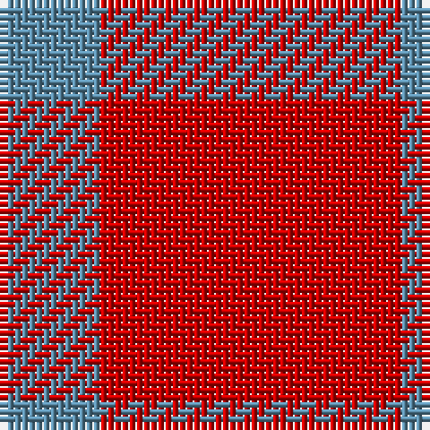

In pattern [BR](/stripes/br/).

This was sourced from register-of-tartans.  It is a [2 stripe tartan](/stripes/stripes2/).

Original link https://www.tartanregister.gov.uk/tartanDetails.aspx?ref=4693

## Also known as

This cloth is also recorded under:

- Wilson's, No 138

## Attestations

This cloth appears in 2 source records; the oldest owns this page.

- 01/01/1819 — Wilson's No.138 (register-of-tartans, [record](https://www.tartanregister.gov.uk/tartanDetails.aspx?ref=4693))
- undated — Wilson's, No 138 (weddslist, [record](http://www.weddslist.com/cgi-bin/tartans/pg.pl?source=sts))

## Register references

External register numbers recorded for this tartan.

- Scottish Register of Tartans: [4693](https://www.tartanregister.gov.uk/tartanDetails.aspx?ref=4693)
- Scottish Tartans Authority (ITI): 448
- Scottish Tartans World Register: 448

## Thread count
R/42 B/14

## Palette
Each colour and the base-6 reference it is a variant of.

| Colour | Shade | Base |
|---|---|---|
| B | <code style="background-color:#5C8CA8;">#5C8CA8</code> `oklch(61.7% 0.067 235.0)` <small>#5C8CA8</small> | B <code style="background-color:#2A418A;">#2A418A</code> |
| R | <code style="background-color:#C80000;">#C80000</code> `oklch(52.3% 0.215 29.2)` <small>#C80000</small> | R <code style="background-color:#CC0000;">#CC0000</code> |

# Sample pattern

## Nearest tartans

The nearest existing variants by ΔTartan distance, with this tartan at the top so the swatches line up against it.

ΔTartan

Tartan

Sett

—

<a href="/ttd/edit/#slug=r3t1~x14">Wilson's No.138</a> <a class="nn-out" href="/setts/s2/r3t1~x14/" title="open its dictionary page">↗</a>

0.89

<a href="/ttd/edit/#slug=r3dg1~x14">Wilson's No.134</a> <a class="nn-out" href="/setts/s2/r3dg1~x14/" title="open its dictionary page">↗</a>

1.19

<a href="/ttd/edit/#slug=r3g1~x14">Wilson's, No 134</a> <a class="nn-out" href="/setts/s2/r3g1~x14/" title="open its dictionary page">↗</a>

2.05

<a href="/ttd/edit/#slug=r8k3~x2">Wilson's No.234</a> <a class="nn-out" href="/setts/s2/r8k3~x2/" title="open its dictionary page">↗</a>

2.55

<a href="/ttd/edit/#slug=r11k4r4lo4r11~x4">Ikelman #4 (Personal)</a> <a class="nn-out" href="/setts/s5/r11k4r4lo4r11~x4/" title="open its dictionary page">↗</a>

3.23

<a href="/ttd/edit/#slug=r4g2t1~x4">Wilson's, No 188</a> <a class="nn-out" href="/setts/s3/r4g2t1~x4/" title="open its dictionary page">↗</a>

3.26

<a href="/ttd/edit/#slug=r9lr1~x20">Roddy &quot;Rowdy&quot; Piper (Personal)</a> <a class="nn-out" href="/setts/s2/r9lr1~x20/" title="open its dictionary page">↗</a>

3.44

<a href="/ttd/edit/#slug=r8w1k1~x20">International Karate Fed. (Corporat)</a> <a class="nn-out" href="/setts/s3/r8w1k1~x20/" title="open its dictionary page">↗</a>

3.44

<a href="/ttd/edit/#slug=r30k10ly3~x4">Masai Shuka 20 (Artefact)</a> <a class="nn-out" href="/setts/s3/r30k10ly3~x4/" title="open its dictionary page">↗</a>

3.48

<a href="/ttd/edit/#slug=lb9r20db2~x2">Masai Shuka 28 (Artefact)</a> <a class="nn-out" href="/setts/s3/lb9r20db2~x2/" title="open its dictionary page">↗</a>

3.48

<a href="/ttd/edit/#slug=r5p19g3p5~x2">Highland Spring</a> <a class="nn-out" href="/setts/s4/r5p19g3p5~x2/" title="open its dictionary page">↗</a>

## Neighbour map

Every grey dot is one of 14299 variants placed by the first two principal components of the ΔTartan feature space (44% of its variance). Red is this tartan; blue dots are its nearest — click one to open its page.

<svg viewBox="0 0 640 380" role="img" style="max-width:100%;height:auto;border:1px solid #e0e0e0;border-radius:4px;display:block" xmlns="http://www.w3.org/2000/svg"><image href="/nn/cloud.v1.png" width="640" height="380"/><a href="/setts/s2/r3dg1~x14/"><circle cx="485.7" cy="366.0" r="4" fill="#3465a4"><title>Wilson's No.134</title></circle></a><a href="/setts/s2/r3g1~x14/"><circle cx="470.5" cy="366.0" r="4" fill="#3465a4"><title>Wilson's, No 134</title></circle></a><a href="/setts/s2/r8k3~x2/"><circle cx="417.7" cy="363.6" r="4" fill="#3465a4"><title>Wilson's No.234</title></circle></a><a href="/setts/s5/r11k4r4lo4r11~x4/"><circle cx="429.7" cy="321.4" r="4" fill="#3465a4"><title>Ikelman #4 (Personal)</title></circle></a><a href="/setts/s3/r4g2t1~x4/"><circle cx="308.6" cy="316.3" r="4" fill="#3465a4"><title>Wilson's, No 188</title></circle></a><a href="/setts/s2/r9lr1~x20/"><circle cx="626.0" cy="313.9" r="4" fill="#3465a4"><title>Roddy &quot;Rowdy&quot; Piper (Personal)</title></circle></a><a href="/setts/s3/r8w1k1~x20/"><circle cx="523.4" cy="246.0" r="4" fill="#3465a4"><title>International Karate Fed. (Corporat)</title></circle></a><a href="/setts/s3/r30k10ly3~x4/"><circle cx="434.4" cy="240.2" r="4" fill="#3465a4"><title>Masai Shuka 20 (Artefact)</title></circle></a><a href="/setts/s3/lb9r20db2~x2/"><circle cx="386.5" cy="238.4" r="4" fill="#3465a4"><title>Masai Shuka 28 (Artefact)</title></circle></a><a href="/setts/s4/r5p19g3p5~x2/"><circle cx="501.5" cy="278.9" r="4" fill="#3465a4"><title>Highland Spring</title></circle></a><circle cx="487.2" cy="366.0" r="5" fill="#c00000"/></svg>

ID: /setts/s2/r3t1~x14/
