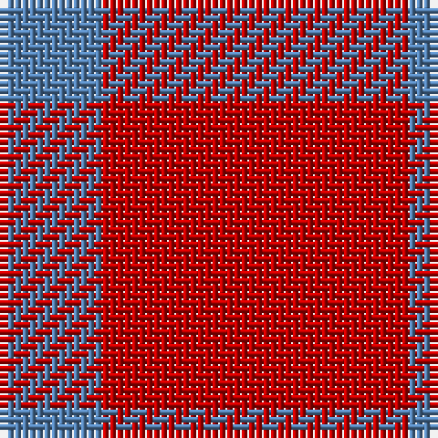

In pattern [BR](/patterns/br/).

This was sourced from weddslist.  It is a [2 stripes tartan](/stripes/stripes2/).

Original link http://www.weddslist.com/cgi-bin/tartans/pg.pl?source=sts

## Thread count
B/14 R/42

## Palette
Each colour and its ΔE from the base-6 reference it is a variant of.

| Colour | Shade | Base | ΔE (OKLab) |
|---|---|---|---|
| B | <code style="background-color:#5480B0;">#5480B0</code> `#5480B0` | B <code style="background-color:#2C4084;">#2C4084</code> | 0.20 |
| R | <code style="background-color:#C00000;">#C00000</code> `#C00000` | R <code style="background-color:#C80000;">#C80000</code> | 0.02 |

# Sample pattern

## Nearest tartans

The nearest existing variants by ΔTartan distance.

1. [Wilson's No.138](/setts/s2/r42b14-b5c8ca8-rc80000/) — ΔT 0.26
1. [Wilson's No.134](/setts/s2/r42g14-g285800-rc80000/) — ΔT 0.99
1. [Wilson's, No 134](/setts/s2/r42g14-g008000-rc00000/) — ΔT 1.28
1. [Wilson's No.234](/setts/s2/r16k6-k101010-rc80000/) — ΔT 2.00
1. [Ikelman #4 (Personal)](/setts/s5/r44k16r16y16r44-k101010-r880000-yd09800/) — ΔT 2.50
1. [Wilson's, No 234](/setts/s2/r16k6-k000000-rc00000/) — ΔT 3.00
1. [Roddy "Rowdy" Piper (Personal)](/setts/s2/r180y20-r8c0000-yb0b0b0/) — ΔT 3.22
1. [Wilson's, No 188](/setts/s3/r16g8b4-b5480b0-g008000-rc00000/) — ΔT 3.23
1. [Highland Spring](/setts/s4/b10g6b38r10-b800080-g008000-rc00000/) — ΔT 3.31
1. [Buie Family Tartan Tartan Number: 1590. Earliest known date: pre 2003 A sample of this tartan was recorded by the Scottish Tartans Society during the period 1970 to 1990. See products available Copyright © Blair Urquhart, Comrie, 2015](/setts/s3/r72k12r8-k101010-rc80000/) — ΔT 3.37

## Neighbour map

Every grey dot is one of 15726 variants placed by the first two principal components of the ΔTartan feature space (44% of its variance). Red is this tartan; blue dots are its nearest — click one to open its page.

<svg viewBox="0 0 640 380" role="img" style="max-width:100%;height:auto;border:1px solid #e0e0e0;border-radius:4px;display:block" xmlns="http://www.w3.org/2000/svg"><image href="/nn/cloud.v1.png" width="640" height="380"/><a href="/setts/s2/r42b14-b5c8ca8-rc80000/"><circle cx="494.8" cy="366.0" r="4" fill="#3465a4"><title>Wilson's No.138</title></circle></a><a href="/setts/s2/r42g14-g285800-rc80000/"><circle cx="493.4" cy="366.0" r="4" fill="#3465a4"><title>Wilson's No.134</title></circle></a><a href="/setts/s2/r42g14-g008000-rc00000/"><circle cx="477.9" cy="366.0" r="4" fill="#3465a4"><title>Wilson's, No 134</title></circle></a><a href="/setts/s2/r16k6-k101010-rc80000/"><circle cx="425.2" cy="366.0" r="4" fill="#3465a4"><title>Wilson's No.234</title></circle></a><a href="/setts/s5/r44k16r16y16r44-k101010-r880000-yd09800/"><circle cx="435.1" cy="322.7" r="4" fill="#3465a4"><title>Ikelman #4 (Personal)</title></circle></a><a href="/setts/s2/r16k6-k000000-rc00000/"><circle cx="399.6" cy="361.2" r="4" fill="#3465a4"><title>Wilson's, No 234</title></circle></a><a href="/setts/s2/r180y20-r8c0000-yb0b0b0/"><circle cx="626.0" cy="315.3" r="4" fill="#3465a4"><title>Roddy &quot;Rowdy&quot; Piper (Personal)</title></circle></a><a href="/setts/s3/r16g8b4-b5480b0-g008000-rc00000/"><circle cx="312.0" cy="317.0" r="4" fill="#3465a4"><title>Wilson's, No 188</title></circle></a><a href="/setts/s4/b10g6b38r10-b800080-g008000-rc00000/"><circle cx="504.6" cy="277.6" r="4" fill="#3465a4"><title>Highland Spring</title></circle></a><a href="/setts/s3/r72k12r8-k101010-rc80000/"><circle cx="626.0" cy="270.1" r="4" fill="#3465a4"><title>Buie Family Tartan Tartan Number: 1590. Earliest known date: pre 2003 A sample of this tartan was recorded by the Scottish Tartans Society during the period 1970 to 1990. See products available Copyright © Blair Urquhart, Comrie, 2015</title></circle></a><circle cx="495.1" cy="366.0" r="5" fill="#c00000"/></svg>

ID: /setts/s2/r42b14-b5480b0-rc00000/
