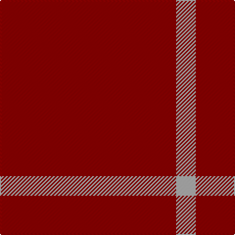

In pattern [RY](/patterns/ry/).

This was sourced from tartans-authority.  It is a [2 stripes tartan](/stripes/stripes2/).

Original link http://www.tartansauthority.com/tartan-ferret/display/5411/

## Thread count
DR/180 N/20

## Palette
Each colour and its ΔE from the base-6 reference it is a variant of.

| Colour | Shade | Base | ΔE (OKLab) |
|---|---|---|---|
| DR | <code style="background-color:#8C0000;">#8C0000</code> `#8C0000` | R <code style="background-color:#CC0000;">#CC0000</code> | 0.14 |
| N | <code style="background-color:#B0B0B0;">#B0B0B0</code> `#B0B0B0` | Y <code style="background-color:#F2BF00;">#F2BF00</code> | 0.18 |

# Sample pattern

## Nearest tartans

The nearest existing variants by ΔTartan distance.

1. [Buie Family Tartan Tartan Number: 1590. Earliest known date: pre 2003 A sample of this tartan was recorded by the Scottish Tartans Society during the period 1970 to 1990. See products available Copyright © Blair Urquhart, Comrie, 2015](/setts/s3/r18k3r2~k101010-rc80000~x4/) — ΔT 1.57
1. [Buie](/setts/s3/r18k3r2~k000000-r802040~x4/) — ΔT 2.06
1. [Buie](/setts/s3/r18k3r2~k000000-rc80000~x4/) — ΔT 2.43
1. [Brooks Brothers Tattersall Red](/setts/s5/b1r9b2r9y1~b202060-r880000-ya08858~x4/) — ΔT 2.87
1. [International Karate Fed. (Corporat)](/setts/s3/r8w1k1~k101010-r880000-we0e0e0~x20/) — ΔT 2.90
1. [Scania 1658](/setts/s4/r60y7r5y2~rc80000-ye8c000~x2/) — ΔT 3.09
1. [Rannoch Red](/setts/s7/r10g3r24w3r16k3r8~g8c7038-k101010-r880000-wc0c0c0~x2/) — ΔT 3.18
1. [Wilson's No.134](/setts/s2/r3g1~g285800-rc80000~x14/) — ΔT 3.21
1. [Wilson's, No 138](/setts/s2/r3b1~b5480b0-rc00000~x14/) — ΔT 3.23
1. [Wilson's No.138](/setts/s2/r3b1~b5c8ca8-rc80000~x14/) — ΔT 3.26

## Neighbour map

Every grey dot is one of 15726 variants placed by the first two principal components of the ΔTartan feature space (44% of its variance). Red is this tartan; blue dots are its nearest — click one to open its page.

<svg viewBox="0 0 640 380" role="img" style="max-width:100%;height:auto;border:1px solid #e0e0e0;border-radius:4px;display:block" xmlns="http://www.w3.org/2000/svg"><image href="/nn/cloud.v1.png" width="640" height="380"/><a href="/setts/s3/r18k3r2~k101010-rc80000~x4/"><circle cx="626.0" cy="278.0" r="4" fill="#3465a4"><title>Buie Family Tartan Tartan Number: 1590. Earliest known date: pre 2003 A sample of this tartan was recorded by the Scottish Tartans Society during the period 1970 to 1990. See products available Copyright © Blair Urquhart, Comrie, 2015</title></circle></a><a href="/setts/s3/r18k3r2~k000000-r802040~x4/"><circle cx="626.0" cy="290.1" r="4" fill="#3465a4"><title>Buie</title></circle></a><a href="/setts/s3/r18k3r2~k000000-rc80000~x4/"><circle cx="610.8" cy="266.1" r="4" fill="#3465a4"><title>Buie</title></circle></a><a href="/setts/s5/b1r9b2r9y1~b202060-r880000-ya08858~x4/"><circle cx="608.8" cy="274.7" r="4" fill="#3465a4"><title>Brooks Brothers Tattersall Red</title></circle></a><a href="/setts/s3/r8w1k1~k101010-r880000-we0e0e0~x20/"><circle cx="524.5" cy="256.1" r="4" fill="#3465a4"><title>International Karate Fed. (Corporat)</title></circle></a><a href="/setts/s4/r60y7r5y2~rc80000-ye8c000~x2/"><circle cx="626.0" cy="205.1" r="4" fill="#3465a4"><title>Scania 1658</title></circle></a><a href="/setts/s7/r10g3r24w3r16k3r8~g8c7038-k101010-r880000-wc0c0c0~x2/"><circle cx="592.4" cy="247.8" r="4" fill="#3465a4"><title>Rannoch Red</title></circle></a><a href="/setts/s2/r3g1~g285800-rc80000~x14/"><circle cx="488.1" cy="366.0" r="4" fill="#3465a4"><title>Wilson's No.134</title></circle></a><a href="/setts/s2/r3b1~b5480b0-rc00000~x14/"><circle cx="490.0" cy="366.0" r="4" fill="#3465a4"><title>Wilson's, No 138</title></circle></a><a href="/setts/s2/r3b1~b5c8ca8-rc80000~x14/"><circle cx="489.6" cy="366.0" r="4" fill="#3465a4"><title>Wilson's No.138</title></circle></a><circle cx="626.0" cy="323.3" r="5" fill="#c00000"/></svg>

ID: /setts/s2/r9y1~r8c0000-yb0b0b0~x20/
