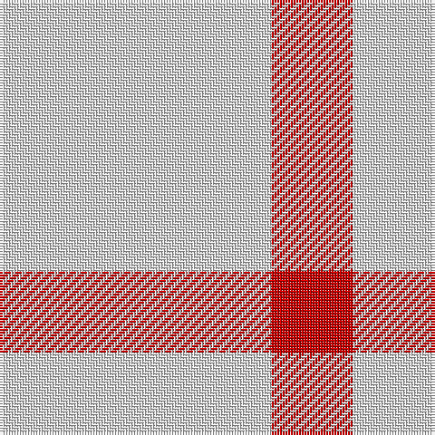

In pattern [RW](/patterns/rw/).

This was sourced from tartans-authority.  It is a [2 stripes tartan](/stripes/stripes2/).

Original link http://www.tartansauthority.com/tartan-ferret/display/8127/

## Thread count
LN/100 R/30

## Palette
Each colour and its ΔE from the base-6 reference it is a variant of.

| Colour | Shade | Base | ΔE (OKLab) |
|---|---|---|---|
| LN | <code style="background-color:#E0E0E0;">#E0E0E0</code> `#E0E0E0` | W <code style="background-color:#F4F4F0;">#F4F4F0</code> | 0.06 |
| R | <code style="background-color:#C80000;">#C80000</code> `#C80000` | R <code style="background-color:#C80000;">#C80000</code> | 0.00 |

# Sample pattern

## Nearest tartans

The nearest existing variants by ΔTartan distance.

1. [Burt's Highlanders (Fashion)](/setts/s5/y80g26y12b26y44-b2c2c80-g006818-yfcb464/) — ΔT 2.96
1. [Quenouille (2011)](/setts/s3/y98r32k22-k1c1714-rca2625-yf8e38c/) — ΔT 2.99
1. [Lucard, Stéphane (Personal)](/setts/s4/w22b40y6b16-b788cb4-wffffff-ye0a126/) — ΔT 3.00
1. [St. George's Check (Fashion)](/setts/s3/r35w94k6-k101010-rd40000-we0e0e0/) — ΔT 3.11
1. [St Georges Check](/setts/s3/r35w94k6-k101010-rff0000-wffffff/) — ΔT 3.19
1. [Sephardim (Corporate)](/setts/s5/w100b14w14ba14w36-b2c2c80-ba2888c4-we0e0e0/) — ΔT 3.25
1. [Virgin One (Corporate)](/setts/s4/y14w12y22r4-rc80000-we0e0e0-ybc8c00/) — ΔT 3.32
1. [One Account (Corporate)](/setts/s4/y12w10y24r4-rc80000-wfcfcfc-ye8c000/) — ΔT 3.38
1. [Lendrum (B&W)](/setts/s4/k28w24k4w24-k101010-wfcfcfc/) — ΔT 3.49
1. [Wallace Dress](/setts/s6/k28w24k4w24k4w24-k101010-wfcfcfc/) — ΔT 3.49

## Neighbour map

Every grey dot is one of 15726 variants placed by the first two principal components of the ΔTartan feature space (44% of its variance). Red is this tartan; blue dots are its nearest — click one to open its page.

<svg viewBox="0 0 640 380" role="img" style="max-width:100%;height:auto;border:1px solid #e0e0e0;border-radius:4px;display:block" xmlns="http://www.w3.org/2000/svg"><image href="/nn/cloud.v1.png" width="640" height="380"/><a href="/setts/s5/y80g26y12b26y44-b2c2c80-g006818-yfcb464/"><circle cx="378.3" cy="248.9" r="4" fill="#3465a4"><title>Burt's Highlanders (Fashion)</title></circle></a><a href="/setts/s3/y98r32k22-k1c1714-rca2625-yf8e38c/"><circle cx="305.3" cy="267.3" r="4" fill="#3465a4"><title>Quenouille (2011)</title></circle></a><a href="/setts/s4/w22b40y6b16-b788cb4-wffffff-ye0a126/"><circle cx="366.0" cy="277.2" r="4" fill="#3465a4"><title>Lucard, Stéphane (Personal)</title></circle></a><a href="/setts/s3/r35w94k6-k101010-rd40000-we0e0e0/"><circle cx="421.4" cy="214.3" r="4" fill="#3465a4"><title>St. George's Check (Fashion)</title></circle></a><a href="/setts/s3/r35w94k6-k101010-rff0000-wffffff/"><circle cx="412.2" cy="205.5" r="4" fill="#3465a4"><title>St Georges Check</title></circle></a><a href="/setts/s5/w100b14w14ba14w36-b2c2c80-ba2888c4-we0e0e0/"><circle cx="516.5" cy="230.8" r="4" fill="#3465a4"><title>Sephardim (Corporate)</title></circle></a><a href="/setts/s4/y14w12y22r4-rc80000-we0e0e0-ybc8c00/"><circle cx="405.2" cy="305.1" r="4" fill="#3465a4"><title>Virgin One (Corporate)</title></circle></a><a href="/setts/s4/y12w10y24r4-rc80000-wfcfcfc-ye8c000/"><circle cx="423.4" cy="283.2" r="4" fill="#3465a4"><title>One Account (Corporate)</title></circle></a><a href="/setts/s4/k28w24k4w24-k101010-wfcfcfc/"><circle cx="290.6" cy="282.4" r="4" fill="#3465a4"><title>Lendrum (B&amp;W)</title></circle></a><a href="/setts/s6/k28w24k4w24k4w24-k101010-wfcfcfc/"><circle cx="326.0" cy="253.3" r="4" fill="#3465a4"><title>Wallace Dress</title></circle></a><circle cx="438.9" cy="338.6" r="5" fill="#c00000"/></svg>

ID: /setts/s2/w100r30-rc80000-we0e0e0/
