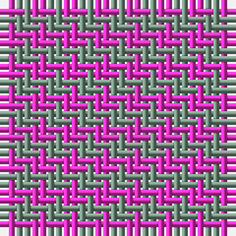

This page is one **sett** — a single exact thread-count. It belongs to the [tartan](/tartans/y1m1/)
(the same proportion at any scale), whose colour order is pattern [GR](/stripes/gr/).

Sourced from tartans-authority.  It is a [2 stripe tartan](/stripes/stripes2/).

Original link http://www.tartansauthority.com/tartan-ferret/display/2180/

## Register references

External register numbers recorded for this tartan.

- Scottish Tartans Authority (ITI): 2180

## Thread count
LR/2 LG/2

## Palette

Palette: <strong>Tartan Register</strong> <small style="color:#888">(1 of 2 colours)</small>
<table><thead><tr><th>Colour</th><th>Threads</th><th>Shade</th><th>Base</th><th>OKLCh</th></tr></thead><tbody><tr><td>LR/</td><td style="text-align:right;font-variant-numeric:tabular-nums">2</td><td><code style="background-color:#EC34C4;">#EC34C4</code> <small style="color:#888">#EC34C4</small></td><td>R <code style="background-color:#CC0000;">#CC0000</code></td><td><small style="color:#888">oklch(65.8% 0.255 338.8)</small></td></tr><tr><td>LG/</td><td style="text-align:right;font-variant-numeric:tabular-nums">2</td><td><code style="background-color:#789484;">#789484</code> <small style="color:#888">#789484</small></td><td>G <code style="background-color:#006100;">#006100</code></td><td><small style="color:#888">oklch(64.0% 0.040 160.0)</small></td></tr></tbody></table>

# Sample pattern

## Nearest tartans

The nearest existing variants by ΔTartan distance, with this tartan at the top so the swatches line up against it.

ΔTartan

Tartan

Sett

—

<a href="/ttd/edit/#slug=y1m1~x2">Une Energie Nouvelle (Corporate) XXX</a> <a class="nn-out" href="/setts/s2/y1m1~x2/" title="open its dictionary page">↗</a>

2.00

<a href="/ttd/edit/#slug=db1r1~x20">Masai Shuka 02 (Artefact)</a> <a class="nn-out" href="/setts/s2/db1r1~x20/" title="open its dictionary page">↗</a>

2.43

<a href="/ttd/edit/#slug=r1w1~x40">MacMedic</a> <a class="nn-out" href="/setts/s2/r1w1~x40/" title="open its dictionary page">↗</a>

2.58

<a href="/ttd/edit/#slug=r1w1~x5">Spare</a> <a class="nn-out" href="/setts/s2/r1w1~x5/" title="open its dictionary page">↗</a>

2.85

<a href="/ttd/edit/#slug=g1p1~x16">Wilson's, No 116</a> <a class="nn-out" href="/setts/s2/g1p1~x16/" title="open its dictionary page">↗</a>

2.86

<a href="/ttd/edit/#slug=db1r1~x100">Rob Roy, Blue &amp; Red (Fashion)</a> <a class="nn-out" href="/setts/s2/db1r1~x100/" title="open its dictionary page">↗</a>

2.86

<a href="/ttd/edit/#slug=db1r1~x14">Cairnbulg &amp; Inverllocjy Fisher Plaid</a> <a class="nn-out" href="/setts/s2/db1r1~x14/" title="open its dictionary page">↗</a>

2.97

<a href="/ttd/edit/#slug=y9dp8~x2">Wilson's No.116 (light)</a> <a class="nn-out" href="/setts/s2/y9dp8~x2/" title="open its dictionary page">↗</a>

3.01

<a href="/ttd/edit/#slug=dy1lb1~x6">Shepherd Brown &amp; White (Fashion?)</a> <a class="nn-out" href="/setts/s2/dy1lb1~x6/" title="open its dictionary page">↗</a>

3.21

<a href="/ttd/edit/#slug=dg1r1~x80">Glenlyon (District)</a> <a class="nn-out" href="/setts/s2/dg1r1~x80/" title="open its dictionary page">↗</a>

3.32

<a href="/ttd/edit/#slug=db1w1~x20">Sillitoe</a> <a class="nn-out" href="/setts/s2/db1w1~x20/" title="open its dictionary page">↗</a>

## Neighbour map

Every grey dot is one of 14359 variants placed by the first two principal components of the ΔTartan feature space (44% of its variance). Red is this tartan; blue dots are its nearest — click one to open its page.

<svg viewBox="0 0 640 380" role="img" style="max-width:100%;height:auto;border:1px solid #e0e0e0;border-radius:4px;display:block" xmlns="http://www.w3.org/2000/svg"><image href="/nn/cloud.v1.png" width="640" height="380"/><a href="/setts/s2/db1r1~x20/"><circle cx="186.9" cy="366.0" r="4" fill="#3465a4"><title>Masai Shuka 02 (Artefact)</title></circle></a><a href="/setts/s2/r1w1~x40/"><circle cx="147.9" cy="366.0" r="4" fill="#3465a4"><title>MacMedic</title></circle></a><a href="/setts/s2/r1w1~x5/"><circle cx="152.8" cy="366.0" r="4" fill="#3465a4"><title>Spare</title></circle></a><a href="/setts/s2/g1p1~x16/"><circle cx="160.4" cy="366.0" r="4" fill="#3465a4"><title>Wilson's, No 116</title></circle></a><a href="/setts/s2/db1r1~x100/"><circle cx="236.6" cy="366.0" r="4" fill="#3465a4"><title>Rob Roy, Blue &amp; Red (Fashion)</title></circle></a><a href="/setts/s2/db1r1~x14/"><circle cx="236.6" cy="366.0" r="4" fill="#3465a4"><title>Cairnbulg &amp; Inverllocjy Fisher Plaid</title></circle></a><a href="/setts/s2/y9dp8~x2/"><circle cx="234.0" cy="366.0" r="4" fill="#3465a4"><title>Wilson's No.116 (light)</title></circle></a><a href="/setts/s2/dy1lb1~x6/"><circle cx="145.5" cy="366.0" r="4" fill="#3465a4"><title>Shepherd Brown &amp; White (Fashion?)</title></circle></a><a href="/setts/s2/dg1r1~x80/"><circle cx="179.0" cy="366.0" r="4" fill="#3465a4"><title>Glenlyon (District)</title></circle></a><a href="/setts/s2/db1w1~x20/"><circle cx="109.0" cy="366.0" r="4" fill="#3465a4"><title>Sillitoe</title></circle></a><circle cx="198.2" cy="366.0" r="5" fill="#c00000"/></svg>

ID: /setts/s2/y1m1~x2/
