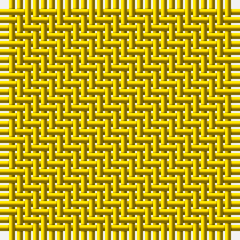

In pattern [YY](/patterns/yy/).

This was sourced from house-of-tartan.  It is a [2 stripes tartan](/stripes/stripes2/).

Original link http://www.house-of-tartan.scotland.net/house/TartanViewjs.asp?colr=Def&tnam=4078

## Thread count
Ya/6 Ya/6

## Palette
Each colour and its ΔE from the base-6 reference it is a variant of.

| Colour | Shade | Base | ΔE (OKLab) |
|---|---|---|---|
| Y | <code style="background-color:#E8C000;">#E8C000</code> `#E8C000` | Y <code style="background-color:#F2BF00;">#F2BF00</code> | 0.02 |
| Ya | <code style="background-color:#E8C000;">#E8C000</code> `#E8C000` | Y <code style="background-color:#F2BF00;">#F2BF00</code> | 0.02 |

# Sample pattern

## Nearest tartans

The nearest existing variants by ΔTartan distance.

1. [Fort Lawrence (District)](/setts/s2/w2w2-wfcfcfc/) — ΔT 7.20
1. [Stone of Destiny Universal Tartan Tartan Number: 2291. Earliest known date: 1996 Designed by Polly Wittering of House of Edgar to commemorate the return of the Stone of Destiny from Westminster. See products available Copyright © Blair Urquhart, Comrie, 2015](/setts/s9/k8k4k34k4k8k4k6k22k6-k000000/) — ΔT 12.49
1. [Unnamed Brown (Teddy Bear)](/setts/s5/r2ra14rb50ra14r2-rc00000-ra806050-rb906030/) — ΔT 15.36
1. [Dark Island Black Weavers Tartan Tartan Number: 5832. Earliest known date: May 2003 A Solid Sett* tartan and an innovative departure from conventional tartan design. An ecru (white) yarn has been woven on a Jacquard loom with the sett being formed by stitches other than 2/2 twill and then the finished fabric has been piece-dyed black. The sett is highlighted because of the differing light reflecting qualities of the stitches. Here they are shown in grey so as to be discernible. *This new category of tartan has been given the description of Solid Sett - a solid colour but with a sett still showing. See products available Copyright © Blair Urquhart, Comrie, 2015](/setts/s16/k8b4k86b40k8b4k4b8k4b4k8b40k86b4k8b4-b1c1c1c-k101010/) — ΔT 15.41
1. [Breckon Hunting](/setts/s9/b12ba4b56g56ba4g4ba4g4ba8-b233634-ba51200f-g27371d/) — ΔT 16.20
1. [Miyuki, House Check Tan, 1004A](/setts/s8/r6r16ra6r40ra40rb6ra16rb6-r806050-ra906030-rbc00000/) — ΔT 16.28
1. [Hallstatt (Artefact)](/setts/s3/g160ga30g20-g604000-ga5c6428/) — ΔT 16.47
1. [Bruce Special 1985 XXX](/setts/s2/b2ba2-b1474b4-ba5c8ca8/) — ΔT 16.89
1. [Harmony, No 13](/setts/s6/b20g2b2g20b36g10-b5480b0-g808080/) — ΔT 16.94
1. [Outlander #4](/setts/s2/g108b12-b5c5c5c-g604000/) — ΔT 17.05

## Neighbour map

Every grey dot is one of 15726 variants placed by the first two principal components of the ΔTartan feature space (44% of its variance). Red is this tartan; blue dots are its nearest — click one to open its page.

<svg viewBox="0 0 640 380" role="img" style="max-width:100%;height:auto;border:1px solid #e0e0e0;border-radius:4px;display:block" xmlns="http://www.w3.org/2000/svg"><image href="/nn/cloud.v1.png" width="640" height="380"/><a href="/setts/s2/w2w2-wfcfcfc/"><circle cx="626.0" cy="366.0" r="4" fill="#3465a4"><title>Fort Lawrence (District)</title></circle></a><a href="/setts/s9/k8k4k34k4k8k4k6k22k6-k000000/"><circle cx="626.0" cy="366.0" r="4" fill="#3465a4"><title>Stone of Destiny Universal Tartan Tartan Number: 2291. Earliest known date: 1996 Designed by Polly Wittering of House of Edgar to commemorate the return of the Stone of Destiny from Westminster. See products available Copyright © Blair Urquhart, Comrie, 2015</title></circle></a><a href="/setts/s5/r2ra14rb50ra14r2-rc00000-ra806050-rb906030/"><circle cx="626.0" cy="333.2" r="4" fill="#3465a4"><title>Unnamed Brown (Teddy Bear)</title></circle></a><a href="/setts/s16/k8b4k86b40k8b4k4b8k4b4k8b40k86b4k8b4-b1c1c1c-k101010/"><circle cx="626.0" cy="341.1" r="4" fill="#3465a4"><title>Dark Island Black Weavers Tartan Tartan Number: 5832. Earliest known date: May 2003 A Solid Sett* tartan and an innovative departure from conventional tartan design. An ecru (white) yarn has been woven on a Jacquard loom with the sett being formed by stitches other than 2/2 twill and then the finished fabric has been piece-dyed black. The sett is highlighted because of the differing light reflecting qualities of the stitches. Here they are shown in grey so as to be discernible. *This new category of tartan has been given the description of Solid Sett - a solid colour but with a sett still showing. See products available Copyright © Blair Urquhart, Comrie, 2015</title></circle></a><a href="/setts/s9/b12ba4b56g56ba4g4ba4g4ba8-b233634-ba51200f-g27371d/"><circle cx="626.0" cy="339.5" r="4" fill="#3465a4"><title>Breckon Hunting</title></circle></a><a href="/setts/s8/r6r16ra6r40ra40rb6ra16rb6-r806050-ra906030-rbc00000/"><circle cx="551.2" cy="358.7" r="4" fill="#3465a4"><title>Miyuki, House Check Tan, 1004A</title></circle></a><a href="/setts/s3/g160ga30g20-g604000-ga5c6428/"><circle cx="626.0" cy="366.0" r="4" fill="#3465a4"><title>Hallstatt (Artefact)</title></circle></a><a href="/setts/s2/b2ba2-b1474b4-ba5c8ca8/"><circle cx="399.8" cy="366.0" r="4" fill="#3465a4"><title>Bruce Special 1985 XXX</title></circle></a><a href="/setts/s6/b20g2b2g20b36g10-b5480b0-g808080/"><circle cx="626.0" cy="357.7" r="4" fill="#3465a4"><title>Harmony, No 13</title></circle></a><a href="/setts/s2/g108b12-b5c5c5c-g604000/"><circle cx="626.0" cy="366.0" r="4" fill="#3465a4"><title>Outlander #4</title></circle></a><circle cx="626.0" cy="366.0" r="5" fill="#c00000"/></svg>

ID: /setts/s2/y6y6-ye8c000/
