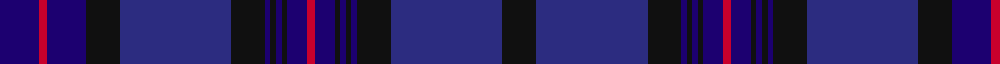

In pattern [BRBKBKBKBKBRBKBKBKBK](/patterns/brbkbkbkbkbrbkbkbkbk/).

This was sourced from house-of-tartan.  It is a [20 stripes tartan](/stripes/stripes20/).

Original link http://www.house-of-tartan.scotland.net/house/TartanViewjs.asp?colr=Def&tnam=2170

## Thread count
DBa/28 R6 DBa28 K24 DB80 K24 DBa4 K4 DBa4 K4 DBa14 R6 DBa14 K4 DBa4 K4 DBa4 K24 DB80 K/24

## Palette
Each colour and its ΔE from the base-6 reference it is a variant of.

| Colour | Shade | Base | ΔE (OKLab) |
|---|---|---|---|
| DB | <code style="background-color:#2C2C80;">#2C2C80</code> `#2C2C80` | B <code style="background-color:#2C4084;">#2C4084</code> | 0.05 |
| DBa | <code style="background-color:#1C0070;">#1C0070</code> `#1C0070` | B <code style="background-color:#2C4084;">#2C4084</code> | 0.14 |
| K | <code style="background-color:#101010;">#101010</code> `#101010` | K <code style="background-color:#000000;">#000000</code> | 0.17 |
| R | <code style="background-color:#C8002C;">#C8002C</code> `#C8002C` | R <code style="background-color:#C80000;">#C80000</code> | 0.03 |

## Nearest tartans

The nearest existing variants by ΔTartan distance.

1. [Rangers F. C. Corporate Tartan Tartan Number: 2062. Earliest known date: 1989 First of a new range of football club tartans designed by the Glasgow kiltmakers, Messrs John MacGregor, who formed a new company, Tartan Sportswear, to develop the idea. The Glasgow Rangers Tartan was launched at September first's game with Ally McCoist in full Highland Dress. See products available Copyright © Blair Urquhart, Comrie, 2015](/setts/s11/r3b12k12ba32k12b2k2b2k2b4r3-b202060-ba1c0070-k101010-rc80000/) — ΔT 1.46
1. [Scottish Canals Corporate Tartan Tartan Number: 3916. Earliest known date: 2001 Designed by Claire Donaldson of House of Edgar for BWB. Initially called Highland Canals, later changed (April 2002) to Caledonian Canal and then in January 2003 to Scottish Canals. See products available Copyright © Blair Urquhart, Comrie, 2015](/setts/s12/g4b2ba58b4g18b52y4b52g18b4ba58b2-b202060-ba2c2c80-g006818-ye8c000/) — ΔT 1.61
1. [Spirit of Alba](/setts/s16/b4g2ba48bb36g4bb4g2b38bc8b38g2bb4g4bb36ba48g2-b2c2c80-ba780078-bb202060-bc2888c4-g006818/) — ΔT 1.69
1. [Black Watch/Isetan Men's](/setts/s13/b42k4b4k4b4k32g32k4g32k32b32k4r2-b1c0070-g004028-k101010-rc8002c/) — ΔT 1.76
1. [Kilmarnock Football Club (2005)](/setts/s20/b56ba22b16ba30bb6ba6bb6ba8w6ba8w6ba8bb6ba6bb6ba30b16ba22b56y4-b1c0070-ba2c2c80-bb780078-we0e0e0-ye8c000/) — ΔT 1.87
1. [Paxton Tartan Tartan Number: 6691. Earliest known date: 2004 Thread samples supplied See products available Copyright © Blair Urquhart, Comrie, 2015](/setts/s11/b60ba8b10g6b4g4b4g20ba14k4ba18-b003054-ba780078-g005030-k101010/) — ΔT 1.88
1. [Stone of Destiny, The](/setts/s16/b24ba6b4r8b4ba40y4ba8y4ba40b4r8b4ba6b24ba4-b14283c-ba2c2c80-r880000-yd09800/) — ΔT 1.94
1. [Woolmark Plaid, The](/setts/s20/b32ba12r2ba60r2ba12b32g32ba2g32b32ba32r2ba8r2ba32b32g32ba2g32-b1c1c1c-ba202060-g406054-rc8002c/) — ΔT 1.96
1. [Rangers Football Club #2](/setts/s11/r6b28k24ba80k24b4k4b4k4b14r6-b000064-ba2c4084-k101010-rc80028/) — ΔT 1.96
1. [Scotland's Own](/setts/s22/b4ba4b8k20b4k4b4ba8k30b60g2b8g2b60k30ba8b4k4b4k20b8ba4-b2c2c80-ba780078-g808080-k101010/) — ΔT 1.97

## Neighbour map

Every grey dot is one of 15726 variants placed by the first two principal components of the ΔTartan feature space (44% of its variance). Red is this tartan; blue dots are its nearest — click one to open its page.

<svg viewBox="0 0 640 380" role="img" style="max-width:100%;height:auto;border:1px solid #e0e0e0;border-radius:4px;display:block" xmlns="http://www.w3.org/2000/svg"><image href="/nn/cloud.v1.png" width="640" height="380"/><a href="/setts/s11/r3b12k12ba32k12b2k2b2k2b4r3-b202060-ba1c0070-k101010-rc80000/"><circle cx="306.3" cy="194.1" r="4" fill="#3465a4"><title>Rangers F. C. Corporate Tartan Tartan Number: 2062. Earliest known date: 1989 First of a new range of football club tartans designed by the Glasgow kiltmakers, Messrs John MacGregor, who formed a new company, Tartan Sportswear, to develop the idea. The Glasgow Rangers Tartan was launched at September first's game with Ally McCoist in full Highland Dress. See products available Copyright © Blair Urquhart, Comrie, 2015</title></circle></a><a href="/setts/s12/g4b2ba58b4g18b52y4b52g18b4ba58b2-b202060-ba2c2c80-g006818-ye8c000/"><circle cx="370.2" cy="185.6" r="4" fill="#3465a4"><title>Scottish Canals Corporate Tartan Tartan Number: 3916. Earliest known date: 2001 Designed by Claire Donaldson of House of Edgar for BWB. Initially called Highland Canals, later changed (April 2002) to Caledonian Canal and then in January 2003 to Scottish Canals. See products available Copyright © Blair Urquhart, Comrie, 2015</title></circle></a><a href="/setts/s16/b4g2ba48bb36g4bb4g2b38bc8b38g2bb4g4bb36ba48g2-b2c2c80-ba780078-bb202060-bc2888c4-g006818/"><circle cx="294.9" cy="153.1" r="4" fill="#3465a4"><title>Spirit of Alba</title></circle></a><a href="/setts/s13/b42k4b4k4b4k32g32k4g32k32b32k4r2-b1c0070-g004028-k101010-rc8002c/"><circle cx="308.4" cy="202.5" r="4" fill="#3465a4"><title>Black Watch/Isetan Men's</title></circle></a><a href="/setts/s20/b56ba22b16ba30bb6ba6bb6ba8w6ba8w6ba8bb6ba6bb6ba30b16ba22b56y4-b1c0070-ba2c2c80-bb780078-we0e0e0-ye8c000/"><circle cx="298.8" cy="163.6" r="4" fill="#3465a4"><title>Kilmarnock Football Club (2005)</title></circle></a><a href="/setts/s11/b60ba8b10g6b4g4b4g20ba14k4ba18-b003054-ba780078-g005030-k101010/"><circle cx="380.2" cy="195.7" r="4" fill="#3465a4"><title>Paxton Tartan Tartan Number: 6691. Earliest known date: 2004 Thread samples supplied See products available Copyright © Blair Urquhart, Comrie, 2015</title></circle></a><a href="/setts/s16/b24ba6b4r8b4ba40y4ba8y4ba40b4r8b4ba6b24ba4-b14283c-ba2c2c80-r880000-yd09800/"><circle cx="365.5" cy="198.5" r="4" fill="#3465a4"><title>Stone of Destiny, The</title></circle></a><a href="/setts/s20/b32ba12r2ba60r2ba12b32g32ba2g32b32ba32r2ba8r2ba32b32g32ba2g32-b1c1c1c-ba202060-g406054-rc8002c/"><circle cx="300.3" cy="172.7" r="4" fill="#3465a4"><title>Woolmark Plaid, The</title></circle></a><a href="/setts/s11/r6b28k24ba80k24b4k4b4k4b14r6-b000064-ba2c4084-k101010-rc80028/"><circle cx="301.0" cy="166.7" r="4" fill="#3465a4"><title>Rangers Football Club #2</title></circle></a><a href="/setts/s22/b4ba4b8k20b4k4b4ba8k30b60g2b8g2b60k30ba8b4k4b4k20b8ba4-b2c2c80-ba780078-g808080-k101010/"><circle cx="417.4" cy="132.4" r="4" fill="#3465a4"><title>Scotland's Own</title></circle></a><circle cx="336.5" cy="163.3" r="5" fill="#c00000"/></svg>

ID: /setts/s20/b28r6b28k24ba80k24b4k4b4k4b14r6b14k4b4k4b4k24ba80k24-b1c0070-ba2c2c80-k101010-rc8002c/
