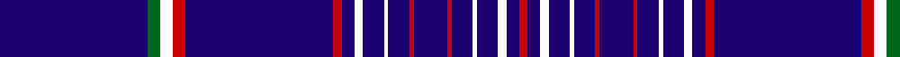

In pattern [BGWRBRBWBWBRBRBWBWBR](/patterns/bgwrbrbwbwbrbrbwbwbr/).

This was sourced from tartans-authority.  It is a [20 stripes tartan](/stripes/stripes20/).

Original link http://www.tartansauthority.com/tartan-ferret/display/10651/

## Thread count
DB/70 G6 W6 R6 DB70 R4 DB6 W4 DB10 W2 DB10 R2 DB16 R2 DB10 W2 DB10 W4 DB6 R/4

## Palette
Each colour and its ΔE from the base-6 reference it is a variant of.

| Colour | Shade | Base | ΔE (OKLab) |
|---|---|---|---|
| DB | <code style="background-color:#1C0070;">#1C0070</code> `#1C0070` | B <code style="background-color:#2A418A;">#2A418A</code> | 0.14 |
| G | <code style="background-color:#006818;">#006818</code> `#006818` | G <code style="background-color:#006100;">#006100</code> | 0.02 |
| R | <code style="background-color:#C80000;">#C80000</code> `#C80000` | R <code style="background-color:#CC0000;">#CC0000</code> | 0.01 |
| W | <code style="background-color:#FCFCFC;">#FCFCFC</code> `#FCFCFC` | W <code style="background-color:#F7F7F7;">#F7F7F7</code> | 0.01 |

## Nearest tartans

The nearest existing variants by ΔTartan distance.

1. [Martha De Laurentiis Name Tartan Tartan Number: 10651. Earliest known date: 05/07/2012 Designed for Martha De Laurentiis. Colours taken from the Italian and American flags to symbolise her American Italian family. See products available Copyright © Blair Urquhart, Comrie, 2015](/setts/s20/b35k3w3r3b35r2b3w2b5w1b5r1b8r1b5w1b5w2b3r2x2~b002366-k000000-rff0000-wffffff/) — ΔT 0.89
1. [Martha De Laurentiis](/setts/s20/b35g3w3r3b35r2b3w2b5w1b5r1b8r1b5w1b5w2b3r2x2~b002366-g008b00-rff0000-wffffff/) — ΔT 1.00
1. [United States (Personal)](/setts/s16/b7ba5w6ba5r7ba2b2ba70w2ba70b2ba2r7ba5w6ba5~b1474b4-ba202060-rc80000-wfcfcfc/) — ΔT 1.08
1. [Suffolk County Police](/setts/s20/b74b6k12y3k3w3b16b8k3b4w3b4k3b8b16w3k3y3k12b6x2~b2c2c80-k101010-we0e0e0-ye8c000/) — ΔT 1.85
1. [Oxford University Dress](/setts/s18/b44g5w2g2b2g2r2b3y3b3r2g2b2g2w2g5b44y4x2~b1c0070-g006818-rc8002c-wfcfcfc-yc4bc68/) — ΔT 1.90
1. [King Pootatau Te Wherowhero](/setts/s14/b23k1b1w1b1r1b4y2b1y2b1y2b1y2x2~b00008c-k101010-rdc0000-wffffff-yd87c00/) — ΔT 1.96
1. [Angotta](/setts/s13/y6b1y1b1y1b5y2b5y4b2r1b40r1x2~b380474-ree0000-ycdad00/) — ΔT 1.97
1. [Cougan Irish Personal Tartan Tartan Number: 6782. Earliest known date: 2005 September Designed by Douglas Gregor of Tartanweb as a personal tartan for Margot Coogan of County Laois, Ireland. The colours reflect those in the Cougan coat of arms - deep red representing the red cross in the shield and the white lines representing the three silver oak leaves. See products available Copyright © Blair Urquhart, Comrie, 2015](/setts/s10/b66r16w2r1w1r1w2r16b66y2x2~b1c0070-r880000-wf8f8f8-ye8c000/) — ΔT 2.04
1. [United States (Corporate)](/setts/s9/b7ba5w6ba5r7ba2b2ba70w2~b1474b4-ba202060-rc80000-wfcfcfc/) — ΔT 2.09
1. [RAAF](/setts/s9/b66w2b10w2b10w2b12r3ba24x2~b1c0070-ba5c8ca8-rc80000-we0e0e0/) — ΔT 2.14

## Neighbour map

Every grey dot is one of 15726 variants placed by the first two principal components of the ΔTartan feature space (44% of its variance). Red is this tartan; blue dots are its nearest — click one to open its page.

<svg viewBox="0 0 640 380" role="img" style="max-width:100%;height:auto;border:1px solid #e0e0e0;border-radius:4px;display:block" xmlns="http://www.w3.org/2000/svg"><image href="/nn/cloud.v1.png" width="640" height="380"/><a href="/setts/s20/b35k3w3r3b35r2b3w2b5w1b5r1b8r1b5w1b5w2b3r2x2~b002366-k000000-rff0000-wffffff/"><circle cx="541.0" cy="90.0" r="4" fill="#3465a4"><title>Martha De Laurentiis Name Tartan Tartan Number: 10651. Earliest known date: 05/07/2012 Designed for Martha De Laurentiis. Colours taken from the Italian and American flags to symbolise her American Italian family. See products available Copyright © Blair Urquhart, Comrie, 2015</title></circle></a><a href="/setts/s20/b35g3w3r3b35r2b3w2b5w1b5r1b8r1b5w1b5w2b3r2x2~b002366-g008b00-rff0000-wffffff/"><circle cx="540.7" cy="89.7" r="4" fill="#3465a4"><title>Martha De Laurentiis</title></circle></a><a href="/setts/s16/b7ba5w6ba5r7ba2b2ba70w2ba70b2ba2r7ba5w6ba5~b1474b4-ba202060-rc80000-wfcfcfc/"><circle cx="543.3" cy="92.5" r="4" fill="#3465a4"><title>United States (Personal)</title></circle></a><a href="/setts/s20/b74b6k12y3k3w3b16b8k3b4w3b4k3b8b16w3k3y3k12b6x2~b2c2c80-k101010-we0e0e0-ye8c000/"><circle cx="480.0" cy="103.9" r="4" fill="#3465a4"><title>Suffolk County Police</title></circle></a><a href="/setts/s18/b44g5w2g2b2g2r2b3y3b3r2g2b2g2w2g5b44y4x2~b1c0070-g006818-rc8002c-wfcfcfc-yc4bc68/"><circle cx="453.6" cy="83.0" r="4" fill="#3465a4"><title>Oxford University Dress</title></circle></a><a href="/setts/s14/b23k1b1w1b1r1b4y2b1y2b1y2b1y2x2~b00008c-k101010-rdc0000-wffffff-yd87c00/"><circle cx="451.7" cy="86.7" r="4" fill="#3465a4"><title>King Pootatau Te Wherowhero</title></circle></a><a href="/setts/s13/y6b1y1b1y1b5y2b5y4b2r1b40r1x2~b380474-ree0000-ycdad00/"><circle cx="546.1" cy="95.3" r="4" fill="#3465a4"><title>Angotta</title></circle></a><a href="/setts/s10/b66r16w2r1w1r1w2r16b66y2x2~b1c0070-r880000-wf8f8f8-ye8c000/"><circle cx="544.5" cy="116.8" r="4" fill="#3465a4"><title>Cougan Irish Personal Tartan Tartan Number: 6782. Earliest known date: 2005 September Designed by Douglas Gregor of Tartanweb as a personal tartan for Margot Coogan of County Laois, Ireland. The colours reflect those in the Cougan coat of arms - deep red representing the red cross in the shield and the white lines representing the three silver oak leaves. See products available Copyright © Blair Urquhart, Comrie, 2015</title></circle></a><a href="/setts/s9/b7ba5w6ba5r7ba2b2ba70w2~b1474b4-ba202060-rc80000-wfcfcfc/"><circle cx="523.2" cy="111.9" r="4" fill="#3465a4"><title>United States (Corporate)</title></circle></a><a href="/setts/s9/b66w2b10w2b10w2b12r3ba24x2~b1c0070-ba5c8ca8-rc80000-we0e0e0/"><circle cx="492.1" cy="136.3" r="4" fill="#3465a4"><title>RAAF</title></circle></a><circle cx="547.8" cy="90.2" r="5" fill="#c00000"/></svg>

ID: /setts/s20/b35g3w3r3b35r2b3w2b5w1b5r1b8r1b5w1b5w2b3r2x2~b1c0070-g006818-rc80000-wfcfcfc/
