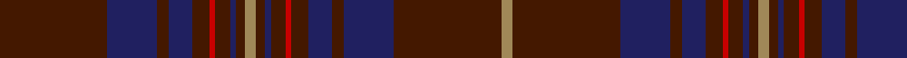

In pattern [BBBBBRBBBYBBBRBBBBBY](/patterns/bbbbbrbbbybbbrbbbbby/).

This was sourced from register-of-tartans.  It is a [20 stripes tartan](/stripes/stripes20/).

Original link https://www.tartanregister.gov.uk/tartanDetails.aspx?ref=5134

## Register references

External register numbers recorded for this tartan.

- Scottish Register of Tartans: [5134](https://www.tartanregister.gov.uk/tartanDetails.aspx?ref=5134)
- Scottish Tartans Authority (ITI): 5733
- Scottish Tartans World Register: 3032

## Thread count
DR/37 DB17 DR4 DB8 DR6 R2 DR5 DB2 DR3 LT4 DR3 DB2 DR5 R2 DR6 DB8 DR4 DB17 DR37 LT/4

## Palette
Each colour and its ΔE from the base-6 reference it is a variant of.

| Colour | Shade | Base | ΔE (OKLab) |
|---|---|---|---|
| DB | <code style="background-color:#202060;">#202060</code> `#202060` | B <code style="background-color:#2A418A;">#2A418A</code> | 0.11 |
| DR | <code style="background-color:#441800;">#441800</code> `#441800` | B <code style="background-color:#2A418A;">#2A418A</code> | 0.23 |
| K | <code style="background-color:#101010;">#101010</code> `#101010` | K <code style="background-color:#000000;">#000000</code> | 0.17 |
| LT | <code style="background-color:#A08858;">#A08858</code> `#A08858` | Y <code style="background-color:#F2BF00;">#F2BF00</code> | 0.21 |
| R | <code style="background-color:#C80000;">#C80000</code> `#C80000` | R <code style="background-color:#CC0000;">#CC0000</code> | 0.01 |

## Nearest tartans

The nearest existing variants by ΔTartan distance.

1. [Griffiths Welsh Name Tartan Tartan Number: 5733. Earliest known date: 2002 The tartan for this Welsh surname and its variation, Griffith, is actually woven in Wales at the Cambrian Woollen Mill, weaving on the same site since 1830. This tartan differs from many traditional patterns in that the warp and weft differ, giving the finished worsted wool cloth more of a predominant stripe, vertically noticeable in the finished Kilt, or Cilt in Wales. Available from Wales Tartan Centres in Swansea See products available Copyright © Blair Urquhart, Comrie, 2015](/setts/s11/y4b37ba17b4ba8b6r2b5ba2b3y4~b441800-ba202060-rc80000-ya08858/) — ΔT 1.52
1. [Lochcarron Mill (Corporate)](/setts/s15/k2b6k2b1k2b1k2b4k4k2b4k19r2k2r2~b404040-k101010-r9c0030~x4/) — ΔT 1.53
1. [Livingstone (Australia) NSW](/setts/s12/g12r4k1y1r2k1y1r4g16r20g2r8~g003820-k101010-r780808-ye1ad29~x2/) — ΔT 1.76
1. [Wanstall](/setts/s10/b12g4b8ba3g3ba3g8ba12b38y2~b680028-ba14283c-g003820-ybc8c00~x2/) — ΔT 1.86
1. [Silver Thistle](/setts/s12/g4b3k6ba20k46r2k4r2k46ba20k6b3~b2c2c80-ba303070-g006818-k101010-r888888~x2/) — ΔT 1.91
1. [Pride (Wales)](/setts/s22/k40b4ba4b4k28b7k8b7k8b10r4b10k8b7k8b7k28b4ba4b4k40g12~b202060-ba5c8ca8-g006818-k101010-rc80000/) — ΔT 1.92
1. [Pride of Scotland, Dark (Fashion)](/setts/s11/b8k2r2b2k13b2k2y1b14k26y2~b343434-k101010-ra07c58-yd0b480~x2/) — ΔT 1.93
1. [Walker Hunting](/setts/s22/r4b2g7b15g3b3g3b7g28k7g6k2g6k7g28b7g3b3g3b15g7b2~b202060-g205034-k101010-rc80000~x2/) — ΔT 1.95
1. [MacInnes Homecoming](/setts/s12/r3k19b2k2b2k2b18k3ba3k3b23ra3~b383838-ba1c1c50-k101010-ra47c00-rab02414~x2/) — ΔT 1.99
1. [Rice of Wales](/setts/s18/r21y1r21g8b4g5b4g4y4g4b4g5b4g8r21y1r21y4~b202060-g5c6428-r901c38-ybc8c00~x2/) — ΔT 2.02

## Neighbour map

Every grey dot is one of 15726 variants placed by the first two principal components of the ΔTartan feature space (44% of its variance). Red is this tartan; blue dots are its nearest — click one to open its page.

<svg viewBox="0 0 640 380" role="img" style="max-width:100%;height:auto;border:1px solid #e0e0e0;border-radius:4px;display:block" xmlns="http://www.w3.org/2000/svg"><image href="/nn/cloud.v1.png" width="640" height="380"/><a href="/setts/s11/y4b37ba17b4ba8b6r2b5ba2b3y4~b441800-ba202060-rc80000-ya08858/"><circle cx="428.6" cy="171.0" r="4" fill="#3465a4"><title>Griffiths Welsh Name Tartan Tartan Number: 5733. Earliest known date: 2002 The tartan for this Welsh surname and its variation, Griffith, is actually woven in Wales at the Cambrian Woollen Mill, weaving on the same site since 1830. This tartan differs from many traditional patterns in that the warp and weft differ, giving the finished worsted wool cloth more of a predominant stripe, vertically noticeable in the finished Kilt, or Cilt in Wales. Available from Wales Tartan Centres in Swansea See products available Copyright © Blair Urquhart, Comrie, 2015</title></circle></a><a href="/setts/s15/k2b6k2b1k2b1k2b4k4k2b4k19r2k2r2~b404040-k101010-r9c0030~x4/"><circle cx="433.0" cy="179.1" r="4" fill="#3465a4"><title>Lochcarron Mill (Corporate)</title></circle></a><a href="/setts/s12/g12r4k1y1r2k1y1r4g16r20g2r8~g003820-k101010-r780808-ye1ad29~x2/"><circle cx="408.6" cy="173.5" r="4" fill="#3465a4"><title>Livingstone (Australia) NSW</title></circle></a><a href="/setts/s10/b12g4b8ba3g3ba3g8ba12b38y2~b680028-ba14283c-g003820-ybc8c00~x2/"><circle cx="486.5" cy="196.5" r="4" fill="#3465a4"><title>Wanstall</title></circle></a><a href="/setts/s12/g4b3k6ba20k46r2k4r2k46ba20k6b3~b2c2c80-ba303070-g006818-k101010-r888888~x2/"><circle cx="473.0" cy="163.6" r="4" fill="#3465a4"><title>Silver Thistle</title></circle></a><a href="/setts/s22/k40b4ba4b4k28b7k8b7k8b10r4b10k8b7k8b7k28b4ba4b4k40g12~b202060-ba5c8ca8-g006818-k101010-rc80000/"><circle cx="403.8" cy="179.4" r="4" fill="#3465a4"><title>Pride (Wales)</title></circle></a><a href="/setts/s11/b8k2r2b2k13b2k2y1b14k26y2~b343434-k101010-ra07c58-yd0b480~x2/"><circle cx="427.9" cy="169.0" r="4" fill="#3465a4"><title>Pride of Scotland, Dark (Fashion)</title></circle></a><a href="/setts/s22/r4b2g7b15g3b3g3b7g28k7g6k2g6k7g28b7g3b3g3b15g7b2~b202060-g205034-k101010-rc80000~x2/"><circle cx="388.4" cy="183.9" r="4" fill="#3465a4"><title>Walker Hunting</title></circle></a><a href="/setts/s12/r3k19b2k2b2k2b18k3ba3k3b23ra3~b383838-ba1c1c50-k101010-ra47c00-rab02414~x2/"><circle cx="384.6" cy="189.5" r="4" fill="#3465a4"><title>MacInnes Homecoming</title></circle></a><a href="/setts/s18/r21y1r21g8b4g5b4g4y4g4b4g5b4g8r21y1r21y4~b202060-g5c6428-r901c38-ybc8c00~x2/"><circle cx="392.6" cy="153.5" r="4" fill="#3465a4"><title>Rice of Wales</title></circle></a><circle cx="461.7" cy="158.4" r="5" fill="#c00000"/></svg>

ID: /setts/s20/b37ba17b4ba8b6r2b5ba2b3y4b3ba2b5r2b6ba8b4ba17b37y4~b441800-ba202060-rc80000-ya08858/
