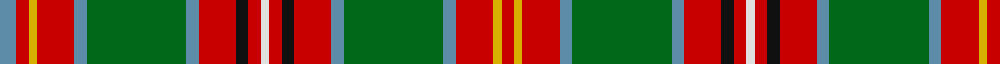

In pattern [BRYRBGBRKRWRKRBGBRYR](/patterns/bryrbgbrkrwrkrbgbryr/).

This was sourced from register-of-tartans.  It is a [20 stripes tartan](/stripes/stripes20/).

Original link https://www.tartanregister.gov.uk/tartanDetails.aspx?ref=4689

## Thread count
B/8 R6 Y4 R18 B6 G48 B6 R18 K6 R6 LN4 R6 K6 R18 B6 G48 B6 R18 Y4 R/6

## Palette
Each colour and its ΔE from the base-6 reference it is a variant of.

| Colour | Shade | Base | ΔE (OKLab) |
|---|---|---|---|
| B | <code style="background-color:#5C8CA8;">#5C8CA8</code> `#5C8CA8` | B <code style="background-color:#2A418A;">#2A418A</code> | 0.23 |
| DG | <code style="background-color:#003820;">#003820</code> `#003820` | G <code style="background-color:#006100;">#006100</code> | 0.15 |
| G | <code style="background-color:#006818;">#006818</code> `#006818` | G <code style="background-color:#006100;">#006100</code> | 0.02 |
| K | <code style="background-color:#101010;">#101010</code> `#101010` | K <code style="background-color:#000000;">#000000</code> | 0.17 |
| LN | <code style="background-color:#E0E0E0;">#E0E0E0</code> `#E0E0E0` | W <code style="background-color:#F7F7F7;">#F7F7F7</code> | 0.07 |
| R | <code style="background-color:#C80000;">#C80000</code> `#C80000` | R <code style="background-color:#CC0000;">#CC0000</code> | 0.01 |
| Y | <code style="background-color:#D8B000;">#D8B000</code> `#D8B000` | Y <code style="background-color:#F2BF00;">#F2BF00</code> | 0.06 |

## Nearest tartans

The nearest existing variants by ΔTartan distance.

1. [MacGuire Irish Family Tartan Tartan Number: 2427. Earliest known date: 1985 MacGuire is an Irish Family tartan See products available Copyright © Blair Urquhart, Comrie, 2015](/setts/s14/w10b3g30r4ba12r30ba6r6ba6r6ba6r30g30bb4-b202060-ba5c8ca8-bb003c64-g006818-rc80000-we0e0e0/) — ΔT 1.09
1. [Pernel (Personal)](/setts/s17/k16w2r4g32r16g16r22y4g4ya2g4w4r20y4r4k2w8-g006818-k101010-rc80000-we0e0e0-ye8c000-yad87c00/) — ΔT 1.10
1. [Innes (D C Stewart)](/setts/s16/k4g24r4k4r4k4r32y4r6b12r6k2g16k2r6w4-b2c2c80-g006818-k101010-rc80000-wfcfcfc-ye8c000/) — ΔT 1.16
1. [MacMaster (New) Family Tartan Tartan Number: 3218. Earliest known date: 2001 Asymetrical design follows Canadian tradition. Elements of the MacInnes and the Nova Scotia tartans were included in line with Dave McMaster's family history. See products available Copyright © Blair Urquhart, Comrie, 2015](/setts/s28/g24r24g4r4g4r4g12y4r2y4g12r4g4r4g4r24b16g16k4r8k4r8k4g16b16r24g24ba4-b2c2c80-ba5c8ca8-g006818-k101010-rc80000-ye8c000/) — ΔT 1.18
1. [Wilson, Janet](/setts/s22/b60w4ba6g6ba6g6ba6g32r6g6r6g6r6g6r6g50r30g8ba8r16w4r30-b304080-ba5480b0-g008000-rc00000-we0e0e0/) — ΔT 1.18
1. [O'Keefe](/setts/s22/k16r4k6y4k4w6k4ya24g44r4g4k2g4r4g44ya24k4w6k4y4k6r4-g8c7038-k101010-rc80000-we0e0e0-ye8c000-yaa08858/) — ΔT 1.22
1. [Wilson, Janet (1780 Original)](/setts/s22/b60w4ba6g6ba6g6ba6g32r6g6r6g6r6g6r6g50r30g8ba8r16w4r30-b440044-ba5c8ca8-g285800-rc80000-we0e0e0/) — ΔT 1.25
1. [Harmon Dress (Personal)](/setts/s19/k4y12ya4y4ya4y38b4g4b4y4r8k4r22g4r4g4r22g4ya4-b2c2c80-g006818-k101010-r880000-yb8b8b8-yae8c000/) — ΔT 1.31
1. [Baxter Clan/Family Tartan Tartan Number: 3664. Earliest known date: 1856 This Baxter tartan is recorded by Logan (c.1832) as "Buchanan". Logans complied his tartan list from the limited information available at the time. It appears in a description as Baxter in D. Macgregor Peter's Baronage of Angus & Mearns, 1856. The principal branch of the clan is the Baxters of Earlshall who live at Leuchars in north Fife. See products available Copyright © Blair Urquhart, Comrie, 2015](/setts/s24/g64k4b8k4y16k4y16k4b8k4r64w8r64k4b8k4y16k4y16k4b8k4g64b8-b4468a4-g006818-k101010-r880000-wfcfcfc-yd09800/) — ΔT 1.34
1. [Wilson (Janet) #2](/setts/s22/b60w4ba6g6ba6g6ba6g32r6g6r6g6r6g6r6g50r30g8ba8r16w4r30-b2c4084-ba3c82af-g005020-rdc0000-we0e0e0/) — ΔT 1.35

## Neighbour map

Every grey dot is one of 15726 variants placed by the first two principal components of the ΔTartan feature space (44% of its variance). Red is this tartan; blue dots are its nearest — click one to open its page.

<svg viewBox="0 0 640 380" role="img" style="max-width:100%;height:auto;border:1px solid #e0e0e0;border-radius:4px;display:block" xmlns="http://www.w3.org/2000/svg"><image href="/nn/cloud.v1.png" width="640" height="380"/><a href="/setts/s14/w10b3g30r4ba12r30ba6r6ba6r6ba6r30g30bb4-b202060-ba5c8ca8-bb003c64-g006818-rc80000-we0e0e0/"><circle cx="171.8" cy="135.0" r="4" fill="#3465a4"><title>MacGuire Irish Family Tartan Tartan Number: 2427. Earliest known date: 1985 MacGuire is an Irish Family tartan See products available Copyright © Blair Urquhart, Comrie, 2015</title></circle></a><a href="/setts/s17/k16w2r4g32r16g16r22y4g4ya2g4w4r20y4r4k2w8-g006818-k101010-rc80000-we0e0e0-ye8c000-yad87c00/"><circle cx="161.9" cy="95.3" r="4" fill="#3465a4"><title>Pernel (Personal)</title></circle></a><a href="/setts/s16/k4g24r4k4r4k4r32y4r6b12r6k2g16k2r6w4-b2c2c80-g006818-k101010-rc80000-wfcfcfc-ye8c000/"><circle cx="186.8" cy="94.6" r="4" fill="#3465a4"><title>Innes (D C Stewart)</title></circle></a><a href="/setts/s28/g24r24g4r4g4r4g12y4r2y4g12r4g4r4g4r24b16g16k4r8k4r8k4g16b16r24g24ba4-b2c2c80-ba5c8ca8-g006818-k101010-rc80000-ye8c000/"><circle cx="173.0" cy="110.0" r="4" fill="#3465a4"><title>MacMaster (New) Family Tartan Tartan Number: 3218. Earliest known date: 2001 Asymetrical design follows Canadian tradition. Elements of the MacInnes and the Nova Scotia tartans were included in line with Dave McMaster's family history. See products available Copyright © Blair Urquhart, Comrie, 2015</title></circle></a><a href="/setts/s22/b60w4ba6g6ba6g6ba6g32r6g6r6g6r6g6r6g50r30g8ba8r16w4r30-b304080-ba5480b0-g008000-rc00000-we0e0e0/"><circle cx="192.3" cy="103.9" r="4" fill="#3465a4"><title>Wilson, Janet</title></circle></a><a href="/setts/s22/k16r4k6y4k4w6k4ya24g44r4g4k2g4r4g44ya24k4w6k4y4k6r4-g8c7038-k101010-rc80000-we0e0e0-ye8c000-yaa08858/"><circle cx="195.0" cy="61.1" r="4" fill="#3465a4"><title>O'Keefe</title></circle></a><a href="/setts/s22/b60w4ba6g6ba6g6ba6g32r6g6r6g6r6g6r6g50r30g8ba8r16w4r30-b440044-ba5c8ca8-g285800-rc80000-we0e0e0/"><circle cx="197.9" cy="101.4" r="4" fill="#3465a4"><title>Wilson, Janet (1780 Original)</title></circle></a><a href="/setts/s19/k4y12ya4y4ya4y38b4g4b4y4r8k4r22g4r4g4r22g4ya4-b2c2c80-g006818-k101010-r880000-yb8b8b8-yae8c000/"><circle cx="127.9" cy="91.8" r="4" fill="#3465a4"><title>Harmon Dress (Personal)</title></circle></a><a href="/setts/s24/g64k4b8k4y16k4y16k4b8k4r64w8r64k4b8k4y16k4y16k4b8k4g64b8-b4468a4-g006818-k101010-r880000-wfcfcfc-yd09800/"><circle cx="138.0" cy="67.6" r="4" fill="#3465a4"><title>Baxter Clan/Family Tartan Tartan Number: 3664. Earliest known date: 1856 This Baxter tartan is recorded by Logan (c.1832) as &quot;Buchanan&quot;. Logans complied his tartan list from the limited information available at the time. It appears in a description as Baxter in D. Macgregor Peter's Baronage of Angus &amp; Mearns, 1856. The principal branch of the clan is the Baxters of Earlshall who live at Leuchars in north Fife. See products available Copyright © Blair Urquhart, Comrie, 2015</title></circle></a><a href="/setts/s22/b60w4ba6g6ba6g6ba6g32r6g6r6g6r6g6r6g50r30g8ba8r16w4r30-b2c4084-ba3c82af-g005020-rdc0000-we0e0e0/"><circle cx="192.7" cy="102.6" r="4" fill="#3465a4"><title>Wilson (Janet) #2</title></circle></a><circle cx="180.1" cy="101.2" r="5" fill="#c00000"/></svg>

ID: /setts/s20/b8r6y4r18b6g48b6r18k6r6w4r6k6r18b6g48b6r18y4r6-b5c8ca8-g006818-k101010-rc80000-we0e0e0-yd8b000/
