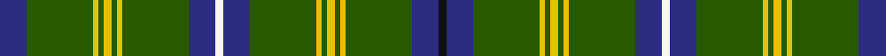

**Bands:** [KBGYGYGYGBWBGYGYGYGB](/stripes/kbgygygygbwbgygygygb/) · **Stripes:** [K DB DG LY DG LY DG LY DG DB W DB DG LY DG LY DG LY DG DB](/stripes/stripes20/) K DB DG LY DG LY DG LY DG DB W DB DG LY DG LY DG LY DG DB

This was sourced from house-of-tartan.  It is a [20 band tartan](/bands/bands20/).

Original link http://www.house-of-tartan.scotland.net/house/TartanViewjs.asp?colr=Def&tnam=6522

## Thread count
DB/20 G50 Y4 G4 Y6 G4 Y4 G50 DB20 W6 DB20 G50 Y4 G4 Y6 G4 Y4 G50 DB20 K/6

## Palette
Each colour and its ΔE from the base-6 reference it is a variant of.

| Colour | Shade | Base | ΔE (OKLab) |
|---|---|---|---|
| DB | <code style="background-color:#2C2C80;">#2C2C80</code> `#2C2C80` | B <code style="background-color:#2A418A;">#2A418A</code> | 0.06 |
| G | <code style="background-color:#285800;">#285800</code> `#285800` | G <code style="background-color:#006100;">#006100</code> | 0.03 |
| K | <code style="background-color:#101010;">#101010</code> `#101010` | K <code style="background-color:#000000;">#000000</code> | 0.17 |
| W | <code style="background-color:#F8F8F8;">#F8F8F8</code> `#F8F8F8` | W <code style="background-color:#F7F7F7;">#F7F7F7</code> | 0.00 |
| Y | <code style="background-color:#E8C000;">#E8C000</code> `#E8C000` | Y <code style="background-color:#F2BF00;">#F2BF00</code> | 0.02 |

## Nearest tartans

The nearest existing variants by ΔTartan distance.

1. [Seattle](/setts/s18/g14lb1db2r1g1r1db2lb1g4lb1db2r1g1r1db2lb1g14lo1~x4/) — ΔT 1.02
1. [Holmes (Clan)](/setts/s15/ly4g39db9k3db5k3db9g32r2g3r2g5ly2g3r3~x2/) — ΔT 1.22
1. [William & Mary GALA (Corporate)](/setts/s11/k3db10dg25ly2dg2ly3dg2ly2dg25db10w3~x2/) — ΔT 1.29
1. [Ronald, Clan (Clan)](/setts/s11/db2r1g10r1k6g12r2g1r1g3w2~x4/) — ΔT 1.36
1. [Bartlett from Winnetka, Illinois](/setts/s13/k3g3ly2g4k2g3k2g24db10ly2db10g30r3~x2/) — ΔT 1.36
1. [Holmes](/setts/s28/ly4g39db9k3db5k3db9g32r2g3r2g5ly2g3r3~x2/) — ΔT 1.41
1. [Kinnear, Barony of (Personal)](/setts/s20/k4r2k8g3k8g36k8g3r4lb2r3lo2r4g3k8g36k8g3k8r2~x2/) — ΔT 1.41
1. [Bartlett from Winnetka, Illinois](/setts/s13/r4g40db12lo2db12g30k2g4k2g4lo2g3k3~x2/) — ΔT 1.43
1. [Sea Bees Regimental Tartan Tartan Number: 2197. Earliest known date: 1986 US military unit. See products available Copyright © Blair Urquhart, Comrie, 2015](/setts/s24/db6g3lb6g7ly2g36ly2g7lb6g3db6g3dy6g3r6g7ly2g36ly2g7r6g3dy6g3~x2/) — ΔT 1.43
1. [Kennedy #2](/setts/s15/ly8dg77db18k7db9k6db18dg64r4dg5r4dg9ly4dg5r6/) — ΔT 1.44

## Neighbour map

Every grey dot is one of 14299 variants placed by the first two principal components of the ΔTartan feature space (44% of its variance). Red is this tartan; blue dots are its nearest — click one to open its page.

<svg viewBox="0 0 640 380" role="img" style="max-width:100%;height:auto;border:1px solid #e0e0e0;border-radius:4px;display:block" xmlns="http://www.w3.org/2000/svg"><image href="/nn/cloud.v1.png" width="640" height="380"/><a href="/setts/s18/g14lb1db2r1g1r1db2lb1g4lb1db2r1g1r1db2lb1g14lo1~x4/"><circle cx="363.6" cy="111.2" r="4" fill="#3465a4"><title>Seattle</title></circle></a><a href="/setts/s15/ly4g39db9k3db5k3db9g32r2g3r2g5ly2g3r3~x2/"><circle cx="391.6" cy="122.7" r="4" fill="#3465a4"><title>Holmes (Clan)</title></circle></a><a href="/setts/s11/k3db10dg25ly2dg2ly3dg2ly2dg25db10w3~x2/"><circle cx="323.8" cy="153.2" r="4" fill="#3465a4"><title>William &amp; Mary GALA (Corporate)</title></circle></a><a href="/setts/s11/db2r1g10r1k6g12r2g1r1g3w2~x4/"><circle cx="323.8" cy="160.8" r="4" fill="#3465a4"><title>Ronald, Clan (Clan)</title></circle></a><a href="/setts/s13/k3g3ly2g4k2g3k2g24db10ly2db10g30r3~x2/"><circle cx="346.8" cy="136.1" r="4" fill="#3465a4"><title>Bartlett from Winnetka, Illinois</title></circle></a><a href="/setts/s28/ly4g39db9k3db5k3db9g32r2g3r2g5ly2g3r3~x2/"><circle cx="400.6" cy="103.1" r="4" fill="#3465a4"><title>Holmes</title></circle></a><a href="/setts/s20/k4r2k8g3k8g36k8g3r4lb2r3lo2r4g3k8g36k8g3k8r2~x2/"><circle cx="310.9" cy="111.0" r="4" fill="#3465a4"><title>Kinnear, Barony of (Personal)</title></circle></a><a href="/setts/s13/r4g40db12lo2db12g30k2g4k2g4lo2g3k3~x2/"><circle cx="405.9" cy="135.7" r="4" fill="#3465a4"><title>Bartlett from Winnetka, Illinois</title></circle></a><a href="/setts/s24/db6g3lb6g7ly2g36ly2g7lb6g3db6g3dy6g3r6g7ly2g36ly2g7r6g3dy6g3~x2/"><circle cx="363.3" cy="94.3" r="4" fill="#3465a4"><title>Sea Bees Regimental Tartan Tartan Number: 2197. Earliest known date: 1986 US military unit. See products available Copyright © Blair Urquhart, Comrie, 2015</title></circle></a><a href="/setts/s15/ly8dg77db18k7db9k6db18dg64r4dg5r4dg9ly4dg5r6/"><circle cx="402.0" cy="129.9" r="4" fill="#3465a4"><title>Kennedy #2</title></circle></a><circle cx="336.3" cy="136.0" r="5" fill="#c00000"/></svg>

ID: /setts/s20/db10dg25ly2dg2ly3dg2ly2dg25db10w3db10dg25ly2dg2ly3dg2ly2dg25db10k3~x2/
