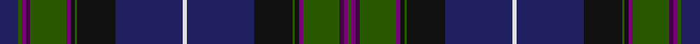

This page is one **sett** — a single exact thread-count. It belongs to the [tartan](/tartans/db9dg2dpi2dp2dg18dpi2k2dg1k19db33w2/)
(the same proportion at any scale), whose colour order is pattern [BGBBGBKGKBWBKGKBGBBG](/stripes/bgbbgbkgkbwbkgkbgbbg/).

Sourced from register-of-tartans.  It is a [20 stripe tartan](/stripes/stripes20/).

Original link https://www.tartanregister.gov.uk/tartanDetails.aspx?ref=1715

## Register references

External register numbers recorded for this tartan.

- Scottish Register of Tartans: [1715](https://www.tartanregister.gov.uk/tartanDetails.aspx?ref=1715)
- Scottish Tartans Authority (ITI): 6477

## Thread count
DB/18 G4 Pa4 DP4 G36 Pa4 K4 G2 K38 DB66 LN4 DB66 K38 G2 K4 Pa4 G36 DP4 Pa4 G/4

## Palette

Palette: <strong>Tartan Register</strong> <small style="color:#888">(6 of 7 colours)</small>
<table><thead><tr><th>Colour</th><th>Threads</th><th>Shade</th><th>Base</th><th>OKLCh</th></tr></thead><tbody><tr><td>DB/</td><td style="text-align:right;font-variant-numeric:tabular-nums">18</td><td><code style="background-color:#202060;">#202060</code> <small style="color:#888">#202060</small></td><td>B <code style="background-color:#2A418A;">#2A418A</code></td><td><small style="color:#888">oklch(28.9% 0.111 276.9)</small></td></tr><tr><td>G</td><td style="text-align:right;font-variant-numeric:tabular-nums">4</td><td><code style="background-color:#285800;">#285800</code> <small style="color:#888">#285800</small></td><td>G <code style="background-color:#006100;">#006100</code></td><td><small style="color:#888">oklch(41.0% 0.122 135.8)</small></td></tr><tr><td>Pa</td><td style="text-align:right;font-variant-numeric:tabular-nums">4</td><td><code style="background-color:#780078;">#780078</code> <small style="color:#888">#780078</small></td><td>B <code style="background-color:#2A418A;">#2A418A</code></td><td><small style="color:#888">oklch(40.2% 0.185 328.4)</small></td></tr><tr><td>DP</td><td style="text-align:right;font-variant-numeric:tabular-nums">4</td><td><code style="background-color:#440044;">#440044</code> <small style="color:#888">#440044</small></td><td>B <code style="background-color:#2A418A;">#2A418A</code></td><td><small style="color:#888">oklch(27.1% 0.125 328.4)</small></td></tr><tr><td>G</td><td style="text-align:right;font-variant-numeric:tabular-nums">36</td><td><code style="background-color:#285800;">#285800</code> <small style="color:#888">#285800</small></td><td>G <code style="background-color:#006100;">#006100</code></td><td><small style="color:#888">oklch(41.0% 0.122 135.8)</small></td></tr><tr><td>Pa</td><td style="text-align:right;font-variant-numeric:tabular-nums">4</td><td><code style="background-color:#780078;">#780078</code> <small style="color:#888">#780078</small></td><td>B <code style="background-color:#2A418A;">#2A418A</code></td><td><small style="color:#888">oklch(40.2% 0.185 328.4)</small></td></tr><tr><td>K</td><td style="text-align:right;font-variant-numeric:tabular-nums">4</td><td><code style="background-color:#101010;">#101010</code> <small style="color:#888">#101010</small></td><td>K <code style="background-color:#000000;">#000000</code></td><td><small style="color:#888">oklch(17.3% 0.000 89.9)</small></td></tr><tr><td>G</td><td style="text-align:right;font-variant-numeric:tabular-nums">2</td><td><code style="background-color:#285800;">#285800</code> <small style="color:#888">#285800</small></td><td>G <code style="background-color:#006100;">#006100</code></td><td><small style="color:#888">oklch(41.0% 0.122 135.8)</small></td></tr><tr><td>K</td><td style="text-align:right;font-variant-numeric:tabular-nums">38</td><td><code style="background-color:#101010;">#101010</code> <small style="color:#888">#101010</small></td><td>K <code style="background-color:#000000;">#000000</code></td><td><small style="color:#888">oklch(17.3% 0.000 89.9)</small></td></tr><tr><td>DB</td><td style="text-align:right;font-variant-numeric:tabular-nums">66</td><td><code style="background-color:#202060;">#202060</code> <small style="color:#888">#202060</small></td><td>B <code style="background-color:#2A418A;">#2A418A</code></td><td><small style="color:#888">oklch(28.9% 0.111 276.9)</small></td></tr><tr><td>LN</td><td style="text-align:right;font-variant-numeric:tabular-nums">4</td><td><code style="background-color:#E0E0E0;">#E0E0E0</code> <small style="color:#888">#E0E0E0</small></td><td>W <code style="background-color:#F7F7F7;">#F7F7F7</code></td><td><small style="color:#888">oklch(90.7% 0.000 89.9)</small></td></tr><tr><td>DB</td><td style="text-align:right;font-variant-numeric:tabular-nums">66</td><td><code style="background-color:#202060;">#202060</code> <small style="color:#888">#202060</small></td><td>B <code style="background-color:#2A418A;">#2A418A</code></td><td><small style="color:#888">oklch(28.9% 0.111 276.9)</small></td></tr><tr><td>K</td><td style="text-align:right;font-variant-numeric:tabular-nums">38</td><td><code style="background-color:#101010;">#101010</code> <small style="color:#888">#101010</small></td><td>K <code style="background-color:#000000;">#000000</code></td><td><small style="color:#888">oklch(17.3% 0.000 89.9)</small></td></tr><tr><td>G</td><td style="text-align:right;font-variant-numeric:tabular-nums">2</td><td><code style="background-color:#285800;">#285800</code> <small style="color:#888">#285800</small></td><td>G <code style="background-color:#006100;">#006100</code></td><td><small style="color:#888">oklch(41.0% 0.122 135.8)</small></td></tr><tr><td>K</td><td style="text-align:right;font-variant-numeric:tabular-nums">4</td><td><code style="background-color:#101010;">#101010</code> <small style="color:#888">#101010</small></td><td>K <code style="background-color:#000000;">#000000</code></td><td><small style="color:#888">oklch(17.3% 0.000 89.9)</small></td></tr><tr><td>Pa</td><td style="text-align:right;font-variant-numeric:tabular-nums">4</td><td><code style="background-color:#780078;">#780078</code> <small style="color:#888">#780078</small></td><td>B <code style="background-color:#2A418A;">#2A418A</code></td><td><small style="color:#888">oklch(40.2% 0.185 328.4)</small></td></tr><tr><td>G</td><td style="text-align:right;font-variant-numeric:tabular-nums">36</td><td><code style="background-color:#285800;">#285800</code> <small style="color:#888">#285800</small></td><td>G <code style="background-color:#006100;">#006100</code></td><td><small style="color:#888">oklch(41.0% 0.122 135.8)</small></td></tr><tr><td>DP</td><td style="text-align:right;font-variant-numeric:tabular-nums">4</td><td><code style="background-color:#440044;">#440044</code> <small style="color:#888">#440044</small></td><td>B <code style="background-color:#2A418A;">#2A418A</code></td><td><small style="color:#888">oklch(27.1% 0.125 328.4)</small></td></tr><tr><td>Pa</td><td style="text-align:right;font-variant-numeric:tabular-nums">4</td><td><code style="background-color:#780078;">#780078</code> <small style="color:#888">#780078</small></td><td>B <code style="background-color:#2A418A;">#2A418A</code></td><td><small style="color:#888">oklch(40.2% 0.185 328.4)</small></td></tr><tr><td>G/</td><td style="text-align:right;font-variant-numeric:tabular-nums">4</td><td><code style="background-color:#285800;">#285800</code> <small style="color:#888">#285800</small></td><td>G <code style="background-color:#006100;">#006100</code></td><td><small style="color:#888">oklch(41.0% 0.122 135.8)</small></td></tr></tbody></table>

## Nearest tartans

The nearest existing variants by ΔTartan distance, with this tartan at the top so the swatches line up against it.

ΔTartan

Tartan

Sett

—

<a href="/ttd/edit/#slug=db9dg2dpi2dp2dg18dpi2k2dg1k19db33w2~x2">Highland Pride of Scotland</a> <a class="nn-out" href="/setts/s20/db9dg2dpi2dp2dg18dpi2k2dg1k19db33w2~x2/" title="open its dictionary page">↗</a>

1.13

<a href="/ttd/edit/#slug=dg5r4m1db36r4dg15r8y1db15r4dg36r4ri1db5y1~x2">Glen Orchy (Fashion)</a> <a class="nn-out" href="/setts/s15/dg5r4m1db36r4dg15r8y1db15r4dg36r4ri1db5y1~x2/" title="open its dictionary page">↗</a>

1.24

<a href="/ttd/edit/#slug=g6dpi2dp2g2dp15g3k2g1k15db43w2db43k15g1k2g2dp15g3dp2dpi2~x2">Scottish Pride</a> <a class="nn-out" href="/setts/s20/g6dpi2dp2g2dp15g3k2g1k15db43w2db43k15g1k2g2dp15g3dp2dpi2~x2/" title="open its dictionary page">↗</a>

1.28

<a href="/ttd/edit/#slug=db9dg2dpi2dp2dg18dpi2k2dg1k19db33w2~x2">Highland Pride of Scotland (Fashion)</a> <a class="nn-out" href="/setts/s11/db9dg2dpi2dp2dg18dpi2k2dg1k19db33w2~x2/" title="open its dictionary page">↗</a>

1.30

<a href="/setts/s20/db4b1dt20db2dt2db18dg2db2dg22k2dp4~x2/">Heartlands Fancy Tartan Tartan Number: 3443. Earliest known date: 2002 Designed by Erica Randall of House of Edgar for MacGregor &amp; MacDuff of 41 Bath Street, Glasgow G2 1HW for use in their kilt hire business. The customer requested that the tartan be based upon the Melville sett. Date of application 6th November 2002. In May 2003 the business was sold by Mr Robert Brown who elected to retain the copyright of this tartan. See products available Copyright © Blair Urquhart, Comrie, 2015</a>

1.31

<a href="/ttd/edit/#slug=dg4r1dg1r3dg16k12r1db27lb2db3lb1ly2~x2">McGuirk (2013)</a> <a class="nn-out" href="/setts/s12/dg4r1dg1r3dg16k12r1db27lb2db3lb1ly2~x2/" title="open its dictionary page">↗</a>

1.35

<a href="/setts/s20/db4b1dt20db2dt2db18dg2db2dg22m2dp4~x2/">Heartlands</a>

1.38

<a href="/ttd/edit/#slug=r2k1dg24k16db2k2db2k2db24k2db2k2db2k16dg24k1ly2~x2">St. Mary's Help of... (School)</a> <a class="nn-out" href="/setts/s17/r2k1dg24k16db2k2db2k2db24k2db2k2db2k16dg24k1ly2~x2/" title="open its dictionary page">↗</a>

1.40

<a href="/setts/s18/db6w1db40m1k12dg12m6dg2dp2dg4~x2/">Scotland the Brave</a>

1.43

<a href="/ttd/edit/#slug=k3db2g2db26t1db1t1db1t1db1t3ti2k10db3g14k3r3~x2">St Lawrence District Tartan Tartan Number: 1030. Earliest known date: pre 1963 Presented to the STS collection by Mr A Yule in 1963. designed by Mrs. Helene Cobb of Clayton and is the registered trademark of the Thousand Islands Museum in Clayton, New York State - www.timuseum.org Woven by Peter MacArthur of Biggar, Scotland. The greens are for the cedars along the shore, the blues are for the St Lawrence River, and the red is the sunset over the Islands. John Fitzpatrick in his review of Canadian tartans in July 2008, pointed out that there were two slightly different thread counts given in the CIDD. See products available Copyright © Blair Urquhart, Comrie, 2015</a> <a class="nn-out" href="/setts/s17/k3db2g2db26t1db1t1db1t1db1t3ti2k10db3g14k3r3~x2/" title="open its dictionary page">↗</a>

1.44

<a href="/ttd/edit/#slug=db24k2db2dp2db2dg16y1dg2y3dg2y1dg16k20db2dp2db2k2~x2">Sandilands-Watson (Personal)</a> <a class="nn-out" href="/setts/s17/db24k2db2dp2db2dg16y1dg2y3dg2y1dg16k20db2dp2db2k2~x2/" title="open its dictionary page">↗</a>

## Neighbour map

Every grey dot is one of 14359 variants placed by the first two principal components of the ΔTartan feature space (44% of its variance). Red is this tartan; blue dots are its nearest — click one to open its page.

<svg viewBox="0 0 640 380" role="img" style="max-width:100%;height:auto;border:1px solid #e0e0e0;border-radius:4px;display:block" xmlns="http://www.w3.org/2000/svg"><image href="/nn/cloud.v1.png" width="640" height="380"/><a href="/setts/s15/dg5r4m1db36r4dg15r8y1db15r4dg36r4ri1db5y1~x2/"><circle cx="287.4" cy="97.1" r="4" fill="#3465a4"><title>Glen Orchy (Fashion)</title></circle></a><a href="/setts/s20/g6dpi2dp2g2dp15g3k2g1k15db43w2db43k15g1k2g2dp15g3dp2dpi2~x2/"><circle cx="332.1" cy="81.6" r="4" fill="#3465a4"><title>Scottish Pride</title></circle></a><a href="/setts/s11/db9dg2dpi2dp2dg18dpi2k2dg1k19db33w2~x2/"><circle cx="296.9" cy="120.1" r="4" fill="#3465a4"><title>Highland Pride of Scotland (Fashion)</title></circle></a><a href="/setts/s20/db4b1dt20db2dt2db18dg2db2dg22k2dp4~x2/"><circle cx="232.4" cy="127.2" r="4" fill="#3465a4"><title>Heartlands Fancy Tartan Tartan Number: 3443. Earliest known date: 2002 Designed by Erica Randall of House of Edgar for MacGregor &amp; MacDuff of 41 Bath Street, Glasgow G2 1HW for use in their kilt hire business. The customer requested that the tartan be based upon the Melville sett. Date of application 6th November 2002. In May 2003 the business was sold by Mr Robert Brown who elected to retain the copyright of this tartan. See products available Copyright © Blair Urquhart, Comrie, 2015</title></circle></a><a href="/setts/s12/dg4r1dg1r3dg16k12r1db27lb2db3lb1ly2~x2/"><circle cx="257.3" cy="112.4" r="4" fill="#3465a4"><title>McGuirk (2013)</title></circle></a><a href="/setts/s20/db4b1dt20db2dt2db18dg2db2dg22m2dp4~x2/"><circle cx="237.2" cy="128.3" r="4" fill="#3465a4"><title>Heartlands</title></circle></a><a href="/setts/s17/r2k1dg24k16db2k2db2k2db24k2db2k2db2k16dg24k1ly2~x2/"><circle cx="299.5" cy="146.8" r="4" fill="#3465a4"><title>St. Mary's Help of... (School)</title></circle></a><a href="/setts/s18/db6w1db40m1k12dg12m6dg2dp2dg4~x2/"><circle cx="321.9" cy="78.0" r="4" fill="#3465a4"><title>Scotland the Brave</title></circle></a><a href="/setts/s17/k3db2g2db26t1db1t1db1t1db1t3ti2k10db3g14k3r3~x2/"><circle cx="253.0" cy="86.0" r="4" fill="#3465a4"><title>St Lawrence District Tartan Tartan Number: 1030. Earliest known date: pre 1963 Presented to the STS collection by Mr A Yule in 1963. designed by Mrs. Helene Cobb of Clayton and is the registered trademark of the Thousand Islands Museum in Clayton, New York State - www.timuseum.org Woven by Peter MacArthur of Biggar, Scotland. The greens are for the cedars along the shore, the blues are for the St Lawrence River, and the red is the sunset over the Islands. John Fitzpatrick in his review of Canadian tartans in July 2008, pointed out that there were two slightly different thread counts given in the CIDD. See products available Copyright © Blair Urquhart, Comrie, 2015</title></circle></a><a href="/setts/s17/db24k2db2dp2db2dg16y1dg2y3dg2y1dg16k20db2dp2db2k2~x2/"><circle cx="276.5" cy="142.8" r="4" fill="#3465a4"><title>Sandilands-Watson (Personal)</title></circle></a><circle cx="285.4" cy="100.1" r="5" fill="#c00000"/></svg>

ID: /setts/s20/db9dg2dpi2dp2dg18dpi2k2dg1k19db33w2~x2/
