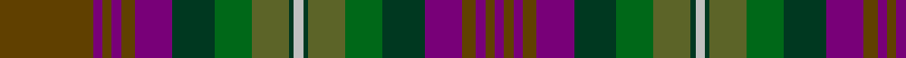

In pattern [BGBGBGGGGWGGGGBGBGBG](/stripes/bgbgbggggwggggbgbgbg/).

This was sourced from register-of-tartans.  It is a [20 stripe tartan](/stripes/stripes20/).

Original link https://www.tartanregister.gov.uk/tartanDetails.aspx?ref=1868

## Register references

External register numbers recorded for this tartan.

- Scottish Register of Tartans: [1868](https://www.tartanregister.gov.uk/tartanDetails.aspx?ref=1868)
- Scottish Tartans Authority (ITI): 2155
- Scottish Tartans World Register: 2155

## Thread count
T/40 P4 T4 P4 T6 P16 DG18 G16 Gc16 DG2 N4 DG2 Gc16 G16 DG18 P16 T6 P4 T4 P/4

## Palette
Each colour and its ΔE from the base-6 reference it is a variant of.

| Colour | Shade | Base | ΔE (OKLab) |
|---|---|---|---|
| DG | <code style="background-color:#003820;">#003820</code> `#003820` | G <code style="background-color:#006100;">#006100</code> | 0.15 |
| G | <code style="background-color:#006818;">#006818</code> `#006818` | G <code style="background-color:#006100;">#006100</code> | 0.02 |
| Ga | <code style="background-color:#289C18;">#289C18</code> `#289C18` | G <code style="background-color:#006100;">#006100</code> | 0.19 |
| Gb | <code style="background-color:#285800;">#285800</code> `#285800` | G <code style="background-color:#006100;">#006100</code> | 0.03 |
| Gc | <code style="background-color:#5C6428;">#5C6428</code> `#5C6428` | G <code style="background-color:#006100;">#006100</code> | 0.10 |
| N | <code style="background-color:#C0C0C0;">#C0C0C0</code> `#C0C0C0` | W <code style="background-color:#F7F7F7;">#F7F7F7</code> | 0.17 |
| Na | <code style="background-color:#888888;">#888888</code> `#888888` | R <code style="background-color:#CC0000;">#CC0000</code> | 0.24 |
| P | <code style="background-color:#780078;">#780078</code> `#780078` | B <code style="background-color:#2A418A;">#2A418A</code> | 0.17 |
| T | <code style="background-color:#604000;">#604000</code> `#604000` | G <code style="background-color:#006100;">#006100</code> | 0.14 |

## Nearest tartans

The nearest existing variants by ΔTartan distance.

1. [Buchanan Hunting (Mackinlay strip)](/setts/s18/dg24k2t6k2m12w1m12k2t6k2dy12k2dy12k2t6k2dg12t6~x2/) — ΔT 0.90
1. [Loseby, Luke (Personal)](/setts/s15/y15dt3y3dt3y3dt16o16k5lo2k5o16dt16y15r1k4~x2/) — ΔT 1.28
1. [Redgate (Connecticut) Hunting #2](/setts/s15/do5k2n6w1n6k2do7k16dg7k2dr4dg2dr4k2dg4~x2/) — ΔT 1.41
1. [Isle of Skye District Tartan Tartan Number: 2155. Earliest known date: 1993 The tartan was instigated and registered by Mrs Rosemary Nicolson Samios in 1992, an Australian of Skye descent, now living in Skye. It was selected through a worldwide competition won by Angus MacLeod from Lewis. Angus, a weaver by trade, produced the first commercial quantities in the traditional kilt weight in 1993 at Lochcarron Weavers in North Strome. The colours of the tartan depict those of the island, often called the 'Misty Isle'. Worn by the Torphican and Bathgate pipe band. (A patented design No. 0600930) See products available Copyright © Blair Urquhart, Comrie, 2015](/setts/s11/dy20dp2dy2dp2dy3dp8dg9g8y8dg1lr2~x2/) — ΔT 1.53
1. [Wcwm 1528](/setts/s19/dg3r2o2r2n20db3n3r8dg2r2dg2r2dg8o2dg2o2dg2o8ly3~x2/) — ΔT 1.54
1. [Watkins Welsh Name Tartan Tartan Number: 6169. Earliest known date: pre 2004 The tartan for this Welsh surname and its variations, Walters, Watts, Gwatkin, Watkiss, is actually woven in Wales at the Cambrian Woollen Mill, weaving on the same site since 1830. This tartan differs from many traditional patterns in that the warp and weft differ, giving the finished worsted wool cloth more of a predominant stripe, vertically noticeable in the finished Kilt, or Cilt in Wales. See products available Copyright © Blair Urquhart, Comrie, 2015](/setts/s19/g2g2db5g4db10dt15g10r12g6g4g6r12g10dt18t2db2dt18db1g2/) — ΔT 1.56
1. [Unidentified (Woven sample)](/setts/s18/r2t2dy3t14do1t1y7dy3t2dy3do7t3y2t3y16r2dy3t2~x2/) — ΔT 1.60
1. [Gordonstoun #2](/setts/s22/ly5y19r2t11lb2r11y11r2g20r2g2lb2~x2/) — ΔT 1.64
1. [Golden Glow](/setts/s17/ly3k2r9k1n8k1r2k1n8k1n2k1n16k1n12k4n2~x2/) — ΔT 1.65
1. [Kelvin Family (Personal)](/setts/s12/db9k2db4k2dr6o3dy2db2dr11dy23t1k8~x2/) — ΔT 1.66

## Neighbour map

Every grey dot is one of 14299 variants placed by the first two principal components of the ΔTartan feature space (44% of its variance). Red is this tartan; blue dots are its nearest — click one to open its page.

<svg viewBox="0 0 640 380" role="img" style="max-width:100%;height:auto;border:1px solid #e0e0e0;border-radius:4px;display:block" xmlns="http://www.w3.org/2000/svg"><image href="/nn/cloud.v1.png" width="640" height="380"/><a href="/setts/s18/dg24k2t6k2m12w1m12k2t6k2dy12k2dy12k2t6k2dg12t6~x2/"><circle cx="164.5" cy="126.6" r="4" fill="#3465a4"><title>Buchanan Hunting (Mackinlay strip)</title></circle></a><a href="/setts/s15/y15dt3y3dt3y3dt16o16k5lo2k5o16dt16y15r1k4~x2/"><circle cx="168.6" cy="155.4" r="4" fill="#3465a4"><title>Loseby, Luke (Personal)</title></circle></a><a href="/setts/s15/do5k2n6w1n6k2do7k16dg7k2dr4dg2dr4k2dg4~x2/"><circle cx="200.0" cy="177.2" r="4" fill="#3465a4"><title>Redgate (Connecticut) Hunting #2</title></circle></a><a href="/setts/s11/dy20dp2dy2dp2dy3dp8dg9g8y8dg1lr2~x2/"><circle cx="227.8" cy="154.9" r="4" fill="#3465a4"><title>Isle of Skye District Tartan Tartan Number: 2155. Earliest known date: 1993 The tartan was instigated and registered by Mrs Rosemary Nicolson Samios in 1992, an Australian of Skye descent, now living in Skye. It was selected through a worldwide competition won by Angus MacLeod from Lewis. Angus, a weaver by trade, produced the first commercial quantities in the traditional kilt weight in 1993 at Lochcarron Weavers in North Strome. The colours of the tartan depict those of the island, often called the 'Misty Isle'. Worn by the Torphican and Bathgate pipe band. (A patented design No. 0600930) See products available Copyright © Blair Urquhart, Comrie, 2015</title></circle></a><a href="/setts/s19/dg3r2o2r2n20db3n3r8dg2r2dg2r2dg8o2dg2o2dg2o8ly3~x2/"><circle cx="151.2" cy="133.0" r="4" fill="#3465a4"><title>Wcwm 1528</title></circle></a><a href="/setts/s19/g2g2db5g4db10dt15g10r12g6g4g6r12g10dt18t2db2dt18db1g2/"><circle cx="201.5" cy="163.0" r="4" fill="#3465a4"><title>Watkins Welsh Name Tartan Tartan Number: 6169. Earliest known date: pre 2004 The tartan for this Welsh surname and its variations, Walters, Watts, Gwatkin, Watkiss, is actually woven in Wales at the Cambrian Woollen Mill, weaving on the same site since 1830. This tartan differs from many traditional patterns in that the warp and weft differ, giving the finished worsted wool cloth more of a predominant stripe, vertically noticeable in the finished Kilt, or Cilt in Wales. See products available Copyright © Blair Urquhart, Comrie, 2015</title></circle></a><a href="/setts/s18/r2t2dy3t14do1t1y7dy3t2dy3do7t3y2t3y16r2dy3t2~x2/"><circle cx="229.1" cy="149.4" r="4" fill="#3465a4"><title>Unidentified (Woven sample)</title></circle></a><a href="/setts/s22/ly5y19r2t11lb2r11y11r2g20r2g2lb2~x2/"><circle cx="175.7" cy="152.9" r="4" fill="#3465a4"><title>Gordonstoun #2</title></circle></a><a href="/setts/s17/ly3k2r9k1n8k1r2k1n8k1n2k1n16k1n12k4n2~x2/"><circle cx="176.6" cy="119.2" r="4" fill="#3465a4"><title>Golden Glow</title></circle></a><a href="/setts/s12/db9k2db4k2dr6o3dy2db2dr11dy23t1k8~x2/"><circle cx="242.7" cy="150.0" r="4" fill="#3465a4"><title>Kelvin Family (Personal)</title></circle></a><circle cx="164.6" cy="136.8" r="5" fill="#c00000"/></svg>

ID: /setts/s20/dy20dp2dy2dp2dy3dp8dg9g8y8dg1lb2~x2/
