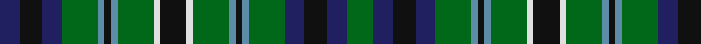

In pattern [BKBGBKBGWKWGBKBGBKBG](/patterns/bkbgbkbgwkwgbkbgbkbg/).

This was sourced from register-of-tartans.  It is a [20 stripes tartan](/stripes/stripes20/).

Original link https://www.tartanregister.gov.uk/tartanDetails.aspx?ref=4696

## Thread count
DB/12 K14 DB12 G22 B4 K4 B4 G22 LN4 K16 LN4 G22 B4 K4 B4 G22 DB12 K14 DB12 G/16

## Palette
Each colour and its ΔE from the base-6 reference it is a variant of.

| Colour | Shade | Base | ΔE (OKLab) |
|---|---|---|---|
| B | <code style="background-color:#5C8CA8;">#5C8CA8</code> `#5C8CA8` | B <code style="background-color:#2C4084;">#2C4084</code> | 0.23 |
| DB | <code style="background-color:#202060;">#202060</code> `#202060` | B <code style="background-color:#2C4084;">#2C4084</code> | 0.11 |
| DG | <code style="background-color:#003820;">#003820</code> `#003820` | G <code style="background-color:#006400;">#006400</code> | 0.16 |
| G | <code style="background-color:#006818;">#006818</code> `#006818` | G <code style="background-color:#006400;">#006400</code> | 0.02 |
| K | <code style="background-color:#101010;">#101010</code> `#101010` | K <code style="background-color:#000000;">#000000</code> | 0.17 |
| LN | <code style="background-color:#E0E0E0;">#E0E0E0</code> `#E0E0E0` | W <code style="background-color:#F4F4F0;">#F4F4F0</code> | 0.06 |

## Nearest tartans

The nearest existing variants by ΔTartan distance.

1. [MacAlpine (1906)](/setts/s14/b16g4b4g24k4g24b4g4b16w4k16g4k16y4-b202060-g006818-k101010-we0e0e0-ye8c000/) — ΔT 1.02
1. [Gordon Dress (US Fashion)](/setts/s13/b8k8b16k16g20y4g20k16g8ba8g24ba4k8-b1c0070-ba2474e8-g006818-k101010-ybc8c00/) — ΔT 1.02
1. [Lloyd of Dolobran (Personal)](/setts/s22/b20k4b20k20g16r4g16k4g16w4g16k40g16w4g16k4g16r4g16k20b20k4-b2c2c80-g006818-k101010-rc80000-wfcfcfc/) — ΔT 1.03
1. [MacKean dress Family/Clan Tartan Tartan Number: 2339. Earliest known date: 1995 This was designed as a special design for silk squares woven by D C Dalgliesh. Assumption is that all these New Zealand MacKeans are Personal tartans rather than Clan/Family. See products available Copyright © Blair Urquhart, Comrie, 2015](/setts/s16/k12g24k6g6k12b18k6w6k6b18k12g6k6g24k12r6-b2c2c80-g006818-k101010-rc80000-we0e0e0/) — ΔT 1.04
1. [Stuart/Stewart Hunting Plaid](/setts/s18/b18g6b18k8g20r8g20k12g4k14g4k14g4k12g20y8g20k16-b2c4084-g005020-k101010-rdc0000-ye8c000/) — ΔT 1.12
1. [CSCA](/setts/s14/g10r8g38k20g16w8b36r8b36w8g16k20g38r8-b2c2c80-g006818-k101010-rc80000-wfcfcfc/) — ΔT 1.13
1. [Allen (1998)](/setts/s21/g4r4g24k8b22r4b22k8b4k18b4k18b4k8b22y4b22k8g24r4g4-b304c78-g006818-k101010-rc80000-ye8c000/) — ΔT 1.13
1. [O'Conner Irish Family Tartan Tartan Number: 2217. Earliest known date: 1985 Designed by Jerry O'Connor of Keltic Klassics, Hillsdale, New Jersey who names it "Royal na Connaught" .Woven by House of Edgar who said they would call it O'Connor. Ref made to Lawrence & Gerald O'Connor - possibly customers of Macnaughtons of Pitlochry (part of same group as House of Edgar) See products available Copyright © Blair Urquhart, Comrie, 2015](/setts/s16/g5k24g12k16g26w4g24w4g26k16b4k4b4k4ba28g3-b003c64-ba2c2c80-g006818-k101010-we0e0e0/) — ΔT 1.16
1. [MacBride Family Tartan Tartan Number: 2153. Earliest known date: 1992 The family of MacBride, (from SaintBride or Brigid) are known to have been a sept of the MacDonalds. Head of the family, Mr Stuart C. MacBride, commissioned Mr Harry Lindley to create a MacBride tartan from the Ensigns Armorial recently granted by Lord Lyon. Mr MacBride is a member of the Weaver Incorporation of Aberdeen. Traditionally members of the family, as a courtesy, ask permission of the chief or head of the family before wearing his tartan. See products available Copyright © Blair Urquhart, Comrie, 2015](/setts/s13/y6g30k30b30k4b30k30g30r6g30k30g30y6-b2c2c80-g006818-k101010-rb468ac-ye8c000/) — ΔT 1.19
1. [Norwich No.038](/setts/s18/g28b4r6b4k32y4b32g32r6g32b32y4k32b4r6b4g28k12-b5c8ca8-g006818-k101010-rc80000-ye8c000/) — ΔT 1.23

## Neighbour map

Every grey dot is one of 15726 variants placed by the first two principal components of the ΔTartan feature space (44% of its variance). Red is this tartan; blue dots are its nearest — click one to open its page.

<svg viewBox="0 0 640 380" role="img" style="max-width:100%;height:auto;border:1px solid #e0e0e0;border-radius:4px;display:block" xmlns="http://www.w3.org/2000/svg"><image href="/nn/cloud.v1.png" width="640" height="380"/><a href="/setts/s14/b16g4b4g24k4g24b4g4b16w4k16g4k16y4-b202060-g006818-k101010-we0e0e0-ye8c000/"><circle cx="155.1" cy="195.0" r="4" fill="#3465a4"><title>MacAlpine (1906)</title></circle></a><a href="/setts/s13/b8k8b16k16g20y4g20k16g8ba8g24ba4k8-b1c0070-ba2474e8-g006818-k101010-ybc8c00/"><circle cx="148.9" cy="224.9" r="4" fill="#3465a4"><title>Gordon Dress (US Fashion)</title></circle></a><a href="/setts/s22/b20k4b20k20g16r4g16k4g16w4g16k40g16w4g16k4g16r4g16k20b20k4-b2c2c80-g006818-k101010-rc80000-wfcfcfc/"><circle cx="161.9" cy="167.9" r="4" fill="#3465a4"><title>Lloyd of Dolobran (Personal)</title></circle></a><a href="/setts/s16/k12g24k6g6k12b18k6w6k6b18k12g6k6g24k12r6-b2c2c80-g006818-k101010-rc80000-we0e0e0/"><circle cx="115.7" cy="221.8" r="4" fill="#3465a4"><title>MacKean dress Family/Clan Tartan Tartan Number: 2339. Earliest known date: 1995 This was designed as a special design for silk squares woven by D C Dalgliesh. Assumption is that all these New Zealand MacKeans are Personal tartans rather than Clan/Family. See products available Copyright © Blair Urquhart, Comrie, 2015</title></circle></a><a href="/setts/s18/b18g6b18k8g20r8g20k12g4k14g4k14g4k12g20y8g20k16-b2c4084-g005020-k101010-rdc0000-ye8c000/"><circle cx="147.5" cy="230.9" r="4" fill="#3465a4"><title>Stuart/Stewart Hunting Plaid</title></circle></a><a href="/setts/s14/g10r8g38k20g16w8b36r8b36w8g16k20g38r8-b2c2c80-g006818-k101010-rc80000-wfcfcfc/"><circle cx="119.9" cy="203.5" r="4" fill="#3465a4"><title>CSCA</title></circle></a><a href="/setts/s21/g4r4g24k8b22r4b22k8b4k18b4k18b4k8b22y4b22k8g24r4g4-b304c78-g006818-k101010-rc80000-ye8c000/"><circle cx="165.9" cy="188.1" r="4" fill="#3465a4"><title>Allen (1998)</title></circle></a><a href="/setts/s16/g5k24g12k16g26w4g24w4g26k16b4k4b4k4ba28g3-b003c64-ba2c2c80-g006818-k101010-we0e0e0/"><circle cx="198.3" cy="175.7" r="4" fill="#3465a4"><title>O'Conner Irish Family Tartan Tartan Number: 2217. Earliest known date: 1985 Designed by Jerry O'Connor of Keltic Klassics, Hillsdale, New Jersey who names it &quot;Royal na Connaught&quot; .Woven by House of Edgar who said they would call it O'Connor. Ref made to Lawrence &amp; Gerald O'Connor - possibly customers of Macnaughtons of Pitlochry (part of same group as House of Edgar) See products available Copyright © Blair Urquhart, Comrie, 2015</title></circle></a><a href="/setts/s13/y6g30k30b30k4b30k30g30r6g30k30g30y6-b2c2c80-g006818-k101010-rb468ac-ye8c000/"><circle cx="141.1" cy="216.5" r="4" fill="#3465a4"><title>MacBride Family Tartan Tartan Number: 2153. Earliest known date: 1992 The family of MacBride, (from SaintBride or Brigid) are known to have been a sept of the MacDonalds. Head of the family, Mr Stuart C. MacBride, commissioned Mr Harry Lindley to create a MacBride tartan from the Ensigns Armorial recently granted by Lord Lyon. Mr MacBride is a member of the Weaver Incorporation of Aberdeen. Traditionally members of the family, as a courtesy, ask permission of the chief or head of the family before wearing his tartan. See products available Copyright © Blair Urquhart, Comrie, 2015</title></circle></a><a href="/setts/s18/g28b4r6b4k32y4b32g32r6g32b32y4k32b4r6b4g28k12-b5c8ca8-g006818-k101010-rc80000-ye8c000/"><circle cx="141.5" cy="163.9" r="4" fill="#3465a4"><title>Norwich No.038</title></circle></a><circle cx="141.9" cy="197.6" r="5" fill="#c00000"/></svg>

ID: /setts/s20/g16b12k14b12g22ba4k4ba4g22w4k16w4g22ba4k4ba4g22b12k14b12-b202060-ba5c8ca8-g006818-k101010-we0e0e0/
