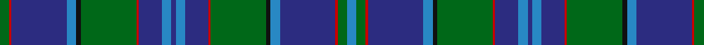

In pattern [BGRBBKGRBBBBBRGKBBRG](/stripes/bgrbbkgrbbbbbrgkbbrg/).

This was sourced from house-of-tartan.  It is a [20 stripe tartan](/stripes/stripes20/).

Original link http://www.house-of-tartan.scotland.net/house/TartanViewjs.asp?colr=Def&tnam=2303

## Thread count
G/8 R2 DB48 B8 K4 G48 R2 DB20 B8 DB4 B8 DB20 R2 G48 K4 B8 DB48 R2 G8 B/8

## Palette
Each colour and the base-6 reference it is a variant of.

| Colour | Shade | Base |
|---|---|---|
| B | <code style="background-color:#2888C4;">#2888C4</code> `oklch(60.1% 0.125 241.5)` <small>#2888C4</small> | B <code style="background-color:#2A418A;">#2A418A</code> |
| DB | <code style="background-color:#2C2C80;">#2C2C80</code> `oklch(35.0% 0.138 276.6)` <small>#2C2C80</small> | B <code style="background-color:#2A418A;">#2A418A</code> |
| DBa | <code style="background-color:#1C0070;">#1C0070</code> `oklch(26.3% 0.162 277.1)` <small>#1C0070</small> | B <code style="background-color:#2A418A;">#2A418A</code> |
| DG | <code style="background-color:#003820;">#003820</code> `oklch(30.0% 0.070 158.3)` <small>#003820</small> | G <code style="background-color:#006100;">#006100</code> |
| DR | <code style="background-color:#880000;">#880000</code> `oklch(39.4% 0.162 29.2)` <small>#880000</small> | R <code style="background-color:#CC0000;">#CC0000</code> |
| DY | <code style="background-color:#D09800;">#D09800</code> `oklch(71.4% 0.147 82.1)` <small>#D09800</small> | Y <code style="background-color:#F2BF00;">#F2BF00</code> |
| G | <code style="background-color:#006818;">#006818</code> `oklch(45.0% 0.142 145.0)` <small>#006818</small> | G <code style="background-color:#006100;">#006100</code> |
| K | <code style="background-color:#101010;">#101010</code> `oklch(17.3% 0.000 89.9)` <small>#101010</small> | K <code style="background-color:#000000;">#000000</code> |
| LP | <code style="background-color:#A8ACE8;">#A8ACE8</code> `oklch(76.3% 0.086 281.2)` <small>#A8ACE8</small> | W <code style="background-color:#F7F7F7;">#F7F7F7</code> |
| N | <code style="background-color:#C0C0C0;">#C0C0C0</code> `oklch(80.8% 0.000 89.9)` <small>#C0C0C0</small> | W <code style="background-color:#F7F7F7;">#F7F7F7</code> |
| P | <code style="background-color:#6C0070;">#6C0070</code> `oklch(37.6% 0.174 326.5)` <small>#6C0070</small> | B <code style="background-color:#2A418A;">#2A418A</code> |
| R | <code style="background-color:#C80000;">#C80000</code> `oklch(52.3% 0.215 29.2)` <small>#C80000</small> | R <code style="background-color:#CC0000;">#CC0000</code> |

## Nearest tartans

The nearest existing variants by ΔTartan distance, with this tartan at the top so the swatches line up against it.

ΔTartan

Tartan

Sett

—

<a href="/ttd/edit/#slug=g4r1db24t4k2g24r1db10t4db2t4db10r1g24k2t4db24r1g4t4~x2">Coopers &amp; Lybrand Corporate Commem. Tartan Tartan Number: 2303. Earliest known date: 1996 Designed by Deirdre Nicholls of Celtic Silks. May 1996. Swatch in STA's Johnston Collection. Dark green, red and blue called for but lighter shades used here to display sett. See products available Copyright © Blair Urquhart, Comrie, 2015</a> <a class="nn-out" href="/setts/s20/g4r1db24t4k2g24r1db10t4db2t4db10r1g24k2t4db24r1g4t4~x2/" title="open its dictionary page">↗</a>

0.85

<a href="/ttd/edit/#slug=dp4db5dp3db50k15g3k5g32w2g3w2g32k5g5k15db50dp3k5dp3">Spirit of Morningside</a> <a class="nn-out" href="/setts/s19/dp4db5dp3db50k15g3k5g32w2g3w2g32k5g5k15db50dp3k5dp3/" title="open its dictionary page">↗</a>

1.06

<a href="/ttd/edit/#slug=k3g30k3dt36k3t26k2t8k2t26k4t26k2t4k2t26k3dt36k3g30k3w2">Ellis</a> <a class="nn-out" href="/setts/s22/k3g30k3dt36k3t26k2t8k2t26k4t26k2t4k2t26k3dt36k3g30k3w2/" title="open its dictionary page">↗</a>

1.10

<a href="/ttd/edit/#slug=db36dg10r2dg10w2dg10r2dg10k14r2db12r3db2r2db4w2~x2">Rankin</a> <a class="nn-out" href="/setts/s16/db36dg10r2dg10w2dg10r2dg10k14r2db12r3db2r2db4w2~x2/" title="open its dictionary page">↗</a>

1.11

<a href="/ttd/edit/#slug=b32db1dg16r2dg2dt18b4lo1dg5lo1b4dt18dg2r2dg16db1b32dt3~x2">Heriot Watt University</a> <a class="nn-out" href="/setts/s18/b32db1dg16r2dg2dt18b4lo1dg5lo1b4dt18dg2r2dg16db1b32dt3~x2/" title="open its dictionary page">↗</a>

1.13

<a href="/ttd/edit/#slug=g19k1dg3k1g3k9db20k1ly1k7ly1k1db21k12g2dg1~x2">Hope-Vere/Weir (Modern)</a> <a class="nn-out" href="/setts/s16/g19k1dg3k1g3k9db20k1ly1k7ly1k1db21k12g2dg1~x2/" title="open its dictionary page">↗</a>

1.17

<a href="/ttd/edit/#slug=db60ly2db2ly2db5k15db5g20r2k3r2g20db5k15g5db20ly2g4~x2">Whitworth (Name)</a> <a class="nn-out" href="/setts/s18/db60ly2db2ly2db5k15db5g20r2k3r2g20db5k15g5db20ly2g4~x2/" title="open its dictionary page">↗</a>

1.20

<a href="/setts/s12/k6db3g28w1db28db2w3~x2/">Weisfeld</a>

1.20

<a href="/ttd/edit/#slug=k3db42k3ly2k3g22k3r2k3g22k3ly2k3db42k3r2~x2">Strachan</a> <a class="nn-out" href="/setts/s16/k3db42k3ly2k3g22k3r2k3g22k3ly2k3db42k3r2~x2/" title="open its dictionary page">↗</a>

1.22

<a href="/ttd/edit/#slug=t4g4r1db24t4k2g24r1db10t4db2~x2">Coopers &amp; Lybrand</a> <a class="nn-out" href="/setts/s11/t4g4r1db24t4k2g24r1db10t4db2~x2/" title="open its dictionary page">↗</a>

1.31

<a href="/ttd/edit/#slug=db18dp2k2db2dp2k1db2k8g1ly1g6k8db14k2g2~x2">Angove, the Black Swan</a> <a class="nn-out" href="/setts/s15/db18dp2k2db2dp2k1db2k8g1ly1g6k8db14k2g2~x2/" title="open its dictionary page">↗</a>

## Neighbour map

Every grey dot is one of 14299 variants placed by the first two principal components of the ΔTartan feature space (44% of its variance). Red is this tartan; blue dots are its nearest — click one to open its page.

<svg viewBox="0 0 640 380" role="img" style="max-width:100%;height:auto;border:1px solid #e0e0e0;border-radius:4px;display:block" xmlns="http://www.w3.org/2000/svg"><image href="/nn/cloud.v1.png" width="640" height="380"/><a href="/setts/s19/dp4db5dp3db50k15g3k5g32w2g3w2g32k5g5k15db50dp3k5dp3/"><circle cx="268.9" cy="110.2" r="4" fill="#3465a4"><title>Spirit of Morningside</title></circle></a><a href="/setts/s22/k3g30k3dt36k3t26k2t8k2t26k4t26k2t4k2t26k3dt36k3g30k3w2/"><circle cx="227.5" cy="126.6" r="4" fill="#3465a4"><title>Ellis</title></circle></a><a href="/setts/s16/db36dg10r2dg10w2dg10r2dg10k14r2db12r3db2r2db4w2~x2/"><circle cx="251.0" cy="131.2" r="4" fill="#3465a4"><title>Rankin</title></circle></a><a href="/setts/s18/b32db1dg16r2dg2dt18b4lo1dg5lo1b4dt18dg2r2dg16db1b32dt3~x2/"><circle cx="275.8" cy="100.5" r="4" fill="#3465a4"><title>Heriot Watt University</title></circle></a><a href="/setts/s16/g19k1dg3k1g3k9db20k1ly1k7ly1k1db21k12g2dg1~x2/"><circle cx="255.5" cy="136.6" r="4" fill="#3465a4"><title>Hope-Vere/Weir (Modern)</title></circle></a><a href="/setts/s18/db60ly2db2ly2db5k15db5g20r2k3r2g20db5k15g5db20ly2g4~x2/"><circle cx="313.3" cy="97.3" r="4" fill="#3465a4"><title>Whitworth (Name)</title></circle></a><a href="/setts/s12/k6db3g28w1db28db2w3~x2/"><circle cx="292.3" cy="141.3" r="4" fill="#3465a4"><title>Weisfeld</title></circle></a><a href="/setts/s16/k3db42k3ly2k3g22k3r2k3g22k3ly2k3db42k3r2~x2/"><circle cx="319.8" cy="115.4" r="4" fill="#3465a4"><title>Strachan</title></circle></a><a href="/setts/s11/t4g4r1db24t4k2g24r1db10t4db2~x2/"><circle cx="291.4" cy="143.0" r="4" fill="#3465a4"><title>Coopers &amp; Lybrand</title></circle></a><a href="/setts/s15/db18dp2k2db2dp2k1db2k8g1ly1g6k8db14k2g2~x2/"><circle cx="302.4" cy="145.3" r="4" fill="#3465a4"><title>Angove, the Black Swan</title></circle></a><circle cx="282.8" cy="120.4" r="5" fill="#c00000"/></svg>

ID: /setts/s20/g4r1db24t4k2g24r1db10t4db2t4db10r1g24k2t4db24r1g4t4~x2/
