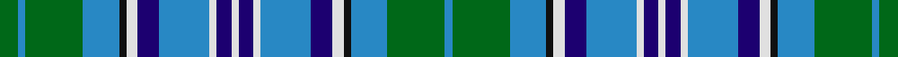

In pattern [BGBKWBBWBWBWBBWKBGBG](/stripes/bgbkwbbwbwbwbbwkbgbg/).

This was sourced from register-of-tartans.  It is a [20 stripe tartan](/stripes/stripes20/).

Original link https://www.tartanregister.gov.uk/tartanDetails.aspx?ref=3729

## Also known as

This cloth is also recorded under:

- Scottish Motor Trade Assoc.

## Attestations

This cloth appears in 2 source records; the oldest owns this page.

- 01/07/1997 — Scottish Motor Trade Association (register-of-tartans, [record](https://www.tartanregister.gov.uk/tartanDetails.aspx?ref=3729))
- undated — Scottish Motor Trade Association Trade Tartan Tartan Number: 2392. Earliest known date: 1903 This is a corporate tartan for the Scottish Motor Trade Association which was established in 1903. Tartan Society threadcount different - G/12 DB4 LG54 B26 K4 W8 DB18 B44 W3 DB12 W/4. Its graphic - and that of the STWR - is incorrect in that what is recorded G/12 for the first pivot actually shows as dark blue. (BW Feb 2005). See products available Copyright © Blair Urquhart, Comrie, 2015 (house-of-tartan, [record](http://www.house-of-tartan.scotland.net/house/TartanViewjs.asp?colr=Def&tnam=2392))

## Register references

External register numbers recorded for this tartan.

- Scottish Register of Tartans: [3729](https://www.tartanregister.gov.uk/tartanDetails.aspx?ref=3729)
- Scottish Tartans Authority (ITI): 2392
- Scottish Tartans World Register: 2392

## Thread count
G/10 B4 G32 B20 K4 LN6 DB12 B28 LN4 DB8 LN4 DB8 LN4 B28 DB12 LN6 K4 B20 G32 B/4

## Palette
Each colour and the base-6 reference it is a variant of.

| Colour | Shade | Base |
|---|---|---|
| B | <code style="background-color:#2888C4;">#2888C4</code> `oklch(60.1% 0.125 241.5)` <small>#2888C4</small> | B <code style="background-color:#2A418A;">#2A418A</code> |
| DB | <code style="background-color:#1C0070;">#1C0070</code> `oklch(26.3% 0.162 277.1)` <small>#1C0070</small> | B <code style="background-color:#2A418A;">#2A418A</code> |
| DBa | <code style="background-color:#2C2C80;">#2C2C80</code> `oklch(35.0% 0.138 276.6)` <small>#2C2C80</small> | B <code style="background-color:#2A418A;">#2A418A</code> |
| G | <code style="background-color:#006818;">#006818</code> `oklch(45.0% 0.142 145.0)` <small>#006818</small> | G <code style="background-color:#006100;">#006100</code> |
| K | <code style="background-color:#101010;">#101010</code> `oklch(17.3% 0.000 89.9)` <small>#101010</small> | K <code style="background-color:#000000;">#000000</code> |
| LN | <code style="background-color:#E0E0E0;">#E0E0E0</code> `oklch(90.7% 0.000 89.9)` <small>#E0E0E0</small> | W <code style="background-color:#F7F7F7;">#F7F7F7</code> |
| N | <code style="background-color:#C0C0C0;">#C0C0C0</code> `oklch(80.8% 0.000 89.9)` <small>#C0C0C0</small> | W <code style="background-color:#F7F7F7;">#F7F7F7</code> |

## Nearest tartans

The nearest existing variants by ΔTartan distance.

1. [Scottish Motor Trade Assoc. (Corp)](/setts/s11/g5t2g16t10k2w3db6t14w2db4w2~x2/) — ΔT 1.23
1. [Shedor (2013)](/setts/s18/lb25g3lb4g4lb5g5lb15r6lb5g19lb8g26lb4w4lb4g7lb4db21~x2/) — ΔT 1.34
1. [Copar a'Beannichte Dress Family Tartan Tartan Number: 6484. Earliest known date: 2004 The name of the tartan is constructed in Gaelic from the Dutch van Koperen and the French Benoist to mean the Blessed Copper, a tribute to Mrs Y Ch van Koperen-Benoist. The green represents oxidised copper of the Koperens and blue the Benoist family. See products available Copyright © Blair Urquhart, Comrie, 2015](/setts/s16/w15dt5w2dt15o4dt10r2dt10o4dt15w2dt5w15g6g20g6~x2/) — ΔT 1.40
1. [Stephenson Hunting #2](/setts/s30/r2k1b9k9g9k1w1k2w1k1g9b9k9b9k1g2~x4/) — ΔT 1.43
1. [Blanton (Dress)](/setts/s15/b12k2b2k2b2k10g5r3w2r3g5k10b11k2b2~x2/) — ΔT 1.49
1. [Campbell of Argyll (no guards)](/setts/s24/k1b8k8g8w2g8k8b1k1b1k1b8k1b1k1b1k8g8ly2g8k8b8k1b1~x2/) — ΔT 1.50
1. [Stinson](/setts/s20/k7b20t2r6t2k20ly3g20b27r3g6~x2/) — ΔT 1.50
1. [Healy (Suspect)](/setts/s20/db2lb2b7r4ly8db4b10lb2db2b9db2lb2b10db4ly8r4b7lb2db2ly2~x4/) — ΔT 1.51
1. [Polaris Military](/setts/s17/b6k1b1k1b1k7g6lo1k1db1k1lo1g6k7b7k1b1~x4/) — ΔT 1.52
1. [Harmon of Plenderleith (Personal)](/setts/s18/k2t6ly2t2ly2t19r2g2r2t2db4k2db11g2db2g2db6ly2~x2/) — ΔT 1.54

## Neighbour map

Every grey dot is one of 14299 variants placed by the first two principal components of the ΔTartan feature space (44% of its variance). Red is this tartan; blue dots are its nearest — click one to open its page.

<svg viewBox="0 0 640 380" role="img" style="max-width:100%;height:auto;border:1px solid #e0e0e0;border-radius:4px;display:block" xmlns="http://www.w3.org/2000/svg"><image href="/nn/cloud.v1.png" width="640" height="380"/><a href="/setts/s11/g5t2g16t10k2w3db6t14w2db4w2~x2/"><circle cx="143.3" cy="179.1" r="4" fill="#3465a4"><title>Scottish Motor Trade Assoc. (Corp)</title></circle></a><a href="/setts/s18/lb25g3lb4g4lb5g5lb15r6lb5g19lb8g26lb4w4lb4g7lb4db21~x2/"><circle cx="164.8" cy="144.7" r="4" fill="#3465a4"><title>Shedor (2013)</title></circle></a><a href="/setts/s16/w15dt5w2dt15o4dt10r2dt10o4dt15w2dt5w15g6g20g6~x2/"><circle cx="117.6" cy="143.1" r="4" fill="#3465a4"><title>Copar a'Beannichte Dress Family Tartan Tartan Number: 6484. Earliest known date: 2004 The name of the tartan is constructed in Gaelic from the Dutch van Koperen and the French Benoist to mean the Blessed Copper, a tribute to Mrs Y Ch van Koperen-Benoist. The green represents oxidised copper of the Koperens and blue the Benoist family. See products available Copyright © Blair Urquhart, Comrie, 2015</title></circle></a><a href="/setts/s30/r2k1b9k9g9k1w1k2w1k1g9b9k9b9k1g2~x4/"><circle cx="135.4" cy="141.1" r="4" fill="#3465a4"><title>Stephenson Hunting #2</title></circle></a><a href="/setts/s15/b12k2b2k2b2k10g5r3w2r3g5k10b11k2b2~x2/"><circle cx="135.3" cy="180.4" r="4" fill="#3465a4"><title>Blanton (Dress)</title></circle></a><a href="/setts/s24/k1b8k8g8w2g8k8b1k1b1k1b8k1b1k1b1k8g8ly2g8k8b8k1b1~x2/"><circle cx="135.2" cy="155.2" r="4" fill="#3465a4"><title>Campbell of Argyll (no guards)</title></circle></a><a href="/setts/s20/k7b20t2r6t2k20ly3g20b27r3g6~x2/"><circle cx="158.4" cy="123.3" r="4" fill="#3465a4"><title>Stinson</title></circle></a><a href="/setts/s20/db2lb2b7r4ly8db4b10lb2db2b9db2lb2b10db4ly8r4b7lb2db2ly2~x4/"><circle cx="126.3" cy="178.3" r="4" fill="#3465a4"><title>Healy (Suspect)</title></circle></a><a href="/setts/s17/b6k1b1k1b1k7g6lo1k1db1k1lo1g6k7b7k1b1~x4/"><circle cx="155.5" cy="169.6" r="4" fill="#3465a4"><title>Polaris Military</title></circle></a><a href="/setts/s18/k2t6ly2t2ly2t19r2g2r2t2db4k2db11g2db2g2db6ly2~x2/"><circle cx="156.4" cy="119.6" r="4" fill="#3465a4"><title>Harmon of Plenderleith (Personal)</title></circle></a><circle cx="140.5" cy="156.0" r="5" fill="#c00000"/></svg>

ID: /setts/s20/g5t2g16t10k2w3db6t14w2db4w2~x2/
