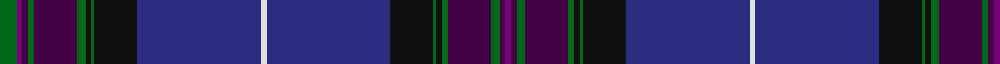

**Bands:** [GBBGBGKGKBWBKGKGBGBB](/stripes/gbbgbgkgkbwbkgkgbgbb/) · **Stripes:** [G DP DP G DP G K G K DB W DB K G K G DP G DP DP](/stripes/stripes20/) G DP DP G DP G K G K DB W DB K G K G DP G DP DP

This was sourced from register-of-tartans.  It is a [20 band tartan](/bands/bands20/).

Original link https://www.tartanregister.gov.uk/tartanDetails.aspx?ref=3740

## Register references

External register numbers recorded for this tartan.

- Scottish Register of Tartans: [3740](https://www.tartanregister.gov.uk/tartanDetails.aspx?ref=3740)
- Scottish Tartans Authority (ITI): 6492

## Thread count
G/12 P4 DP4 G4 DP30 G6 K4 G2 K30 DB86 LN4 DB86 K30 G2 K4 G4 DP30 G6 DP4 P/4

## Palette
Each colour and its ΔE from the base-6 reference it is a variant of.

| Colour | Shade | Base | ΔE (OKLab) |
|---|---|---|---|
| DB | <code style="background-color:#2C2C80;">#2C2C80</code> `#2C2C80` | B <code style="background-color:#2A418A;">#2A418A</code> | 0.06 |
| DP | <code style="background-color:#440044;">#440044</code> `#440044` | B <code style="background-color:#2A418A;">#2A418A</code> | 0.18 |
| G | <code style="background-color:#006818;">#006818</code> `#006818` | G <code style="background-color:#006100;">#006100</code> | 0.02 |
| K | <code style="background-color:#101010;">#101010</code> `#101010` | K <code style="background-color:#000000;">#000000</code> | 0.17 |
| LN | <code style="background-color:#E0E0E0;">#E0E0E0</code> `#E0E0E0` | W <code style="background-color:#F7F7F7;">#F7F7F7</code> | 0.07 |
| P | <code style="background-color:#780078;">#780078</code> `#780078` | B <code style="background-color:#2A418A;">#2A418A</code> | 0.17 |

## Nearest tartans

The nearest existing variants by ΔTartan distance.

1. [Heart of Scotland (Lochcarron)](/setts/s18/db5w1db44dp1g12k12dp5k2m2k3~x2/) — ΔT 1.13
1. [Highland Pride of Scotland](/setts/s20/db9dg2dp2dp2dg18dp2k2dg1k19db33w2~x2/) — ΔT 1.24
1. [Scottish Pride (Fashion)](/setts/s11/g6dp2dp2g2dp15g3k2g1k15db43w2~x2/) — ΔT 1.38
1. [Scotland the Brave](/setts/s18/db6w1db40m1k12dg12m6dg2dp2dg4~x2/) — ΔT 1.44
1. [Kirkcaldy Tartan Army](/setts/s22/dt36r3dt1r2dt3r6db1r2db35w1db1lo2~x2/) — ΔT 1.47
1. [Strathtummel (District?)](/setts/s14/db37dp2db2dp3k13dp10w2dp10y1dp2y2dp2y9dp13~x2/) — ΔT 1.52
1. [Monarch of the Glen](/setts/s22/dp42dt3g1dt2r1dt2dp2db20dt1r2dt3g1dt2r1dt2dp2g3dt1g2lo1g2db2~x2/) — ΔT 1.61
1. [Strathtummel](/setts/s14/db37k2db2k3k13k10w2k10dg1k2dg2k2dg9k13~x2/) — ΔT 1.67
1. [Kirkcaldy Tartan Army (Corporate)](/setts/s12/dt36r3dt1r2dt3r6db1r2db35w1db1lo2~x2/) — ΔT 1.67
1. [Muir Homes](/setts/s11/db66k20db7y4db5y4db5y4db7k2lr6/) — ΔT 1.73

## Neighbour map

Every grey dot is one of 14299 variants placed by the first two principal components of the ΔTartan feature space (44% of its variance). Red is this tartan; blue dots are its nearest — click one to open its page.

<svg viewBox="0 0 640 380" role="img" style="max-width:100%;height:auto;border:1px solid #e0e0e0;border-radius:4px;display:block" xmlns="http://www.w3.org/2000/svg"><image href="/nn/cloud.v1.png" width="640" height="380"/><a href="/setts/s18/db5w1db44dp1g12k12dp5k2m2k3~x2/"><circle cx="366.0" cy="80.6" r="4" fill="#3465a4"><title>Heart of Scotland (Lochcarron)</title></circle></a><a href="/setts/s20/db9dg2dp2dp2dg18dp2k2dg1k19db33w2~x2/"><circle cx="285.4" cy="100.0" r="4" fill="#3465a4"><title>Highland Pride of Scotland</title></circle></a><a href="/setts/s11/g6dp2dp2g2dp15g3k2g1k15db43w2~x2/"><circle cx="313.9" cy="95.8" r="4" fill="#3465a4"><title>Scottish Pride (Fashion)</title></circle></a><a href="/setts/s18/db6w1db40m1k12dg12m6dg2dp2dg4~x2/"><circle cx="322.3" cy="77.9" r="4" fill="#3465a4"><title>Scotland the Brave</title></circle></a><a href="/setts/s22/dt36r3dt1r2dt3r6db1r2db35w1db1lo2~x2/"><circle cx="361.1" cy="73.9" r="4" fill="#3465a4"><title>Kirkcaldy Tartan Army</title></circle></a><a href="/setts/s14/db37dp2db2dp3k13dp10w2dp10y1dp2y2dp2y9dp13~x2/"><circle cx="310.6" cy="125.1" r="4" fill="#3465a4"><title>Strathtummel (District?)</title></circle></a><a href="/setts/s22/dp42dt3g1dt2r1dt2dp2db20dt1r2dt3g1dt2r1dt2dp2g3dt1g2lo1g2db2~x2/"><circle cx="364.0" cy="52.4" r="4" fill="#3465a4"><title>Monarch of the Glen</title></circle></a><a href="/setts/s14/db37k2db2k3k13k10w2k10dg1k2dg2k2dg9k13~x2/"><circle cx="290.1" cy="122.7" r="4" fill="#3465a4"><title>Strathtummel</title></circle></a><a href="/setts/s12/dt36r3dt1r2dt3r6db1r2db35w1db1lo2~x2/"><circle cx="355.9" cy="111.3" r="4" fill="#3465a4"><title>Kirkcaldy Tartan Army (Corporate)</title></circle></a><a href="/setts/s11/db66k20db7y4db5y4db5y4db7k2lr6/"><circle cx="350.8" cy="120.5" r="4" fill="#3465a4"><title>Muir Homes</title></circle></a><circle cx="332.2" cy="81.6" r="5" fill="#c00000"/></svg>

ID: /setts/s20/g6dp2dp2g2dp15g3k2g1k15db43w2db43k15g1k2g2dp15g3dp2dp2~x2/
