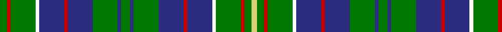

In pattern [GRGWBRBGBGBGBRBWGRGY](/patterns/grgwbrbgbgbgbrbwgrgy/).

This was sourced from register-of-tartans.  It is a [20 stripes tartan](/stripes/stripes20/).

Original link https://www.tartanregister.gov.uk/tartanDetails.aspx?ref=1793

## Thread count
G/8 R4 G28 W4 DBa28 R4 DBa28 G28 DBa4 G10 DBa4 G28 DBa28 R4 DBa28 W4 G28 R4 G8 LG/6

## Palette
Each colour and its ΔE from the base-6 reference it is a variant of.

| Colour | Shade | Base | ΔE (OKLab) |
|---|---|---|---|
| DB | <code style="background-color:#00008C;">#00008C</code> `#00008C` | B <code style="background-color:#2A418A;">#2A418A</code> | 0.13 |
| DBa | <code style="background-color:#2C2C80;">#2C2C80</code> `#2C2C80` | B <code style="background-color:#2A418A;">#2A418A</code> | 0.06 |
| DR | <code style="background-color:#8C0000;">#8C0000</code> `#8C0000` | R <code style="background-color:#CC0000;">#CC0000</code> | 0.14 |
| G | <code style="background-color:#007800;">#007800</code> `#007800` | G <code style="background-color:#006100;">#006100</code> | 0.07 |
| LG | <code style="background-color:#D8D078;">#D8D078</code> `#D8D078` | Y <code style="background-color:#F2BF00;">#F2BF00</code> | 0.07 |
| N | <code style="background-color:#C8C8C8;">#C8C8C8</code> `#C8C8C8` | W <code style="background-color:#F7F7F7;">#F7F7F7</code> | 0.14 |
| R | <code style="background-color:#C80000;">#C80000</code> `#C80000` | R <code style="background-color:#CC0000;">#CC0000</code> | 0.01 |
| W | <code style="background-color:#FCFCFC;">#FCFCFC</code> `#FCFCFC` | W <code style="background-color:#F7F7F7;">#F7F7F7</code> | 0.01 |

## Nearest tartans

The nearest existing variants by ΔTartan distance.

1. [Hunter of Hunterston (Clan)](/setts/s11/g10b4g28b28r4b28w4g28r4g8y6-b2c2c80-g007800-rc80000-wfcfcfc-yd8d078/) — ΔT 1.23
1. [O'Connor (Name)](/setts/s16/g10k24g12k16g26w4g24w4g26k16b4k4b4k4b28g6-b1474b4-g006428-k101010-wfcfcfc/) — ΔT 1.28
1. [O'Conner Irish Family Tartan Tartan Number: 2217. Earliest known date: 1985 Designed by Jerry O'Connor of Keltic Klassics, Hillsdale, New Jersey who names it "Royal na Connaught" .Woven by House of Edgar who said they would call it O'Connor. Ref made to Lawrence & Gerald O'Connor - possibly customers of Macnaughtons of Pitlochry (part of same group as House of Edgar) See products available Copyright © Blair Urquhart, Comrie, 2015](/setts/s16/g5k24g12k16g26w4g24w4g26k16b4k4b4k4ba28g3-b003c64-ba2c2c80-g006818-k101010-we0e0e0/) — ΔT 1.30
1. [Hunter of Hunterston Clan Tartan Tartan Number: 719. Earliest known date: 1985 Authorized by Clan Society 1985. Chiefship of the Clan Hunter passed to the Cochrane-Patrick family who have changed their name to Hunter of Hunterston. Hunterston House belongs to British Nuclear Fuels. See products available Copyright © Blair Urquhart, Comrie, 2015](/setts/s11/g10b4g24b24r4b24w4g24r4g8y6-b2c2c80-g006818-rc80000-we0e0e0-ye8c000/) — ΔT 1.30
1. [Greylock Corporate Tartan Tartan Number: 944. Earliest known date: 1987 . See products available Copyright © Blair Urquhart, Comrie, 2015](/setts/s13/g20w4g20k6b24r6b24g30w4b6k4g6y6-b2c2c80-g006818-k101010-rc80000-we0e0e0-ye8c000/) — ΔT 1.36
1. [Shaw of Carolina Clan Tartan Tartan Number: 6803. Earliest known date: 2005 Based on a cloth fragment and a description of a tartan blanket worn by Mary Irvine for her husband, John Shaw c.1800. See products available Copyright © Blair Urquhart, Comrie, 2015](/setts/s20/g12k6g36r8b8w8g36k6g12k6b12k6b36w8b8r8b36k6b12k6-b2c2c80-g006818-k101010-rc80000-we0e0e0/) — ΔT 1.40
1. [Norwich No.038](/setts/s18/g28b4r6b4k32y4b32g32r6g32b32y4k32b4r6b4g28k12-b5c8ca8-g006818-k101010-rc80000-ye8c000/) — ΔT 1.41
1. [Shaw of Carolina (Personal)](/setts/s20/g12k6g36r8b8w8g36k6g12k6b12k6b36w8b8r8b36k6b12k6-b202060-g006818-k101010-rc80000-wf8f8f8/) — ΔT 1.43
1. [Hunter of Hunterston](/setts/s11/g10b4g24b24r4b24w4g24r4g8y6-b304080-g008000-rc00000-we0e0e0-yf0c000/) — ΔT 1.44
1. [Campbell of Argyll (no guards)](/setts/s24/b2k2b16k16g16y4g16k16b2k2b2k2b16k2b2k2b2k16g16w4g16k16b16k2-b1474b4-g006818-k101010-wfcfcfc-ye8c000/) — ΔT 1.45

## Neighbour map

Every grey dot is one of 15726 variants placed by the first two principal components of the ΔTartan feature space (44% of its variance). Red is this tartan; blue dots are its nearest — click one to open its page.

<svg viewBox="0 0 640 380" role="img" style="max-width:100%;height:auto;border:1px solid #e0e0e0;border-radius:4px;display:block" xmlns="http://www.w3.org/2000/svg"><image href="/nn/cloud.v1.png" width="640" height="380"/><a href="/setts/s11/g10b4g28b28r4b28w4g28r4g8y6-b2c2c80-g007800-rc80000-wfcfcfc-yd8d078/"><circle cx="211.1" cy="189.5" r="4" fill="#3465a4"><title>Hunter of Hunterston (Clan)</title></circle></a><a href="/setts/s16/g10k24g12k16g26w4g24w4g26k16b4k4b4k4b28g6-b1474b4-g006428-k101010-wfcfcfc/"><circle cx="205.4" cy="203.3" r="4" fill="#3465a4"><title>O'Connor (Name)</title></circle></a><a href="/setts/s16/g5k24g12k16g26w4g24w4g26k16b4k4b4k4ba28g3-b003c64-ba2c2c80-g006818-k101010-we0e0e0/"><circle cx="198.3" cy="175.7" r="4" fill="#3465a4"><title>O'Conner Irish Family Tartan Tartan Number: 2217. Earliest known date: 1985 Designed by Jerry O'Connor of Keltic Klassics, Hillsdale, New Jersey who names it &quot;Royal na Connaught&quot; .Woven by House of Edgar who said they would call it O'Connor. Ref made to Lawrence &amp; Gerald O'Connor - possibly customers of Macnaughtons of Pitlochry (part of same group as House of Edgar) See products available Copyright © Blair Urquhart, Comrie, 2015</title></circle></a><a href="/setts/s11/g10b4g24b24r4b24w4g24r4g8y6-b2c2c80-g006818-rc80000-we0e0e0-ye8c000/"><circle cx="206.7" cy="204.2" r="4" fill="#3465a4"><title>Hunter of Hunterston Clan Tartan Tartan Number: 719. Earliest known date: 1985 Authorized by Clan Society 1985. Chiefship of the Clan Hunter passed to the Cochrane-Patrick family who have changed their name to Hunter of Hunterston. Hunterston House belongs to British Nuclear Fuels. See products available Copyright © Blair Urquhart, Comrie, 2015</title></circle></a><a href="/setts/s13/g20w4g20k6b24r6b24g30w4b6k4g6y6-b2c2c80-g006818-k101010-rc80000-we0e0e0-ye8c000/"><circle cx="170.7" cy="168.0" r="4" fill="#3465a4"><title>Greylock Corporate Tartan Tartan Number: 944. Earliest known date: 1987 . See products available Copyright © Blair Urquhart, Comrie, 2015</title></circle></a><a href="/setts/s20/g12k6g36r8b8w8g36k6g12k6b12k6b36w8b8r8b36k6b12k6-b2c2c80-g006818-k101010-rc80000-we0e0e0/"><circle cx="143.4" cy="166.6" r="4" fill="#3465a4"><title>Shaw of Carolina Clan Tartan Tartan Number: 6803. Earliest known date: 2005 Based on a cloth fragment and a description of a tartan blanket worn by Mary Irvine for her husband, John Shaw c.1800. See products available Copyright © Blair Urquhart, Comrie, 2015</title></circle></a><a href="/setts/s18/g28b4r6b4k32y4b32g32r6g32b32y4k32b4r6b4g28k12-b5c8ca8-g006818-k101010-rc80000-ye8c000/"><circle cx="141.5" cy="163.9" r="4" fill="#3465a4"><title>Norwich No.038</title></circle></a><a href="/setts/s20/g12k6g36r8b8w8g36k6g12k6b12k6b36w8b8r8b36k6b12k6-b202060-g006818-k101010-rc80000-wf8f8f8/"><circle cx="137.9" cy="164.9" r="4" fill="#3465a4"><title>Shaw of Carolina (Personal)</title></circle></a><a href="/setts/s11/g10b4g24b24r4b24w4g24r4g8y6-b304080-g008000-rc00000-we0e0e0-yf0c000/"><circle cx="205.8" cy="203.7" r="4" fill="#3465a4"><title>Hunter of Hunterston</title></circle></a><a href="/setts/s24/b2k2b16k16g16y4g16k16b2k2b2k2b16k2b2k2b2k16g16w4g16k16b16k2-b1474b4-g006818-k101010-wfcfcfc-ye8c000/"><circle cx="129.4" cy="151.8" r="4" fill="#3465a4"><title>Campbell of Argyll (no guards)</title></circle></a><circle cx="201.7" cy="166.7" r="5" fill="#c00000"/></svg>

ID: /setts/s20/g8r4g28w4b28r4b28g28b4g10b4g28b28r4b28w4g28r4g8y6-b2c2c80-g007800-rc80000-wfcfcfc-yd8d078/
