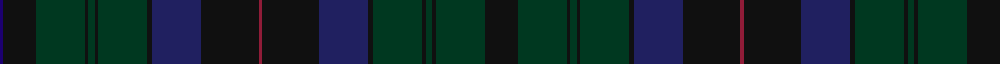

**Bands:** [BKGKGKGKBKRKBKGKGKGK](/stripes/bkgkgkgkbkrkbkgkgkgk/) · **Stripes:** [DB K DG K DG K DG K DB K R K DB K DG K DG K DG K](/stripes/stripes20/) DB K DG K DG K DG K DB K R K DB K DG K DG K DG K

This was sourced from register-of-tartans.  It is a [20 band tartan](/bands/bands20/).

Original link https://www.tartanregister.gov.uk/tartanDetails.aspx?ref=3332

## Register references

External register numbers recorded for this tartan.

- Scottish Register of Tartans: [3332](https://www.tartanregister.gov.uk/tartanDetails.aspx?ref=3332)
- Scottish Tartans Authority (ITI): 5751

## Thread count
DBa/2 K20 DG30 K2 DG4 K2 DG30 K3 DB30 K35 DR2 K35 DB30 K3 DG30 K2 DG4 K2 DG30 K/20

## Palette
Each colour and its ΔE from the base-6 reference it is a variant of.

| Colour | Shade | Base | ΔE (OKLab) |
|---|---|---|---|
| DB | <code style="background-color:#202060;">#202060</code> `#202060` | B <code style="background-color:#2A418A;">#2A418A</code> | 0.11 |
| DBa | <code style="background-color:#1C0070;">#1C0070</code> `#1C0070` | B <code style="background-color:#2A418A;">#2A418A</code> | 0.14 |
| DG | <code style="background-color:#003820;">#003820</code> `#003820` | G <code style="background-color:#006100;">#006100</code> | 0.15 |
| DR | <code style="background-color:#901C38;">#901C38</code> `#901C38` | R <code style="background-color:#CC0000;">#CC0000</code> | 0.13 |
| K | <code style="background-color:#101010;">#101010</code> `#101010` | K <code style="background-color:#000000;">#000000</code> | 0.17 |

## Nearest tartans

The nearest existing variants by ΔTartan distance.

1. [Phillips Welsh Name Tartan Tartan Number: 5751. Earliest known date: 2002 The tartan for this Welsh surname and its variations, Filpin, Phelps, Philipson, Phillips, Philpin, Phipps is actually woven in Wales at the Cambrian Woollen Mill, weaving on the same site since 1830. This tartan differs from many traditional patterns in that the warp and weft differ, giving the finished worsted wool cloth more of a predominant stripe, noticeable in the finished Kilt, or Cilt in Wales. See products available Copyright © Blair Urquhart, Comrie, 2015](/setts/s11/k2k20dg30k2dg4k2dg30k3db30k35r2/) — ΔT 1.29
1. [Alasdair Dhana](/setts/s12/dg3dt20dg16r2dg2r3dg3r5dg16dt20ly1k2~x2/) — ΔT 1.40
1. [Queensferry](/setts/s17/dg6n2lb1dg9dt2dg7dt4dg4dt7dg2dt20r1dt2r1dr3dt3r3~x2/) — ΔT 1.45
1. [Protheroe of Wales](/setts/s22/dg10dt1lo1dt1dg2dt5db2dg2db2dg2dg5dg2db2dg2db2dt5dg2dt1lo1dt1dg10db3~x4/) — ΔT 1.49
1. [Black Watch/Isetan Men's](/setts/s13/db16k2db2k2db2k12dg13k2dg13k12db12k2r1~x2/) — ΔT 1.50
1. [Barony of Gartly (Personal)](/setts/s24/db9dg2db9dt3db3dt8dg27w1db3w1dg27dt8dg5dt13dg4dt13dg5dt8dg27m4dg27dt8db3dt3~x2/) — ΔT 1.77
1. [Ryder Cup 2006](/setts/s10/k10lo1k3dt8dg8dg1dg8dt8k15lo1~x2/) — ΔT 1.83
1. [Protheroe (Welsh Name)](/setts/s12/dg5dg2db2dg2db2dt5dg2dt1lo1dt1dg10db3~x4/) — ΔT 1.84
1. [Ontario, Ensign of (District)](/setts/s15/dg3do16dg3do3dg3do16k2r4k2dg18do3dg3do3dg16y3~x2/) — ΔT 1.84
1. [Ontario, Ensign of](/setts/s15/y4dg18do3dg3do3dg18k2r4k2do16dg3do3dg3do16dg3~x2/) — ΔT 1.84

## Neighbour map

Every grey dot is one of 14313 variants placed by the first two principal components of the ΔTartan feature space (44% of its variance). Red is this tartan; blue dots are its nearest — click one to open its page.

<svg viewBox="0 0 640 380" role="img" style="max-width:100%;height:auto;border:1px solid #e0e0e0;border-radius:4px;display:block" xmlns="http://www.w3.org/2000/svg"><image href="/nn/cloud.v1.png" width="640" height="380"/><a href="/setts/s11/k2k20dg30k2dg4k2dg30k3db30k35r2/"><circle cx="360.4" cy="231.5" r="4" fill="#3465a4"><title>Phillips Welsh Name Tartan Tartan Number: 5751. Earliest known date: 2002 The tartan for this Welsh surname and its variations, Filpin, Phelps, Philipson, Phillips, Philpin, Phipps is actually woven in Wales at the Cambrian Woollen Mill, weaving on the same site since 1830. This tartan differs from many traditional patterns in that the warp and weft differ, giving the finished worsted wool cloth more of a predominant stripe, noticeable in the finished Kilt, or Cilt in Wales. See products available Copyright © Blair Urquhart, Comrie, 2015</title></circle></a><a href="/setts/s12/dg3dt20dg16r2dg2r3dg3r5dg16dt20ly1k2~x2/"><circle cx="382.3" cy="219.0" r="4" fill="#3465a4"><title>Alasdair Dhana</title></circle></a><a href="/setts/s17/dg6n2lb1dg9dt2dg7dt4dg4dt7dg2dt20r1dt2r1dr3dt3r3~x2/"><circle cx="385.7" cy="188.9" r="4" fill="#3465a4"><title>Queensferry</title></circle></a><a href="/setts/s22/dg10dt1lo1dt1dg2dt5db2dg2db2dg2dg5dg2db2dg2db2dt5dg2dt1lo1dt1dg10db3~x4/"><circle cx="339.7" cy="223.8" r="4" fill="#3465a4"><title>Protheroe of Wales</title></circle></a><a href="/setts/s13/db16k2db2k2db2k12dg13k2dg13k12db12k2r1~x2/"><circle cx="334.6" cy="249.5" r="4" fill="#3465a4"><title>Black Watch/Isetan Men's</title></circle></a><a href="/setts/s24/db9dg2db9dt3db3dt8dg27w1db3w1dg27dt8dg5dt13dg4dt13dg5dt8dg27m4dg27dt8db3dt3~x2/"><circle cx="428.2" cy="184.4" r="4" fill="#3465a4"><title>Barony of Gartly (Personal)</title></circle></a><a href="/setts/s10/k10lo1k3dt8dg8dg1dg8dt8k15lo1~x2/"><circle cx="332.5" cy="255.6" r="4" fill="#3465a4"><title>Ryder Cup 2006</title></circle></a><a href="/setts/s12/dg5dg2db2dg2db2dt5dg2dt1lo1dt1dg10db3~x4/"><circle cx="307.8" cy="248.0" r="4" fill="#3465a4"><title>Protheroe (Welsh Name)</title></circle></a><a href="/setts/s15/dg3do16dg3do3dg3do16k2r4k2dg18do3dg3do3dg16y3~x2/"><circle cx="387.1" cy="245.0" r="4" fill="#3465a4"><title>Ontario, Ensign of (District)</title></circle></a><a href="/setts/s15/y4dg18do3dg3do3dg18k2r4k2do16dg3do3dg3do16dg3~x2/"><circle cx="380.4" cy="241.1" r="4" fill="#3465a4"><title>Ontario, Ensign of</title></circle></a><circle cx="357.6" cy="218.1" r="5" fill="#c00000"/></svg>

ID: /setts/s20/k20dg30k2dg4k2dg30k3db30k35r2k35db30k3dg30k2dg4k2dg30k20db2/
