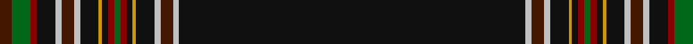

In pattern [BGRKWBWKYKRGRKYKWBWK](/patterns/bgrkwbwkykrgrkykwbwk/).

This was sourced from register-of-tartans.  It is a [20 stripes tartan](/stripes/stripes20/).

Original link https://www.tartanregister.gov.uk/tartanDetails.aspx?ref=4573

## Thread count
DR/8 G12 DRa4 K12 N4 DR8 N4 K12 DY2 K4 DRa4 G4 DRa4 K4 DY2 K12 N4 DR8 N4 K/224

## Palette
Each colour and its ΔE from the base-6 reference it is a variant of.

| Colour | Shade | Base | ΔE (OKLab) |
|---|---|---|---|
| DR | <code style="background-color:#441800;">#441800</code> `#441800` | B <code style="background-color:#2C4084;">#2C4084</code> | 0.22 |
| DRa | <code style="background-color:#880000;">#880000</code> `#880000` | R <code style="background-color:#C80000;">#C80000</code> | 0.14 |
| DY | <code style="background-color:#D09800;">#D09800</code> `#D09800` | Y <code style="background-color:#E8C000;">#E8C000</code> | 0.11 |
| G | <code style="background-color:#006818;">#006818</code> `#006818` | G <code style="background-color:#006400;">#006400</code> | 0.02 |
| K | <code style="background-color:#101010;">#101010</code> `#101010` | K <code style="background-color:#000000;">#000000</code> | 0.17 |
| N | <code style="background-color:#C0C0C0;">#C0C0C0</code> `#C0C0C0` | W <code style="background-color:#F4F4F0;">#F4F4F0</code> | 0.16 |

## Nearest tartans

The nearest existing variants by ΔTartan distance.

1. [New World Celts (Corporate)](/setts/s13/k150b4w4k4y4g8r6k4r8k2w8k4b10-b2888c4-g003820-k101010-rc80000-we0e0e0-ye8c000/) — ΔT 1.71
1. [MacHattie Family Tartan Tartan Number: 5917. Earliest known date: 2003 A tartan for the McHattie family of Aberdeen See products available Copyright © Blair Urquhart, Comrie, 2015](/setts/s10/k90b4r4ra4y2w2y2ra4r4b4-b003c64-k101010-r880000-rac80000-we0e0e0-ye8c000/) — ΔT 1.78
1. [Western Australia-Pending (District)](/setts/s13/k114b2k3b3k5b5k2g5w6r5y3k3ba14-b2888c4-ba2c2c80-g006818-k101010-rc80000-we0e0e0-yfccc00/) — ΔT 1.82
1. [Watt (Corporate/Name)](/setts/s12/k96b8k12ba3k3ba3k3g20r8k3r4w4-b2c2c80-ba780078-g006818-k101010-rc80000-we0e0e0/) — ΔT 2.14
1. [Platinum Golf Scotland](/setts/s12/r4k6b2k90r2k4r4k4g8ra2g2w2-b440044-g003820-k00002c-r888888-rac80000-wfcfcfc/) — ΔT 2.19
1. [Spirit of Lanarkshire (Corporate)](/setts/s8/k166y4b8r4k16g10r8w6-b2c2c80-g006818-k101010-rc80000-we0e0e0-ye8c000/) — ΔT 2.26
1. [CoVASS (Corporate)](/setts/s11/k180b2k4r4w2k2r8k4g2k4ba4-b780078-ba2c2c80-g006818-k101010-re87878-we0e0e0/) — ΔT 2.37
1. [Royal Canadian Mounted Police Corporate Tartan Tartan Number: 2447. Earliest known date: 05/05/1998 Designed by Violet Holmes, B.C. Canada and adopted as the official RCMP tartan. Weft differs in having red in place of orange so making 6 weft colours. Sample presented to the RCMP by Priness Anne during a visit to New Brunswick on 25th June 1998. Lochcarron records say December 1997. Different weft - orange missing. Original count had dark blue in place of the black shown here in the Lochcarron swatch. See products available Copyright © Blair Urquhart, Comrie, 2015](/setts/s16/k152b2k4w2g28r10k26ra2y2ra2k26r10g28w2k4b2-b0064ac-g006818-k000000-r800000-rab84c00-wc0c0c0-yd09000/) — ΔT 2.37
1. [Initial City Link #2](/setts/s11/k100g14k8w4k4y4k4g14k4ga6y4-g003c14-ga005020-k101010-we0e0e0-ye8c000/) — ΔT 2.37
1. [Firefighters](/setts/s14/k182y6k22w4r6k4r6w4k6r12k6r6y6w6-k101010-rc8002c-wf8f8f8-ybc8c00/) — ΔT 2.37

## Neighbour map

Every grey dot is one of 15726 variants placed by the first two principal components of the ΔTartan feature space (44% of its variance). Red is this tartan; blue dots are its nearest — click one to open its page.

<svg viewBox="0 0 640 380" role="img" style="max-width:100%;height:auto;border:1px solid #e0e0e0;border-radius:4px;display:block" xmlns="http://www.w3.org/2000/svg"><image href="/nn/cloud.v1.png" width="640" height="380"/><a href="/setts/s13/k150b4w4k4y4g8r6k4r8k2w8k4b10-b2888c4-g003820-k101010-rc80000-we0e0e0-ye8c000/"><circle cx="493.5" cy="30.8" r="4" fill="#3465a4"><title>New World Celts (Corporate)</title></circle></a><a href="/setts/s10/k90b4r4ra4y2w2y2ra4r4b4-b003c64-k101010-r880000-rac80000-we0e0e0-ye8c000/"><circle cx="507.3" cy="57.7" r="4" fill="#3465a4"><title>MacHattie Family Tartan Tartan Number: 5917. Earliest known date: 2003 A tartan for the McHattie family of Aberdeen See products available Copyright © Blair Urquhart, Comrie, 2015</title></circle></a><a href="/setts/s13/k114b2k3b3k5b5k2g5w6r5y3k3ba14-b2888c4-ba2c2c80-g006818-k101010-rc80000-we0e0e0-yfccc00/"><circle cx="472.0" cy="22.7" r="4" fill="#3465a4"><title>Western Australia-Pending (District)</title></circle></a><a href="/setts/s12/k96b8k12ba3k3ba3k3g20r8k3r4w4-b2c2c80-ba780078-g006818-k101010-rc80000-we0e0e0/"><circle cx="441.2" cy="73.3" r="4" fill="#3465a4"><title>Watt (Corporate/Name)</title></circle></a><a href="/setts/s12/r4k6b2k90r2k4r4k4g8ra2g2w2-b440044-g003820-k00002c-r888888-rac80000-wfcfcfc/"><circle cx="546.2" cy="60.4" r="4" fill="#3465a4"><title>Platinum Golf Scotland</title></circle></a><a href="/setts/s8/k166y4b8r4k16g10r8w6-b2c2c80-g006818-k101010-rc80000-we0e0e0-ye8c000/"><circle cx="561.2" cy="84.6" r="4" fill="#3465a4"><title>Spirit of Lanarkshire (Corporate)</title></circle></a><a href="/setts/s11/k180b2k4r4w2k2r8k4g2k4ba4-b780078-ba2c2c80-g006818-k101010-re87878-we0e0e0/"><circle cx="626.0" cy="59.1" r="4" fill="#3465a4"><title>CoVASS (Corporate)</title></circle></a><a href="/setts/s16/k152b2k4w2g28r10k26ra2y2ra2k26r10g28w2k4b2-b0064ac-g006818-k000000-r800000-rab84c00-wc0c0c0-yd09000/"><circle cx="421.9" cy="26.0" r="4" fill="#3465a4"><title>Royal Canadian Mounted Police Corporate Tartan Tartan Number: 2447. Earliest known date: 05/05/1998 Designed by Violet Holmes, B.C. Canada and adopted as the official RCMP tartan. Weft differs in having red in place of orange so making 6 weft colours. Sample presented to the RCMP by Priness Anne during a visit to New Brunswick on 25th June 1998. Lochcarron records say December 1997. Different weft - orange missing. Original count had dark blue in place of the black shown here in the Lochcarron swatch. See products available Copyright © Blair Urquhart, Comrie, 2015</title></circle></a><a href="/setts/s11/k100g14k8w4k4y4k4g14k4ga6y4-g003c14-ga005020-k101010-we0e0e0-ye8c000/"><circle cx="474.1" cy="108.2" r="4" fill="#3465a4"><title>Initial City Link #2</title></circle></a><a href="/setts/s14/k182y6k22w4r6k4r6w4k6r12k6r6y6w6-k101010-rc8002c-wf8f8f8-ybc8c00/"><circle cx="559.9" cy="62.4" r="4" fill="#3465a4"><title>Firefighters</title></circle></a><circle cx="559.0" cy="22.1" r="5" fill="#c00000"/></svg>

ID: /setts/s20/k224w4b8w4k12y2k4r4g4r4k4y2k12w4b8w4k12r4g12b8-b441800-g006818-k101010-r880000-wc0c0c0-yd09800/
